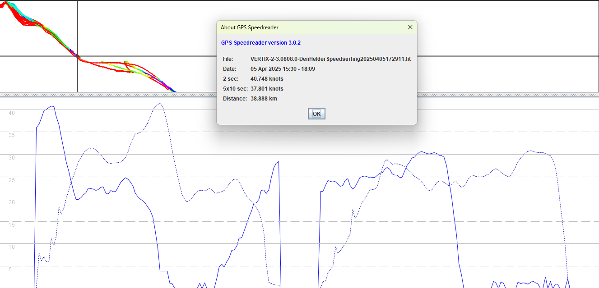

## COROS - Alignment Issues

Author: Michael George

Created: 6 Apr 2025

### Overview

The following image shows part of a session from a VERTIX 2 with firmware 3.0808.0.

The solid blue line is the recorded speed, and the dotted blue line is the position-derived speed.

Two significant issues are apparent in the data:

1. The speed data and positional data are significantly offset, and the difference is more than 40 seconds in this track.
2. No speeds are being recorded whilst the position is not changing, so significant chunks of speed data is being discarded.

### Issues

#### Alpha 500

The calculation of alpha 500 results on GP3S relies upon positional data and speed data. The alignment issue / temporal offset causes alpha 500 results on GP3S to be completely wrong.

A similar alignment / temporal offset issues have been present on the APEX 2 / APEX 2 Pro / VERTIX 2 for several years. The original document describing the issue referred to these bogus results as [fantasy alphas](../alpha/README.md).

#### Distance

The speed surfing world integrates the speed data to calculate the total distance travelled. Since lots of speed data is not being recorded by this firmware (due to the alignment issue), distances are coming up short on GP3S; 38 km instead of 50 km.

### Remedy

It is conceivable that this issue relates to the stitching together of NMEA sentences such as GGA and VTG, or some other combination.

It is unique to COROS watches such as the APEX 2 / APEX 2 Pro / VERTIX 2 and not seen on Garmin watches using the same Airoha chipsets.

Since it is intermittent it is very difficult to test. It's not happened to me personally, but the issue affects many others at random.

### Reference

- Session on [GPS-Speedsurfing](https://www.gps-speedsurfing.com/default.aspx?mnu=user&val=464256&uid=22337&spotid=1719)
- Export of [VERTIX-2-3.0808.0-DenHelderSpeedsurfing20250405172911.fit](VERTIX-2-3.0808.0-DenHelderSpeedsurfing20250405172911.fit)
- Description of [fantasy alphas](../alpha/README.md)
