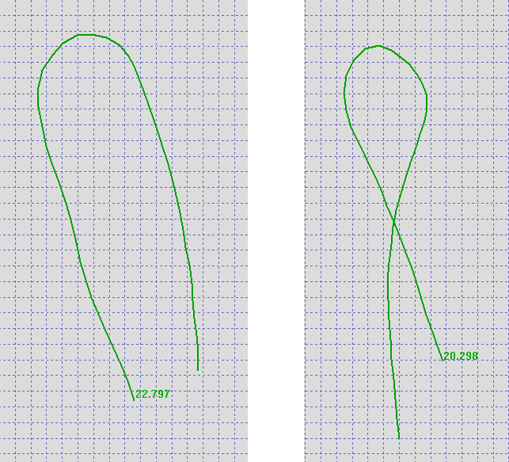
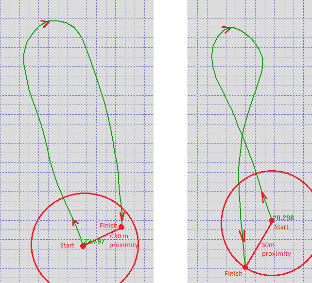
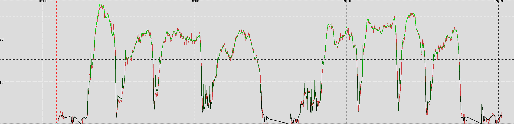
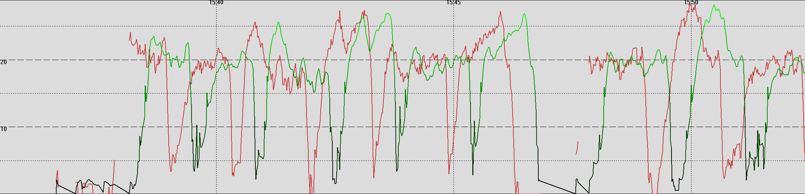
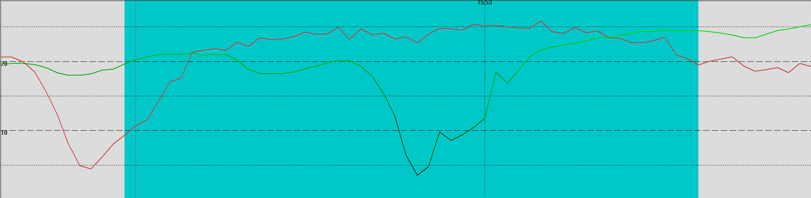

## Fantasy Alphas

Author: Michael George

Created: 21 Dec 2023

### Background

Alpha racing is a merging of GPS technology with the natural back and forth sailing done by most sailboarders around the world. It uses the power of GPS and computing to calculate your best average speed from any point through a gybe and back to the same point.

There are only two rules in Alpha Racing:

1. **You must get back to a previous position**. Because it is not always easy to know exactly where you have been or on what line you sailed into the gybe, a tolerance needs to be applied in the calculations. The term for this tolerance is the Proximity Distance. 
1. **All results must have a total distance covered that is less than or equal to the maximum distance.** The software will only calculate results achieved where the total distance covered from start to return is less than or equal to the maximum distance.

Alpha 500 is one of the standard speed categories when speedsurfing, where the proximity distance is **50m** and the maximum distance covered is **500m**.

#### Example Alphas

The image below shows two examples of an alpha 500:

1. Typically, alpha 500 runs resemble a U shape so that the finishing speed is maximized after the gybe / turn.
2. Crossing the original path is also perfectly acceptable as shown in the second example.

#### Alpha Detection

The **proximity distance** and **maximum distance** are applied to the data to determine when alphas have occurred; 50m and 500m respectively.

The examples from above have been annotated below, showing the significance of the 50m proximity detection.

#### Speed Calculation

It is worth noting that position and speed are calculated independently by GPS receivers and that at any point in time a GPS receiver will know either the position, speed, neither, or both.

Once the start and end times have been determined for possible alphas, speeds are calculated between the start and end points. This is simply a matter of calculating the arithmetic mean during that period of time. 

### COROS Issue

An issue has been observed on the COROS VERTIX 2 and the COROS APEX 2 Pro which results in "fantasy alphas". These are not genuine results and have been seen to boost peoples alphas by up to 10 knots.

The exact nature of the COROS bug is unknown, but the problem can clearly be seen when examining data within a FIT file.

The issue is definitely present in firmware versions between 2.69 (5 Jul 2022) and 3.0308.0 (31 Jan 2024). It is unclear how much earlier the issue was present, or if it has since been resolved. There has not been a lot of focus on the alpha issue due to investigations affecting the firmware releases since 3.0408.0 (10 May 2024).

#### Normal Data

A simple graph comparing speeds calculated from the positional data (green) and doppler data (red) is show below.

 

#### Problem Data

Within problem tracks, speeds calculated from the positional data (green) and doppler data (red) are offset. 

 

#### Fantasy Alphas

You will recall that the positional data is used to determine when the alpha occurred but the doppler speeds are used for the actual result.

The fact that positional data and doppler speeds are offset causes "fantasy alphas" to occur, as in the example below which is awarding a 24.41 knots "fantasy alpha" (red) when the actual alpha was more like 18.71 knots (green).     

 

#### General Issue

It is not clear whether COROS is failing to capture the NMEA data from the GNSS receiver correctly in real-time, or whether they are mangling it in their downstream processing.

What is very clear is that the data that they are recording is incorrect, primarily with positions and speeds being temporally offset. The issue has been observed right from the start of tracks, and also starting half way into a session.

#### Examples

Here are two example FIT files from a VERTIX 2:

- [Speedsurfing20230325102728.fit](Speedsurfing20230325102728.fit) gives an alpha of 27.30 knots when the reality is more like 18.31 knots
- [Speedsurfing20220820155948.fit](Speedsurfing20220820155948.fit) gives an alpha of 27.60 knots when the reality is more like 19.87 knots

### Summary

My suspicion is that COROS are combining NMEA sentences, but not doing it correctly. The obvious way to capture position and speed is using the RMC sentence (time, position and speed) but COROS may be using GGA (time and position) and VTG (speed).  

The issue could be related to VTG sentences not including a timestamp, or due to some messages being absent for a period of time. It's not easy to determine the root cause solely from the FIT files, so COROS need to investigate.

Whatever the cause, COROS need to fix this issue as the VERTIX 2 and APEX 2 Pro are sometimes logging bad data and causing spurious alpha's to appear in our rankings.

