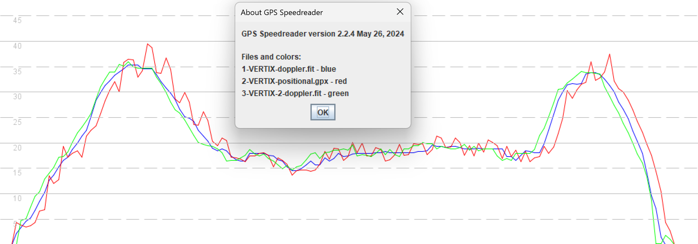
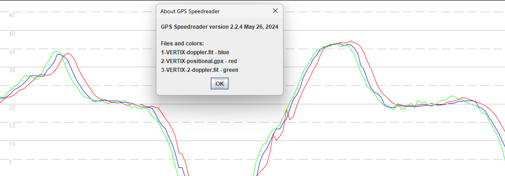
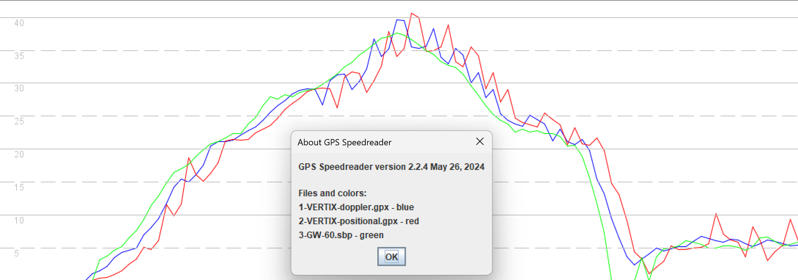
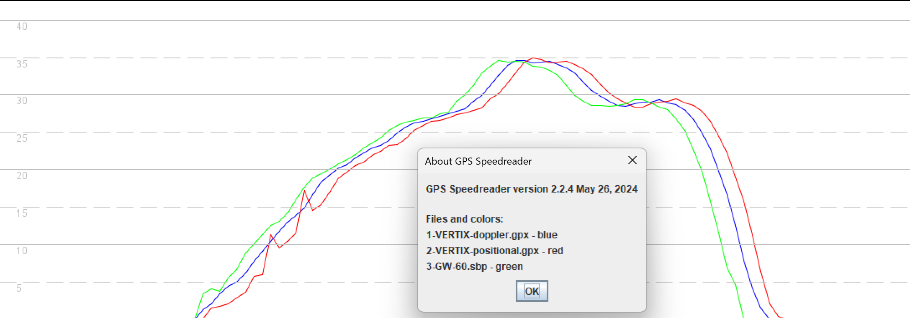
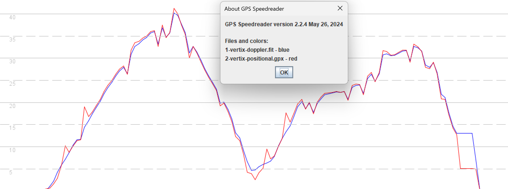
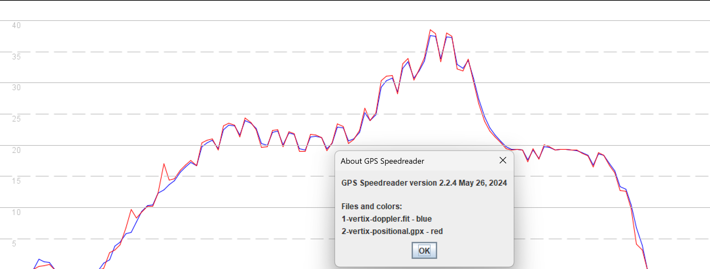

## COROS Speed Issues

Author: Michael George

Created: 19 Aug 2024

### Overview

Firmware V 3.0508.0 has introduced problems on the VERTIX (and presumably the APEX Pro) which adversely affect speed surfing.

Two sessions from 11 August 2024 will be used to illustrate the problems affecting two different riders, each using their own VERTIX.

In both sessions the max 2 second speeds is more than 2 knots higher than the reality, which is a big deal within speed surfing.

### Background

I should clarify that I am not a member of the GP3S team, but I do provide advice on technical issues / matters. I am also responsible for the technology and time keeping at the worlds longest running speed competition ([Weymouth Speed Week](https://weymouthspeedweek.com/)) and the recent [ISWC World Championships](https://speedwindsurfing.org/).

The importance of Doppler-derived speeds has been recognised by the speed surfing community for years and has been summarised in a short [article](https://medium.com/@mikeg888/the-importance-of-doppler-b886b14bb65d) that I wrote earlier this year. The next two images will illustrate how the VERTIX used to behave prior to firmware V 3.0508.0.

The first image compares what is believed to be the Doppler-derived speed of the VERTIX (blue) against the position-derived speed of the VERTIX (red) and the speed from a VERTIX 2 (green). The sawtooth artefacts in the position-derived speeds (red) of the VERTIX are very prominent.

During that same session it should also be noted that there were short periods when the position-derived speeds did not exhibit the sawtooth artefacts, except during the initial periods of acceleration.

These two graphs show how the VERTIX used to behave, prior to firmware V3.0508.0. It is believed that Doppler-derived speeds calculated by the Sony GNSS chip were being recorded by COROS prior to the firmware update.

### VERTIX V 3.0508.0

Since upgrading to firmware V 3.0508.0, what should be the Doppler-derived speed (blue) is now almost identical to the position-derived speed (red), except for a 2 second time difference. They now exhibit almost exactly the same sawtooth artefacts, with the exception of the extra "teeth" during periods of acceleration, which have always been present in positional-derived speeds from COROS watches.

The same session was also recorded on the Locosys GW-60 (green) which can be regarded as a benchmark device, providing us with trustworthy speeds. There is obviously a slight difference in the timestamps of the GW-60 and COROS, but it's the speeds that matter most.

As with the previous firmware there are also periods where there are no sawtooth artefacts evident in the data. The only exception is during the initial period of acceleration where "teeth" are evident in the position-derived speeds.

Looking at the fastest run from a second speed surfer (same day, same spot, different VERTIX) also shows an unrealistic max 2 seconds, almost certainly a couple of knots too high. The most important point to note is that what should be the Doppler-derived speed (blue) contains the sawtooth artefacts of the position-derived speed (red). The main exception is during the initial periods of acceleration where "teeth" are evident in the position-derived speeds.

The second fastest run of this same rider is another particularly good example, showing the same sawtooth artefacts in what should be the Doppler-derived speed (blue) and position-derived speed (red). There is no ambiguity with this specific run and what should be Doppler-derived speeds are almost identical to the position-derived speeds.

This behavior is unlike anything that I have seen from a COROS watch since buying an APEX Pro in 2021, and subsequently upgrading to the APEX 2 Pro.

### Summary

After upgrading to firmware V 3.0508.0 the VERTIX no longer appears to be recording the Doppler-derived speeds of the Sony GNSS chip. This results in inflated speeds being reported and the examples above show an excess of 2 knots for the max 2 seconds. A difference of two knots might not sound like much but it is actually a big deal when we expect the accuracy to typically be within a few tenths of a knot.

There are international competitions reliant upon the accuracy of the data from the COROS watches, so a fix or workaround will be required very quickly. The Swedish Championship is scheduled for September with many riders using personal COROS watches. They'll either be needing a fix, or some way to install the firmware that was being used back in April.

It is perhaps not a coincidence that this issue has occurred after the release of V 3.0508.0 (and the beta V 3.0506.0) which attempted to resolve an issue affecting watches using the Airoha chipset (VERTIX 2S, VERTIX 2, APEX 2 Pro, APEX 2). Perhaps the "fix" was simply to use position-derived speeds, instead of the Doppler-derived speeds calculated by the Airoha chipset.

If this is indeed the case and none of the COROS watches are recording Doppler-derived speeds (Sony or Airoha) then it needs to be resolved as a matter of urgency. This document has been written for the benefit of the guys at GP3S, so they can decide what to tell the community. Hopefully it also contains enough information for the developers / engineers at COROS to resolve the matter.

