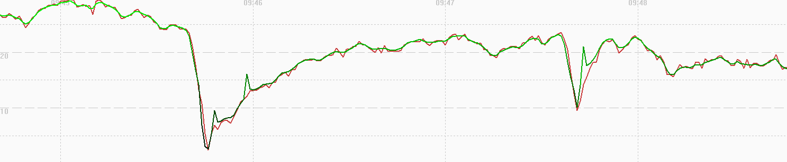
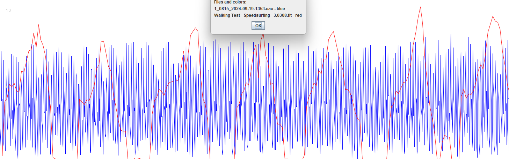
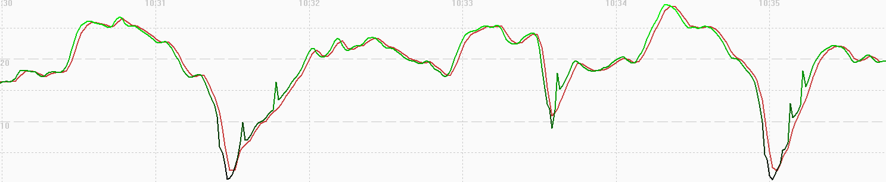

## 3.0308.0

### Overview

The 3.0308.0 release in Jan 2024 exhibits the original / accepted behavior, similar in many respects to the Garmin watches in 2024.

However, unique to the COROS is the temporal offset issue on the APEX 2, APEX 2 Pro, VERTIX 2 which causes [fantasy alphas](../../alpha/README.md).

### GNSS

| APEX Pro | VERTIX | APEX 2 | APEX 2 Pro | VERTIX 2 / 2S |
| :------: | :----: | :----: | :--------: | :-----------: |
|    -     |   -    | 3.1.0  |   3.1.0    |     3.1.0     |

### Aliasing

The short article about [sampling rates and aliasing](../../../../general/aliasing/README.md) provides the background required to understand this section.

A simple walking test used APEX 2 Pro watches to determine whether 3.0308.0 is using low-pass filtering for the speedsurfing activity.

The firmware releases 3.0308.0 and 3.0706 were tested simultaneously for speedsurfing and windsurfing activities.

- The speedsurfing activity exhibits aliasing in 3.0308.0 (blue) but low-pass filtering is evident in 3.0706.0 (red).
- The windsurfing activity exhibits heavier filtering than speedsurfing. The 3.0308.0 and 3.0706.0 data is very similar in nature (green and magenta).

### Speedsurfing

#### Sailing Test

Comparing the APEX 2 Pro with 3.0706.0 against the Motion GPS @ 5 Hz the speedsurfing mode can be seen to capture the highs and lows.

However there is quite a lot of sawtooth evident in the 3.0706.0 data, which is consistent with the aliasing observations in the walking test.

GPSResults can be used to compare the position-derived speeds (green) and doppler-derived speeds (red) of the speedsurfing activity.

It should be noted that COROS are applying custom filters to the positional data, clearly evident in the green trace (ignoring the spikes).

The doppler-derived speeds (red) contain more detail than the position-derived speeds, although quite a lot of sawtooth evident.

#### Walking Test

Comparing the APEX 2 Pro with the Motion @ 5 Hz there is obvious [aliasing](../../../../general/aliasing/README.md) which suggests there is no low-pass filter.

GPSResults can be used to compare the position-derived speeds (green) and probable doppler-derived speeds (red).

Differences in the plots show some independence of position and speed.

#### Fantasy Alphas

The 3.0308.0 firmware is prone to [fantasy alphas](../../alpha/README.md) because the positional data and speed data can become offset.

### Windsurfing

#### Sailing Test

Comparing the APEX 2 Pro with 3.0706.0 against the Motion GPS @ 5 Hz it can be seen that there is more smoothing than speedsurfing, and the COROS does not accurately capture the low speeds during turns.

The COROS speeds are not nearly so close to the Motion when using the windsurfing mode. They are often out by several tenths of a knot and sometimes multiple knots, especially during sudden bursts of speed and when slowing down during turns.

GPSResults can be used to compare the position-derived speeds (green) and recorded speeds (red) of the windsurfing activity.

The windsurfing data is heavily filtered and is believed to be derived from the positional data, which would mean the speeds are non-Doppler.

The windsurfing activity behaves like many other [activities](../../activities/README.md) on the COROS watches - e.g. bike, flatwater, GPS cardio, etc.

#### Walking Test

GPSResults can be used to compare the position-derived speeds (green) and recorded speeds (red) when walking.

The windsurfing data is heavily filtered and is believed to be derived from the positional data, which would mean the speeds are non-Doppler.

The windsurfing activity behaves like many other [activities](../../activities/README.md) on the COROS watches - e.g. bike, flatwater, GPS cardio, etc.

### Summary

The behavior of 3.0308.0 has generally been considered ok when using speedsurfing activity:

- The firmware is believed to be recording the Doppler-derived speeds.
- Aliasing is observed whilst walking, which suggests unfiltered data is being recorded.
- The speed results are close to that of the Motion GPS, and certainly better than many other watches.

One of the major issues is the temporal offset issue:

- 3.0308.0 is known to be affected by the temporal offset issue which causes [fantasy alphas](../../alpha/README.md).

