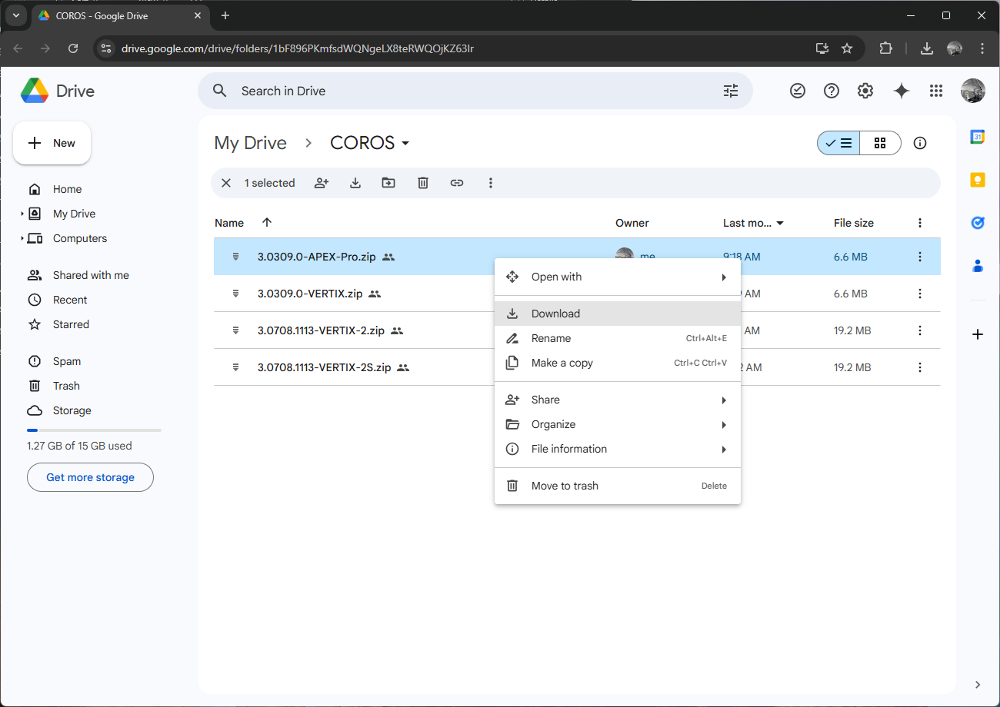

## APEX Pro + VERTIX - Working Firmware

### Background

The speedsurfing mode on the APEX Pro and VERTIX has been broken since firmware [3.0508.0](../3.0508.0/README.md) which was released in Aug 2024.

The problems are yet to be acknowledged by COROS, but earlier firmware versions continue to work such as [3.0309.0](README.md), [3.0408.0](../3.0408.0/README.md), and [3.0409.0](../3.0409.0/README.md).

This page describes how to install 3.0309.0 on your APEX Pro and VERTIX.

### Step 1 - Download Files to your Computer

The first step is to download the firmware from Google Drive.

There are ZIPs for various COROS watches, including the APEX Pro and VERTIX.

The shortened URL for the folder is [https://tinyurl.com/4433d2mx](https://tinyurl.com/4433d2mx)

Click the link and download the appropriate ZIP to your computer.

### Step 2 - Copy Files to your Watch

Connect the watch to your computer and wait for the external drive to be listed - "APEX PRO" or "VERTIX".

Copy the contents of the ZIP file into the "Upgrade" folder.

The image below is a screenshot of the "APEX PRO" drive and "Upgrade" folder.

### Step 3 - Complete the Update

Wait for several seconds after the copy has completed then (ideally) eject the drive, or if you don't know how to eject a drive, simply unplug the watch from the computer.

The installation will then begin and will take several minutes. The various files are initially processed one by one, which takes some time. Once the files have been processed the watch will say "Updating" and finally, you will be asked for your preferred language.

Once the update has completed, you may wish to check your firmware via System -> More Settings -> Device Info -> Software.

### Wrap Up

Hopefully these instructions have helped you to install 3.0309.0 on your APEX Pro and VERTIX. Sorry, manual updates do require some technical skills!

COROS is yet to acknowledge the issue that was introduced in August, so for now you are strongly advised to use 3.0309.0 instead of 3.0508.0.
