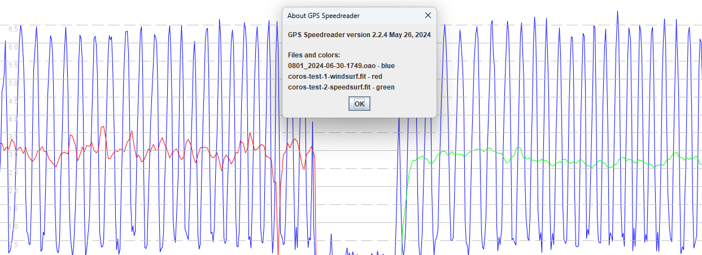
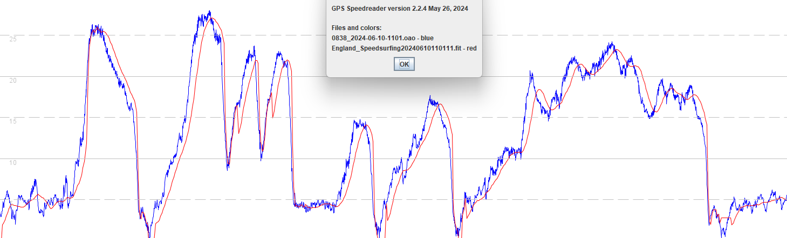
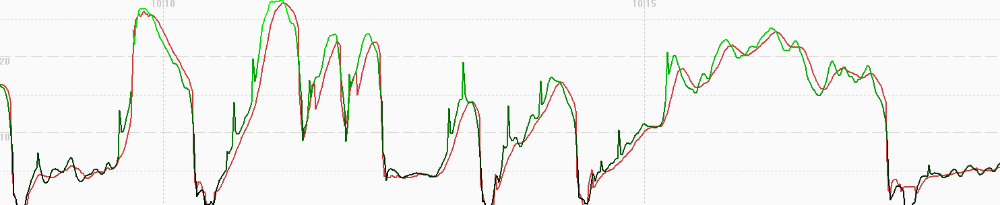
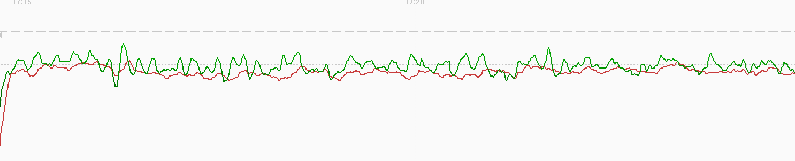
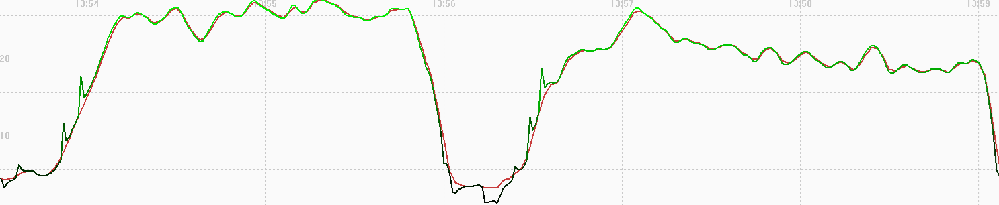
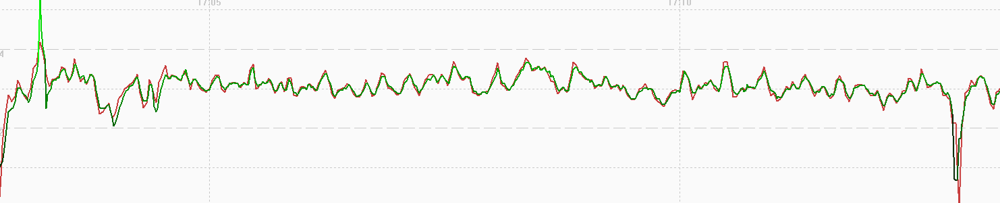

## 3.0408.0

### Overview

The 3.0408.0 release exhibits major smoothing issues on Airoha watches, reminiscent of Garmin watches in 2022.

### GNSS

| APEX Pro | VERTIX | APEX 2 | APEX 2 Pro | VERTIX 2 / 2S |
| :------: | :----: | :----: | :--------: | :-----------: |
|    -     |   -    | 3.1.0  |   3.1.0    |     3.1.0     |

### Extreme Filtering

The short article about [sampling rates and aliasing](../../../../general/aliasing/README.md) provides the background required to understand this section.

A simple walking test used APEX 2 Pro watches to determine whether 3.0408.0 is using low-pass filtering for the speedsurfing activity.

The firmware releases 3.0408.0 was tested alongside Motion GPS #801 @ 1 Hz and #805 @ 5 Hz for speedsurfing and windsurfing activities.

- Filtering is clearly evident for windsurfing (red) and speedsurfing (green) activities, when compared against the Motion @ 1 Hz (blue).
- Unlike any previous (or subsequent) firmware the speedsurfing mode (green) is subject to heavier filtering than windsurfing.

### Speedsurfing

#### Sailing Test

Comparing the APEX 2 Pro with 3.0408.0 against the Motion GPS @ 5 Hz it can be seen that there is extreme filtering and smoothing.

This is reminiscent of Garmin watches using the same Airoha chipset back in 2022; Fenix 7, Forerunner 255, etc.

GPSResults can be used to compare the position-derived speeds (green) and expected doppler-derived speeds (red) of the speedsurfing activity.

It should be noted that COROS are applying custom filters to the positional data, clearly evident in the green trace (ignoring the spikes).

The expected doppler-derived speeds (red) appear to have passed through an extreme filter, apparently independently of the positional data.

#### Walking Test

GPSResults can be used to compare the position-derived speeds (green) and expected doppler-derived speeds (red) when walking.

It should be noted that COROS are applying custom filters to the positional data, clearly evident in the green trace (ignoring the spikes).

The expected doppler-derived speeds (red) have been filtered even more heavily than the positional data.

### Windsurfing

#### Sailing Test

GPSResults can be used to compare the position-derived speeds (green) and expected doppler-derived speeds (red) of the windsurfing activity.

The windsurfing data is heavily filtered and is believed to be derived from the positional data, which would mean the speeds are non-Doppler.

The windsurfing activity behaves like many other [activities](../../activities/README.md) on the COROS watches - e.g. bike, flatwater, GPS cardio, etc.

#### Walking Test

GPSResults can be used to compare the position-derived speeds (green) and recorded speeds (red) of the windsurfing activity.

The windsurfing data is heavily filtered and is believed to be derived from the positional data, which would mean the speeds are non-Doppler.

The windsurfing activity behaves like many other [activities](../../activities/README.md) on the COROS watches - e.g. bike, flatwater, GPS cardio, etc.

### Summary

The 3.0408.0 firmware is extremely problematic for the speedsurfing community:

- What should really be the Doppler-derived speeds are heavily filtered and smoothed, presumably due to the Airoha settings.
- The nature of the smoothing is much akin to the Garmin watches of 2022; e.g. Fenix7 and Forerunner 255.

Unknowns:

- It is not clear what was changed in 3.0408.0, perhaps one of the Airoha settings that were [discussed](../../smoothing/update.md) in Aug 2024?
- It is not known whether 3.0408.0 is affected by the long-standing issue that causes [fantasy alphas](../../alpha/README.md).

