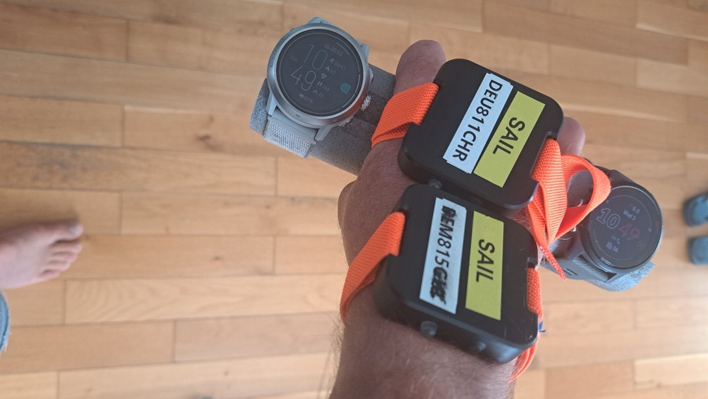
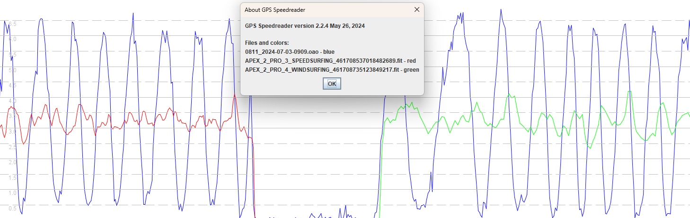
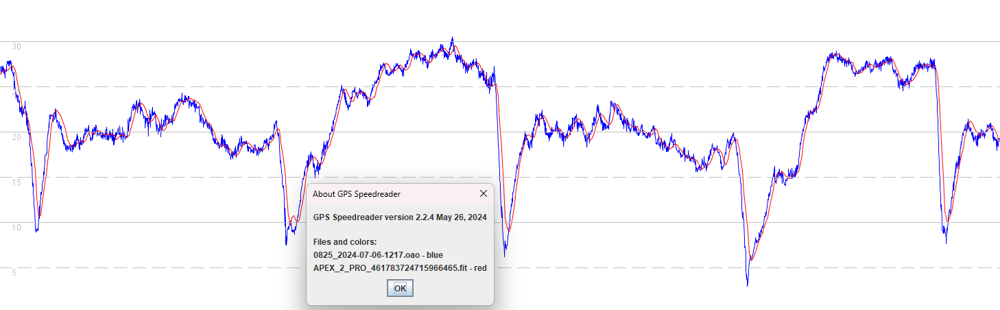
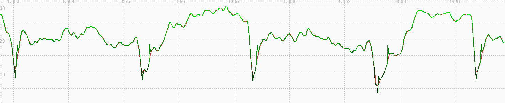
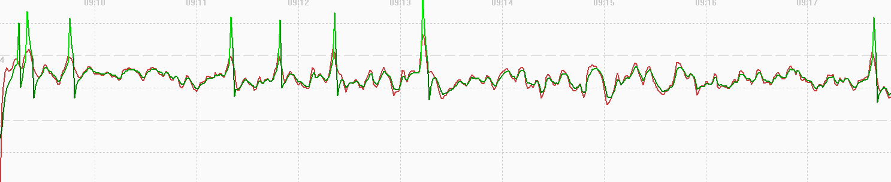
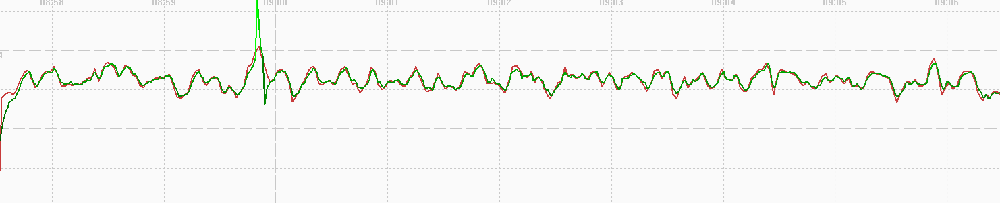

## 3.0506.0 beta - 1 Jul 2024

### Overview

The 3.0506.0 beta release in Jul 2024 exhibits issues because speedsurfing behaves much like windsurfing, which is non-doppler and thus prone to spikes.

The 3.0506.0 beta was initially thought to fix the speed issues in [3.0408.0](../3.0408.0/README.md) and [3.0409.0](../3.0409.0/README.md). However [3.0508.0](../3.0508.0/README.md) on the APEX Pro and VERTIX made it clear that there were some new speed issues. The non-Doppler speed issues of 3.0506.0 and 3.0508.0 were [documented](../../doppler/README.md) on 19 Aug 2024.

### Satellite Systems

| APEX 2 | APEX 2 Pro | VERTIX 2 / 2S |
| :----: | :--------: | :-----------: |
| 3.1.0  |   3.1.0    |     3.1.0     |

### Low-pass Filtering

The short article about [sampling rates and aliasing](../../../../general/aliasing/README.md) provides the background required to understand this section.

A simple walking test used an APEX 2 Pro watche to determine whether 3.0506.0 is using low-pass filtering for the speedsurfing activity.

The firmware release 3.0506.0 was tested alongside Motion GPS #801 @ 1 Hz and #805 @ 5 Hz for speedsurfing and windsurfing activities.

- Filtering is clearly evident for speedsurfing (red) and windsurfing (green) activities, when compared against the Motion @ 1 Hz (blue).
- There does not appear to be any significant difference between speedsurfing and windsurfing behaviors, any differences are subtle.

### Speedsurfing

#### Sailing Test

Comparing the APEX 2 Pro with 3.0506.0 against the Motion GPS @ 5 Hz it can be seen that the COROS is failing to capture the low speeds during turns.

There is obvious filtering and smoothing of the speeds being recorded in the speedsurfing mode.

The behavior has strong similarities with the windsurfing mode in previous versions of the firmware.

GPSResults can be used to compare the position-derived speeds (green) and expected doppler-derived speeds (red) of the speedsurfing activity.

The speedsurfing data is heavily filtered and is believed to be derived from the positional data, which would mean the speeds are non-Doppler.

The speedsurfing activity behaves like many other [activities](../../activities/README.md) on the COROS watches - e.g. bike, flatwater, GPS cardio, etc.

#### Walking Test

GPSResults can be used to compare the position-derived speeds (green) and expected doppler-derived speeds (red) when walking.

The speedsurfing data is heavily filtered and is believed to be derived from the positional data, which would mean the speeds are non-Doppler.

The speedsurfing activity behaves like many other [activities](../../activities/README.md) on the COROS watches - e.g. bike, flatwater, GPS cardio, etc.

### Windsurfing

#### Walking Test

GPSResults can be used to compare the position-derived speeds (green) and recorded speeds (red) of the windsurfing activity.

The windsurfing data is heavily filtered and is believed to be derived from the positional data, which would mean the speeds are non-Doppler.

The windsurfing activity behaves like many other [activities](../../activities/README.md) on the COROS watches - e.g. bike, flatwater, GPS cardio, etc.

### Summary

The 3.0506.0 firmware is problematic for the speedsurfing community:

- It was initially thought to fix the extreme filtering / smoothing issue in [3.0408.0](../3.0408.0/README.md) but that turned out to be incorrect.
- It was always clear that speedsurfing mode in 3.0506.0 was behaving in a near-identical way to the windsurfing mode.
- What was unknown at the time was that windsurfing mode is essentially using heavily smoothed positional data, so non-Doppler.
- When [3.0508.0](../3.0508.0/README.md) was released for the APEX Pro and VERTIX it immediately became apparent that 3.0506.0 was problematic.

Unknowns:

- It has not been established whether 3.0506.0 fixes the long-standing issue that causes [fantasy alphas](../../alpha/README.md).
