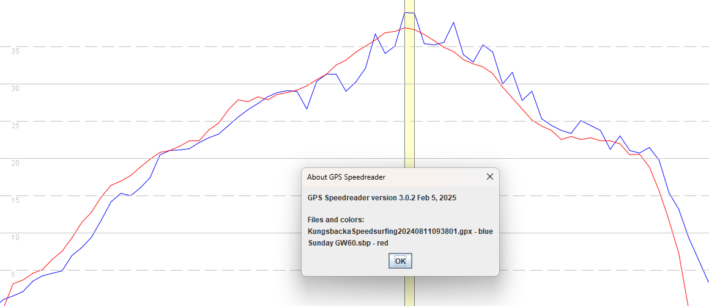
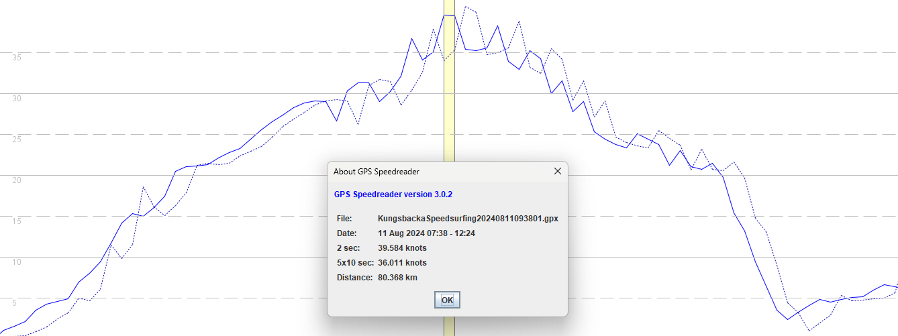

## 3.0508.0 - 15 Jul 2024

### Overview

The 3.0508.0 release in Jul / Aug 2024 exhibits issues because speedsurfing behaves much like windsurfing, which is non-doppler and thus prone to spikes. It was the first release for the APEX Pro and VERTIX to include the changes of [3.0506.0](../3.0506.0/README.md) which made the issues apparent.

The non-Doppler speed issues of 3.0506.0 and 3.0508.0 were [documented](../../doppler/README.md) on 19 Aug 2024 and fixed in [3.0508.0219](../3.0508.0219/README.md) beta.

In the absence of a public fix, owners of an APEX Pro or VERTIX with firmware 3.050x.0 (released Aug 2024) are encouraged to [downgrade](../3.0309.0/install.md) to 3.0309.0.

### Satellite Systems

| APEX Pro | VERTIX | APEX 2 | APEX 2 Pro | VERTIX 2 / 2S |
| :------: | :----: | :----: | :--------: | :-----------: |
|  20047   | 20047  | 3.1.0  |   3.1.0    |     3.1.0     |

### Example

The image below shows the very first file where an issue was spotted, where the VERTIX reported 2 knots higher than the GW-60.

When looking at the speeds in the FIT (solid blue) vs the position-derived speeds (dotted blue) it can be seen they are near identical. Since the position-derived speeds from Sony-based watches have always been prone to this level of sawtooth, it strongly suggests that is being used as the speed.

