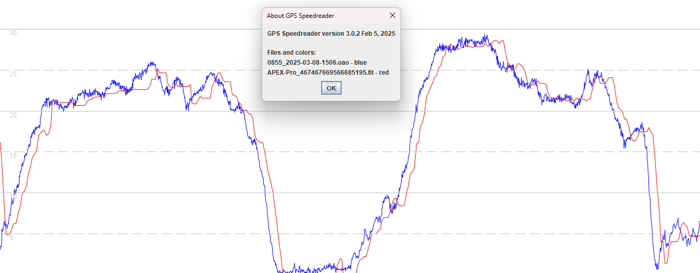

## 3.0508.0219 beta - 19 Feb 2025

### Overview

The 3.0508.0219 beta release in Feb 2024 fixes the issues introduced in the [3.0508.0](../3.0508.0/README.md).

Results are no longer exaggerated by position-derived speeds and artefacts of the Sony GNSS chipset are clearly evident, such as repeated speeds.

### Example

The image below shows a comparison of 3.0508.0219 beta on the APEX Pro against the Motion Mini.

It is notable how familiar artefacts are present, namely the propensity for the Sony GNSS chipset to repeat speeds, visible as flat spots.

It seems likely that repeated speeds are due to the [special algorithm](../../swinging/README.md) which handles "swinging of the receiver by the hand", which is the default setting.