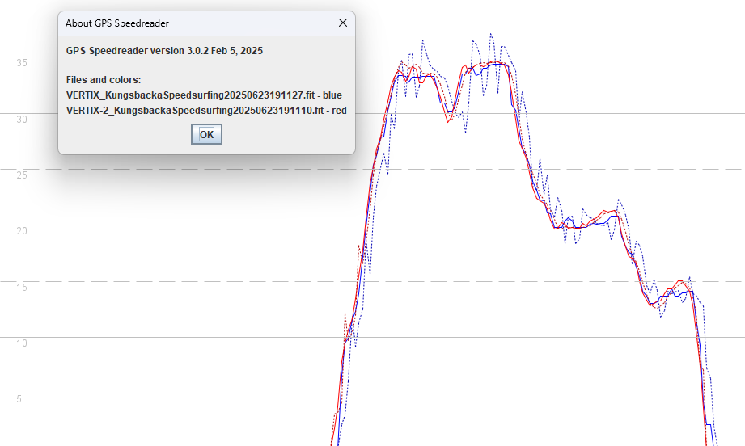

## 3.0510.0 - 2 Aug 2024 or 18 Jun 2025

### Overview

Confusingly, the version number for 3.0510 was re-used for different watches almost one year apart.

- 2 Aug 2024 = APEX 2 / APEX  2 Pro / VERTIX 2 / VERTIX 2S
- 18 Jun 2025 = APEX Pro and VERTIX

The 3.0510.0 release in Aug 2024 had issues because the speedsurfing activity behaved much like windsurfing, which is non-doppler and thus prone to spikes.

It has been observed that 3.0510.0 behaves in exactly the same way as [3.0508.0](../3.0508.0/README.md) and [3.0506.0](../3.0506.0/README.md) on the APEX 2 / APEX  2 Pro / VERTIX 2 / VERTIX 2S and thus it has the same issues. Most of the time it isn't a huge problem on the newer watches, but it is nevertheless an issue.

The APEX Pro and VERTIX have the Sony GNSS chipset and the use of non-Doppler speeds is a much bigger issue. It has been observed that 3.0510.0 behaves in exactly the same way as [3.0508.0](../3.0508.0/README.md) on the APEX Pro and VERTIX. Large errors will often occur with this firmware.

The following sections will show some screenshots from the APEX Pro and VERTIX on 23 June 2025, followed by a summary and actions.

#### APEX Pro

Here are two screenshots from a single APEX Pro session with firmware 3.0510.

- blue = APEX Pro
- red = Locosys GT-31

It can be seen the APEX Pro (blue) exhibits a lot of extreme sawtooth and the high values of the APEX Pro often exceed the GT-31 by multiple knots.

#### VERTIX

Here are two screenshots from a single VERTIX session with firmware 3.0510.

- red = VERTIX recording at 1 Hz
- blue = Locosys GW-60 recording at 5 Hz

It can be seen the VERTIX (red) also exhibits extreme sawtooth artefacts and the high values of the VERTIX often exceed the GT-31 by multiple knots.

### Position-Derived Speed

It is perhaps worth elaborating on why these the sawtooth artefacts of 3.0510.0 are likely due to the use of position-derived speeds.

The image below compares an VERTIX (blue) and VERTIX 2 (red) with working firmware. The solid lines are the speeds being recorded by the watches and the dotted lines are the position-derived speeds, calculated by GPS Speedreader. It should be noted just how extreme the sawtooth is for the VERTIX (dotted blue) and exactly the same characteristics are evident in the speeds recorded by 3.0510.0.

### Summary

Timeline:

- [3.0508.0](../3.0508.0/README.md) was released in July 2024 and introduced serious issues affecting the APEX Pro + VERTIX.
- For 6+ months COROS failed to recognise or acknowledge the issue, despite it being raised multiple times.
- [3.0508.0219](../3.0508.0219/README.md) beta was created in Feb 2025 which fixed the issue, essentially reverting to prior behavior.
- The fix was released publicly as [3.0509.0](../3.0509.0/README.md) in March 2025.
- COROS released 3.0510.0  in June 2025 which removes the fix in 3.0509.0, making the APEX Pro + VERTIX unreliable, again.

Actions:

- [3.0508.0](../3.0508.0/README.md) or 3.0510.0 can both be considered as highly unreliable. The same issue affects both versions.
- APEX Pro and VERTIX users with [3.0508.0](../3.0508.0/README.md) or 3.0510.0 should downgrade to [3.0309.0](../3.0309.0/install.md).
- COROS should fix this once and for all and take measures to ensure this does not re-occur in future.
- GPS-Speedsurfing should probably consider the suitability of the APEX Pro and VERTIX after one year of issues.
- APEX Pro and VERTIX users might consider one of the better watches which are now available.
