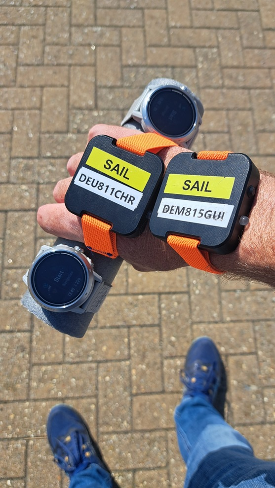
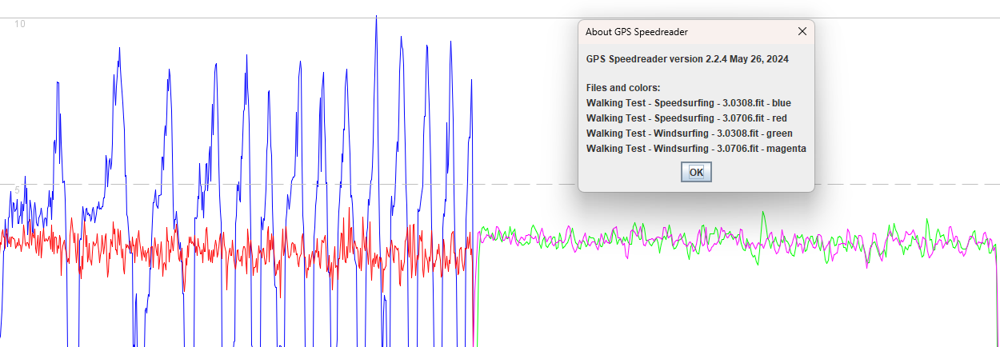
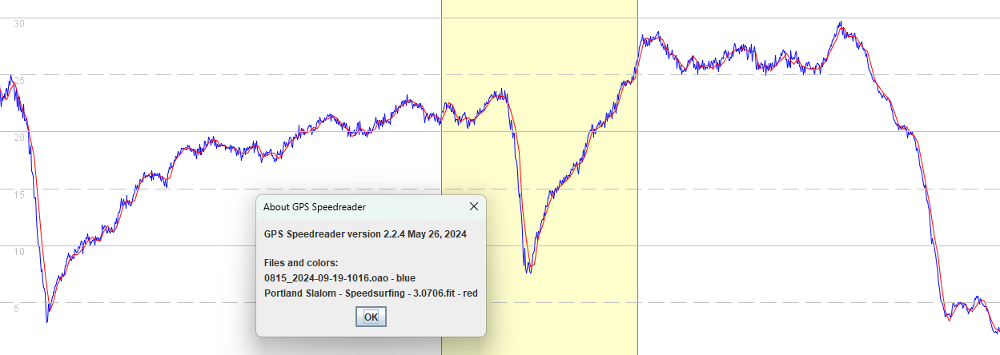
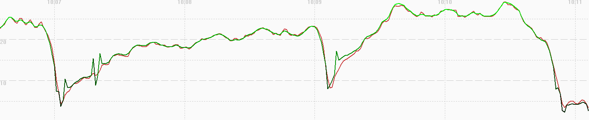
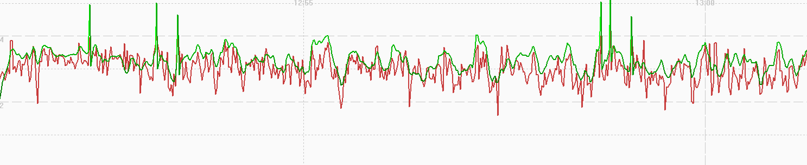
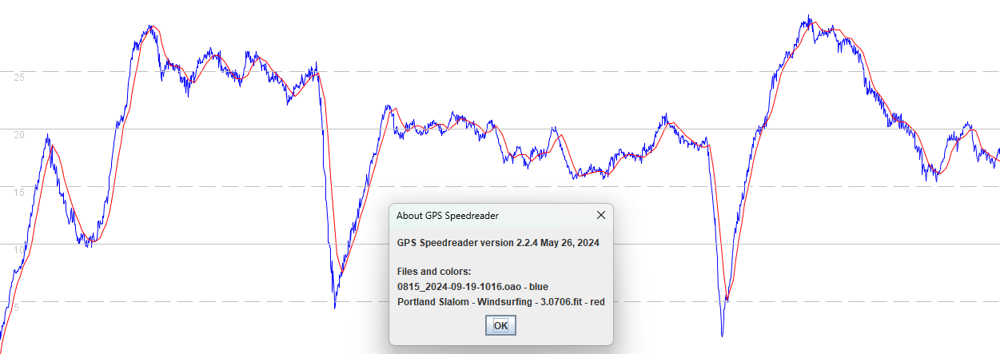
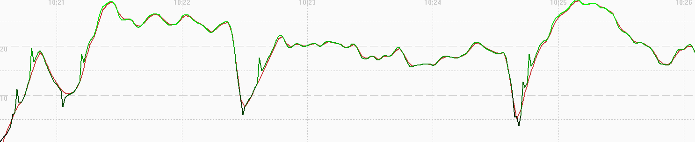
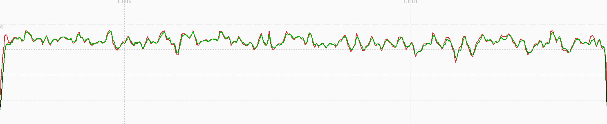

## 3.0706.0 beta

### Overview

The beta release 3.0706.0 appears to fix the issues seen between May and Aug 2024.

The beta has yet to be released for the APEX Pro and VERTIX. This will provide further evidence about the use of Doppler speeds.

### GNSS

| APEX Pro | VERTIX | APEX 2 | APEX 2 Pro | VERTIX 2 / 2S |
| :------: | :----: | :----: | :--------: | :-----------: |
|    ?     |   ?    | 3.1.0  |   3.1.0    |     3.1.0     |

### Low-pass Filtering

The short article about [sampling rates and aliasing](../../../../general/aliasing/README.md) provides the background required to understand this section.

A simple walking test used APEX 2 Pro watches to determine whether 3.0706.0 is using low-pass filtering for the speedsurfing activity.

The firmware releases 3.0308.0 and 3.0706 were tested simultaneously for speedsurfing and windsurfing activities.

- The speedsurfing activity exhibits aliasing in 3.0308.0 (blue) but low-pass filtering is evident in 3.0706.0 (red).
- The windsurfing activity exhibits heavier filtering than speedsurfing. The 3.0308.0 and 3.0706.0 data is very similar in nature (green and magenta).

### Speedsurfing

#### Sailing Test

Comparing the APEX 2 Pro with 3.0706.0 against the Motion GPS @ 5 Hz it can be seen that it can faithfully capture the board speeds.

The two devices are typically within 0.1 knots of each other for the majority of the time. Differences do occur but that is par for the course!

GPSResults can be used to compare the position-derived speeds (green) and doppler-derived speeds (red) of the speedsurfing activity.

It should be noted that COROS are applying custom filters to the positional data, clearly evident in the green trace (ignoring the spikes).

The doppler-derived speeds (red) contain more detail than the position-derived speeds.

#### Walking Test

GPSResults can be used to compare the position-derived speeds (green) and probable doppler-derived speeds (red) when walking.

It should be noted that COROS are applying custom filters to the positional data, clearly evident in the green trace (ignoring the spikes).

The doppler-derived speeds (red) appear to have passed through a low-pass filter; either within the Airoha chip or implemented by COROS.

### Windsurfing

#### Sailing Test

Comparing the APEX 2 Pro with 3.0706.0 against the Motion GPS @ 5 Hz it can be seen that there is more smoothing than speedsurfing, and the COROS does not accurately capture the low speeds during turns.

The COROS speeds are not nearly so close to the Motion when using the windsurfing mode. They are often out by several tenths of a knot and sometimes multiple knots, especially during sudden bursts of speed and when slowing down during turns.

GPSResults can be used to compare the position-derived speeds (green) and recorded speeds (red) of the windsurfing activity.

The windsurfing data is heavily filtered and is believed to be derived from the positional data, which would mean the speeds are non-Doppler.

The windsurfing activity behaves like many other [activities](../../activities/README.md) on the COROS watches - e.g. bike, flatwater, GPS cardio, etc.

#### Walking Test

GPSResults can be used to compare the position-derived speeds (green) and recorded speeds (red) when walking.

The windsurfing data is heavily filtered and is believed to be derived from the positional data, which would mean the speeds are non-Doppler.

The windsurfing activity behaves like many other [activities](../../activities/README.md) on the COROS watches - e.g. bike, flatwater, GPS cardio, etc.

### Summary

The initial test results for 3.0706.0 are very encouraging for the speedsurfing activity:

- The new firmware is believed to be recording the Doppler-derived speeds.
- Aliasing is not being observed whilst walking, which suggests that a low-pass filter is being employed by Airoha or COROS.
- The speed results closely match those of the Motion GPS.

Upcoming tasks:

- Test the new firmware on the APEX Pro and VERTIX, which were worst affected by the changes in 3.0508.0.
- Determine whether the APEX Pro and VERTIX with 3.0706.0 resemble 3.0309.0. This is an easy task, due to the Sony quirks.

Unknowns:

- It is not clear what was changed in 3.0706.0, perhaps this included one of the Airoha settings that were [suggested](../../smoothing/update.md) in Aug 2024?
- It is yet to be determined whether 3.0706.0 is still affected by the long-standing issue that causes [fantasy alphas](../../alpha/README.md).

