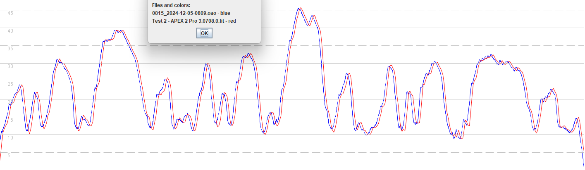

## 3.0708.0

### Overview

3.0708.0 performs in the same way as [3.0706.0](../3.0706.0/README.md) beta.

- It fixes the issues seen between May and Aug 2024 on the APEX 2 + APEX 2 Pro.
- The VERTIX 2 + 2S are broken and have reverted back to the behavior of 3.040x.0 in May 2024.

There is a tendency for the VERTIX 2 and 2S to report speeds that are too low, which is frustrating for anyone affected.

The issues affecting the VERTIX 2 and 2S appear to be resolved in [3.0708.1113](../3.0708.1113/README.md) which is a private beta, due for public release later in 2024.

### Satellite Systems

| APEX 2 | APEX 2 Pro | VERTIX 2 / 2S |
| :----: | :--------: | :-----------: |
| 3.1.0  |   3.1.0    |     3.1.0     |

### Quick Test

3 laps of a short test circuit were driven in a relatively open-sky environment. The total distance was almost exactly 5 km.

- The VERTIX 2 and APEX 2 Pro were both running firmware 3.0708.0.

- Motion 815 was recording at 5 Hz and Motion 1042 was recording at 1 Hz.

At the end of the drive the Vertix 2 was reporting a 2s result of 43.44 knots, which was 2 knots slower than the APEX 2 Pro showing 45.39 knots.

The 250 m results differed by 0.37 knots and the 500 m results differed by 0.78 knots, with the VERTIX 2 being the slower device.

### Quick Review

Comparing the APEX 2 Pro against Motion 815 @ 5 Hz they can be seen to be very similar. The high and low speeds are practically identical throughout the drive. The APEX 2 Pro data lags behind the Motion by around 1.5 seconds.

Comparing the VERTIX 2 against Motion 815 @ 5 Hz there is a clear issue, beyond the 1.5 second delay which was also present on the APEX 2 Pro.

Comparing the VERTIX 2 against the APEX 2 Pro eliminates any potential confusion caused by the delay, and clearly shows an issue.

### Summary

3.0708.0 performs in the same way as [3.0706.0](../3.0706.0/README.md) beta.

- It fixes the issues seen between May and Aug 2024 on the APEX 2 + APEX 2 Pro.
- The VERTIX 2 + 2S are broken and have reverted back to the behavior of 3.040x.0 in May 2024.

There is a tendency for the VERTIX 2 and 2S to report speeds that are too low, which is frustrating for anyone affected.

The issues affecting the VERTIX 2 and 2S appear to be resolved in [3.0708.1113](../3.0708.1113/README.md) which is a private beta, due for public release later in 2024.

