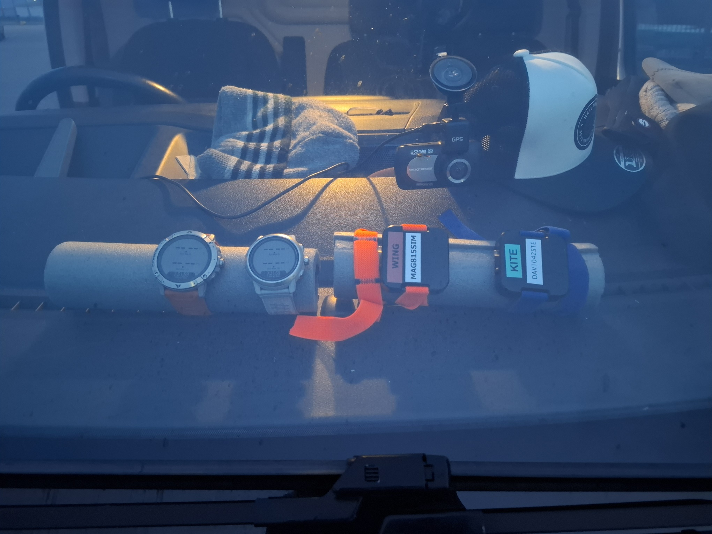
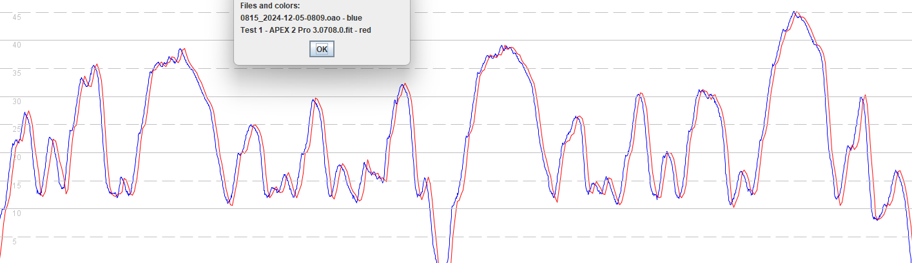
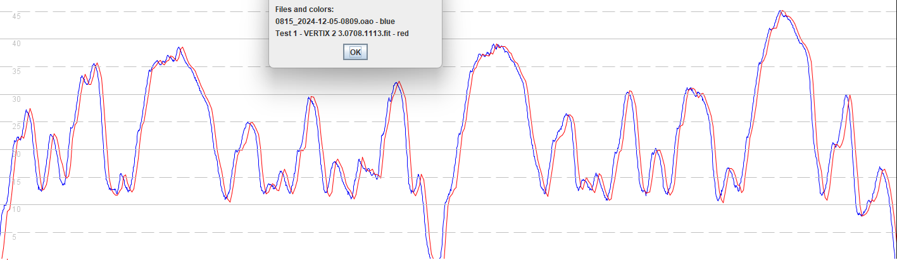
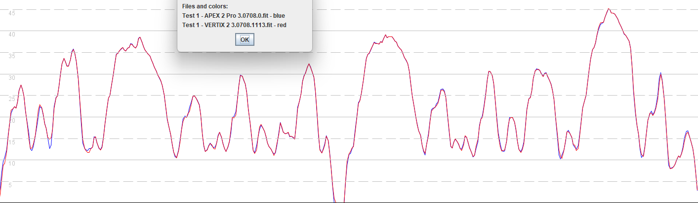

## 3.0708.1113

### Overview

3.0708.1113 appears to fix the speedsurfing issues that affected the VERTIX 2 and 2S in [3.0706.0](../3.0706.0/README.md) beta and [3.0708.0](../3.0708.0/README.md).

- It retains the fixes in 3.070x.0 for the APEX 2 + APEX 2 Pro.
- It fixes the issues seen in 3.070x.0 for the VERTIX 2 and 2S.

This will be very much welcomed by owners of the VERTIX 2 and 2S, who will no longer see their watches under-reporting their speeds! 

If you wish to install 3.0708.1113 on your VERTIX 2 / 2S then written [instructions](install.md) are now available!

### Satellite Systems

| APEX 2 | APEX 2 Pro | VERTIX 2 / 2S |
| :----: | :--------: | :-----------: |
| 3.1.0  |   3.1.0    |     3.1.0     |

### Quick Test

3 laps of a short test circuit were driven in a relatively open-sky environment. The total distance was almost exactly 5 km.

- The VERTIX 2 was running firmware 3.0708.1113.

- The APEX 2 Pro was running firmware 3.0708.0.
- Motion 815 was recording at 5 Hz and Motion 1042 was recording at 1 Hz.

At the end of the drive both watches were reporting very similar speeds, within a few hundredths of a knot.

Apologies but no photos were taken at the time!

### Quick Review

Comparing the APEX 2 Pro against Motion 815 @ 5 Hz they can be seen to be very similar. The high and low speeds are practically identical throughout the drive. The APEX 2 Pro data lags behind the Motion by around 1.5 seconds.

Comparing the VERTIX 2 against Motion 815 @ 5 Hz they can be seen to be very similar. The high and low speeds are practically identical throughout the drive. The APEX 2 Pro data lags behind the Motion by around 1.5 seconds.

Comparing the VERTIX 2 against the APEX 2 Pro eliminates any potential confusion caused by the delay, and shows how similar they were in behavior. There were just a couple of differences near the beginning of the test, but this isn't entirely unexpected as the GNSS signals are being acquired.

### Summary

3.0708.1113 appears to fix the speedsurfing issues that affected the VERTIX 2 and 2S in [3.0706.0](../3.0706.0/README.md) beta and [3.0708.0](../3.0708.0/README.md).

- It retains the fixes in 3.070x.0 for the APEX 2 + APEX 2 Pro.
- It fixes the issues seen in 3.070x.0 for the VERTIX 2 and 2S.

This will be very much welcomed by owners of the VERTIX 2 and 2S, who will no longer see their watches under-reporting their speeds! 
