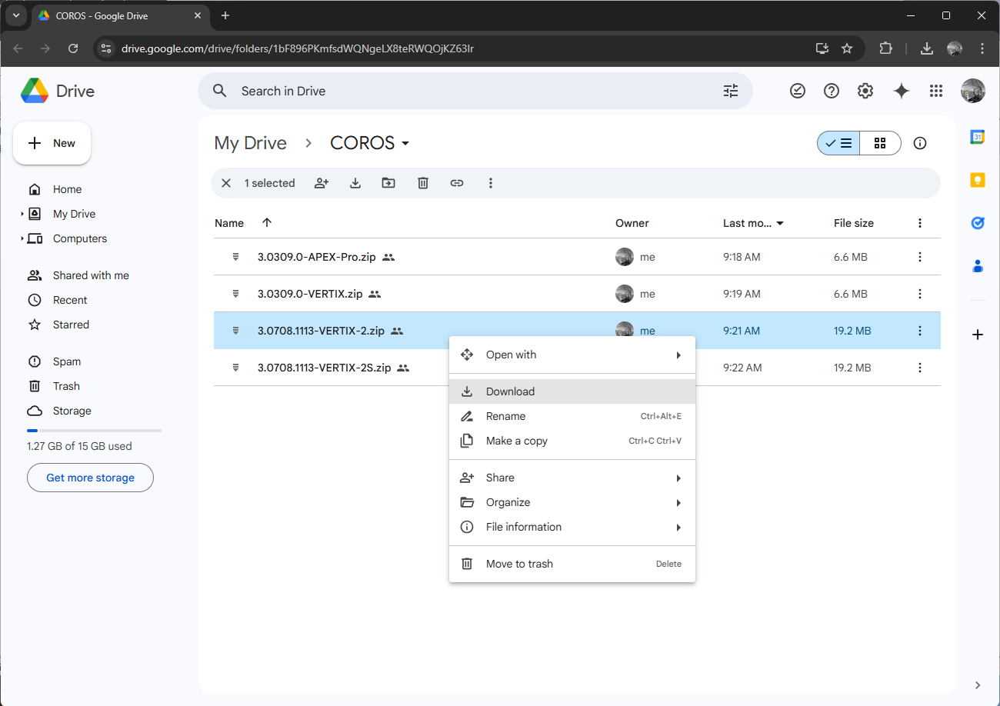
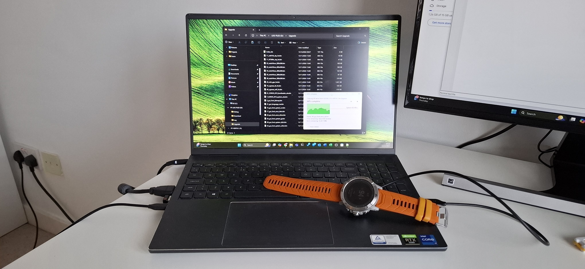
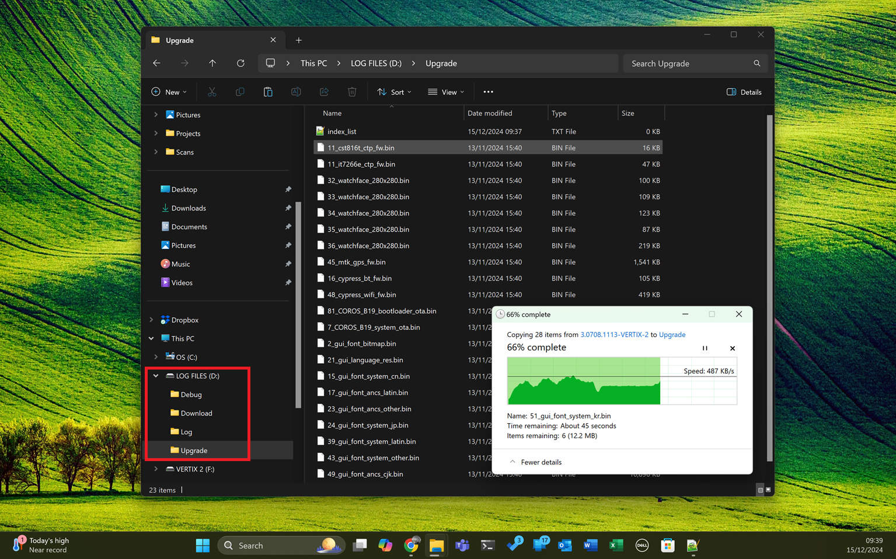
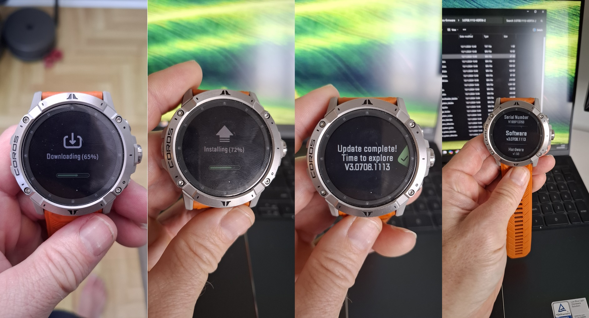

## VERTIX 2 + 2S - Beta Firmware

### Background

The speedsurfing mode on the VERTIX 2 and VERTIX 2S has been unreliable since firmware [3.0408.0](../3.0408.0/README.md) which was released in May 2024.

The problems are fixed in [3.0708.1113](README.md) beta, but the fix will not be in a public firmware release until late January 2025.

This page describes how to install [3.0708.1113](README.md) beta on your VERTIX 2 or VERTIX 2S.

The exact same issues used to affect the APEX 2 and APEX 2 Pro, but they were fixed in [3.0706.0](../3.0706.0/README.md) beta and [3.0708.0](../3.0708.0/README.md).

### Step 1 - Download Files to your Computer

The first step is to download the firmware from Google Drive.

There are ZIPs for various COROS watches, including the VERTIX 2 and VERTIX 2S.

The shortened URL for the folder is [https://tinyurl.com/4433d2mx](https://tinyurl.com/4433d2mx)

Click the link and download the appropriate ZIP to your computer.

### Step 2 - Copy Files to your Watch

Connect the watch to your computer and wait for two external drives to be listed - "LOG FILES" and "VERTIX 2" (or "VERTIX 2S").

Copy the contents of the ZIP file into the "Install" folder which is located on the "LOG FILES" drive.

The image below is a screenshot of the "LOG FILES" drive and "Upgrade" folder.

### Step 3 - Complete the Update

Wait for several seconds after the copy has completed then (ideally) eject the drive, or if you don't know how to eject a drive, simply unplug the watch from the computer.

The installation will then begin and will take several minutes. Once complete, you may wish to check your firmware via System -> More Settings -> Device Info -> Software.

### Wrap Up

Hopefully these instructions have helped you to install 3.0708.1113 beta on your VERTIX 2 or VERTIX 2S. Sorry, manual updates do require some technical skills!

COROS plans to ship the same fix(es) in their next public firmware release which is due late in January. This beta will allow you to enjoy reliable speeds in the meantime!
