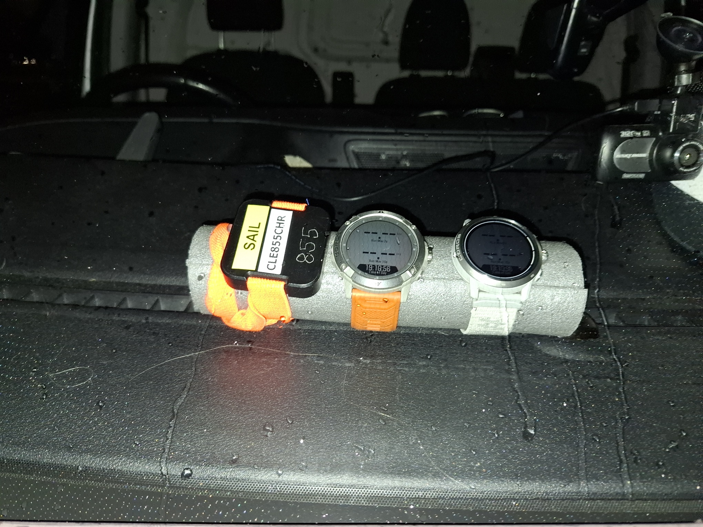
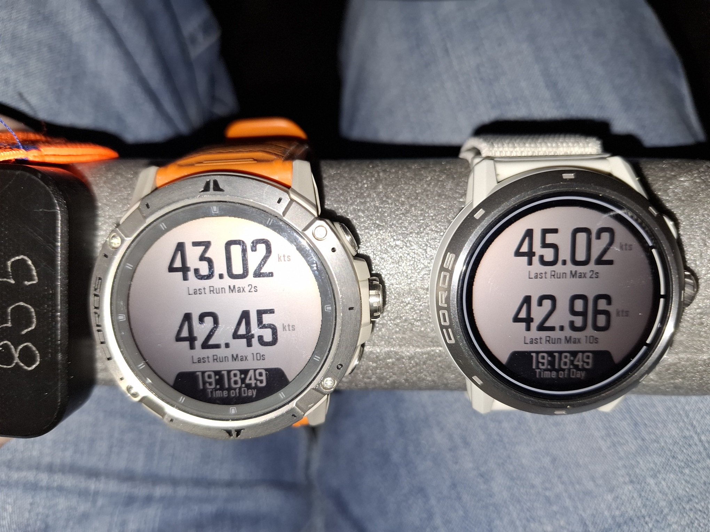
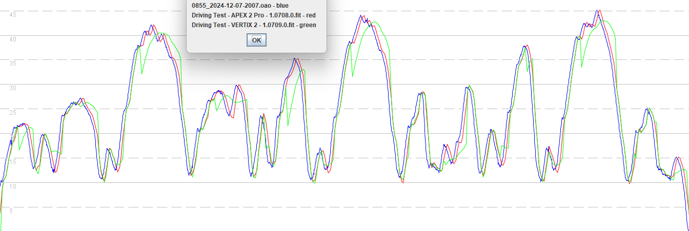

## 3.0709.0 - 3 Dec 2024

### Overview

3.0709.0 has been quickly tested on the VERTIX 2 + 2S but it exhibits the same issues as [3.0708.0](../3.0708.0/README.md) and [3.0408.0](../3.0408.0/README.md).

It does not include the fix that was present in [3.0708.1113](../3.0708.1113/README.md) (private beta) which performed well during testing.

There is a tendency for the VERTIX 2 and 2S to report speeds that are too low, which is frustrating for anyone who is affected.

The APEX 2 and APEX 2 Pro both work well when running 3.0709.0.

### Satellite Systems

| APEX 2 | APEX 2 Pro | VERTIX 2 / 2S |
| :----: | :--------: | :-----------: |
| 3.1.0  |   3.1.0    |     3.1.0     |

### Quick Test

3 laps of a short test circuit were driven in a relatively open-sky environment. The total distance was almost exactly 5 km.

- The APEX 2 Pro was running firmware 3.0708.0 which is known to be working properly and serves as a benchmark.
- The VERTIX 2 was running firmware 3.0709.0.
- The Motion GPS was recording at 5 Hz.

At the end of the drive the Vertix 2 was reporting a 2s result of 43.02 knots, which was 2 knots slower than the APEX 2 Pro showing 45.02 knots.

### Quick Comparison

Comparing the APEX 2 Pro (red) against the Motion (blue) they can be seen to be very similar. The high and low speeds are practically identical throughout the drive. The APEX 2 Pro data lags behind the Motion by around 1.5 seconds.

The VERTIX 2 (green) is clearly not recording high speeds correctly, exhibiting the same behavior as the 3.040x.0 and 3.070x.0 releases. This is disappointing because it means the fix that was in [3.0708.1113](../3.0708.1113/README.md) (private beta) has not been included.

### Summary

3.0709.0 has been quickly tested on the VERTIX 2 + 2S but it exhibits the same issues as [3.0708.0](../3.0708.0/README.md) and [3.0408.0](../3.0408.0/README.md).

It does not include the fix that was present in [3.0708.1113](../3.0708.1113/README.md) (private beta) which performed well during testing.

There is a tendency for the VERTIX 2 and 2S to report speeds that are too low, which is frustrating for anyone who is affected.

The APEX 2 and APEX 2 Pro both work well when running 3.0709.0.
