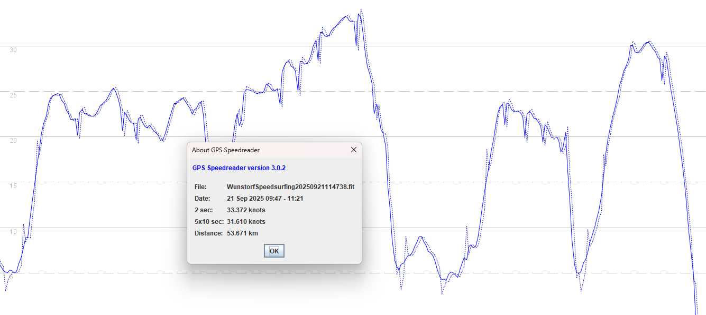

## 3.0808.0 - 15 Jan 2025 or 19 Aug 2025

### Overview

Confusingly, the version number for 3.0808.0 was re-used for different watches roughly 7 months apart.

- 15 Jan 2025 = APEX 2 / APEX  2 Pro / VERTIX 2 / VERTIX 2S
- 19 Aug 2025 = APEX Pro and VERTIX, broken (again)

3.0808.0 has been tested on the VERTIX 2 and APEX 2 Pro.

- The VERTIX 2 now works properly and the issues of firmware 3.07xx.0 + 3.04xx.0 have been resolved.
- The APEX 2 Pro continues to work properly, just like it did with firmware 3.07xx.0.

The VERTIX 2S and APEX 2 have not been tested, but are assumed to perform just like the VERTIX 2 and APEX 2 Pro.

In the absence of a public fix, owners of an APEX Pro or VERTIX with firmware 3.0808.0 are encouraged to [downgrade](../3.0309.0/install.md) to 3.0309.0.

### Satellite Systems

| APEX 2 | APEX 2 Pro | VERTIX 2 | VERTIX 2S |
| :----: | :--------: | :------: | :------: |
|   ?    |   3.1.0    |  3.1.0   | ?         |

### Quick Test - VERTIX

This file was recorded on a VERTIX with FW 3.0808.0.

I conclude that it is broken (again) for the following reasons.

- Dips occur at the same time in both the recorded speed (solid blue) and position-derived speed
- There are no repeated speeds as one would expect from the Sony chipset
- There is no restricted precision to approximately 0.1 kts as one would expect from Sony-based COROS watches

In the absence of a public fix, owners of an APEX Pro or VERTIX with firmware 3.0808.0 are encouraged to [downgrade](../3.0309.0/install.md) to 3.0309.0.

### Quick Test - VERTIX 2 and APEX 2 Pro

3 laps of a short test circuit were driven in a relatively open-sky environment. The total distance was almost exactly 5 km.

- The VERTIX 2 and APEX 2 Pro were both running firmware 3.0808.0.
- Motion 825 was recording at 5 Hz.

At the end of the test drive the data from the APEX 2 Pro and VERTIX 2 were compared to the motion. The speeds during one of the laps is shown in the screenshot below.

This quick visual check is enough to confirm that the filtering issues that affected firmware 3.07xx.0 on the VERTIX 2 (and firmware 3.04xx.0 on both watches) have been resolved.

