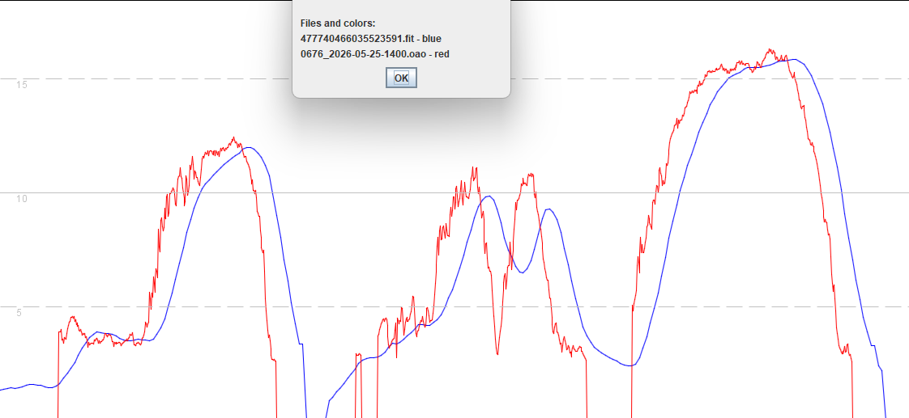
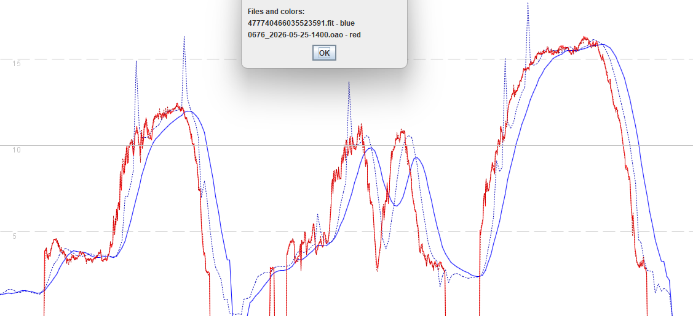

## 3.0910.0 - 3 Apr 2025

### Overview

3.0910.0 is horribly broken, so I will document the issues when time allows.

Motion in red, VERTIX in blue. Obviously over-filtered / smoothed and not sure whether it is Doppler.

Same image, but also showing position-derived speeds of VERTIX as dotted lines.
