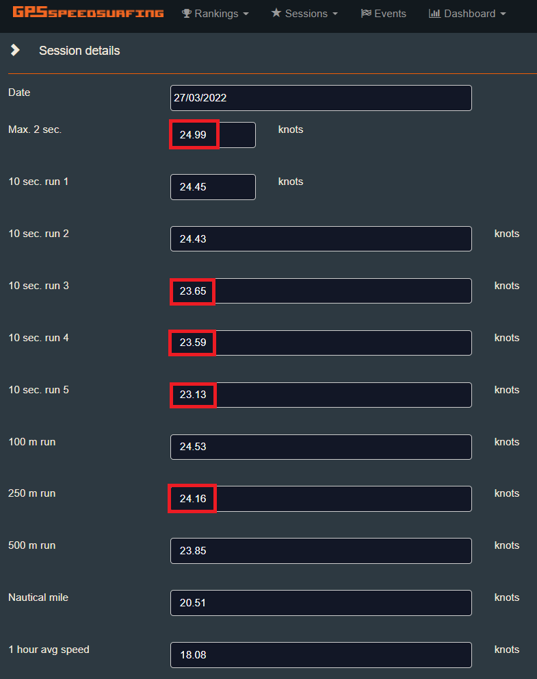

## COROS Data Issues

Author: Michael George

Created: 2 April 2022

Updated: 24 April 2022

### APEX Pro + VERTIX

The issues that I have observed can be placed into two distinct categories:

- Minor glitches in the way that results are calculated on the APEX Pro during a session.
- Inadequacies in the Doppler speed data that is recorded every second.

The first category can be considered a minor irritation but the second category is somewhat disappointing for a premium sports watch.

### Minor glitches in real-time results

#### Missing Runs

The screenshot below is taken from a light wind foiling [session](https://logiqx.github.io/gps-guides/sessions/20220327/) on 27 Mar 2022. It's worth saying that whilst racking up a distance of 39 km, I did a lot more than 11 runs in total. I definitely wasn't doing runs that were close to 4km in length!

I believe the reason for this discrepancy in the run count is related to the "speed into a run" setting used by the APEX Pro to decide when runs begin and end. If your gybes do not drop below the specified speed (12 knots) then the watch doesn't think that you've finished one run and started another.

This may be fine during a true speed sailing session because you will tend to actually stop at the end of a run. However, when you are simply blasting back and forth it leads to "missing" runs on the watch and in the COROS app.

#### Differences in Results

It is often the case that APEX Pro results are slightly different on the phone / COROS app and GP3S website. The COROS app always shows the exact same speeds that were displayed on the APEX Pro during the session. The GP3S website always shows speeds matching the FIT data which can be exported from the COROS app and analysed offline.

The screenshot below shows how the uploaded results differed to the speeds shown on the APEX Pro and in the COROS app (above). This might simply be due to converting between different speed units, rounding, converting to other units and rounding again but I don't know for sure.

Any big differences in the 5 best 10s runs (e.g. 10s run #5) are almost certainly due to runs being ignored as a consequence of the "speed into run" logic. It's slightly irritating but not the end of the world since the runs get processed correctly during the upload to GP3S or during offline analysis of the FIT data.

#### Alpha 500m

Alpha results displayed on the APEX Pro (and in the COROS app) can be very misleading.

For example, I've had a 27 knot alpha reported when I did a really fast gybe on speed kit which didn't quite qualify as an alpha. I thought I'd beaten my PB by 2 knots so it was quite disappointing to see it absent after uploading the session to GP3S.

The most ridiculous alpha result that I've seen so far was during a light wind wing session on 21 Mar 2022. I have absolutely no idea why the APEX Pro reported a 26 knot alpha when my fastest 2s of the session was a mere 15.71 knots!

Fortunately, alpha results are correct when posted to GP3S and when the FIT file is analysed offline but it is worth knowing they can be highly spurious on the APEX Pro itself and in the COROS app.

### Inadequacies in the Doppler Speed Data

The issues described above are just minor annoyances but actual data issues are more disappointing and can be summarised as follows:

- Repeated speeds are very common in APEX Pro data (e.g. exactly the same speed for 5 or 6 seconds) and I've even seen speeds repeated for as long as 12 or 13 seconds.
- The resolution of Doppler speed data is only to within 5 cm/s. This is 5 times lower than devices from Locosys and 50 times lower than specialised devices such as the Motion.

#### Repeated Speeds

It is common to see repeated speeds in data from the APEX Pro. The screenshot below compares the same 500m run recorded on the Locosys GT-31 (blue) and COROS APEX Pro (red). You might be forgiven for thinking that the COROS has done a better job with the smoother looking plot:

However, there are lots of repeated speeds in the APEX Pro data which is completely unrealistic. I suspect this may be some kind of smoothing being done by the APEX Pro itself or by the Sony GPS chip. Combined with the next issue (low resolution speed data) it results in unrealistically consistent speeds being recorded.

When looking across a number of runs it is clear that there are lots of flat regions in the APEX Pro data (red), showing no apparent change of speed.

The above comparison with GT-31 data is from a light wind foiling [session](https://logiqx.github.io/gps-guides/sessions/20220327/) on 27 Mar 2022 but the chart below combines three windsurfing sessions recorded by a [friend](https://logiqx.github.io/gps-guides/sessions/contacts/newm/) on his COROS VERTIX. The chart illustrates that repeated speeds for 5 or 6 seconds are not uncommon in the data and can be go on for as long as 13 seconds. This simply isn't realistic for a windsurfer, let alone when speeds are recorded to 3 decimal places!

#### Low Resolution Doppler Speeds

I completed a detailed [investigation](../resolution/README.md) into the apparent low resolution of Doppler speeds logged by the APEX Pro. I would encourage you to take a read if you are interested in how I determined the resolution of speed data on various GPS devices.

TLDR: I was also able to prove that the resolution of speeds recorded by the VERTIX is 5 cm/s and produced a nice chart (below) by combining the data from my friend's three [sessions](https://logiqx.github.io/gps-guides/sessions/contacts/newm/). Speeds below 8 knots (4 m/s) occasionally appear to have a higher resolution (although it could just be noise) but higher speeds are always around 5 cm/s.

The reason that this matters is because it is much lower than devices from Locosys (GT-31 / GW-52 / GW-60) which have a speed resolution of 1 cm/s and Motion which is 1 mm/s. The resolution of 5 cm/s is equivalent to a precision of around 0.1 knot, 1 decimal place.

This discovery might go some way to explaining why so many identical speeds can be seen continuously for several seconds in the APEX Pro data. A combination of smoothing and low precision results could perhaps connect both of these data issues.

It's worth noting that this may also affect other devices with the Sony GPS chip; e.g. Garmin, Suunto and Polar devices launched between 2018/2019 and 2021. I will confirm this when I get hold of some data from the various devices.

For full details, please see the [investigation](../resolution/README.md) into low resolution Doppler speeds on the APEX Pro.

### Track Data

You can find all of the tracks on [GitHub](https://github.com/Logiqx/gps-guides) under sessions/20220327/tracks.

