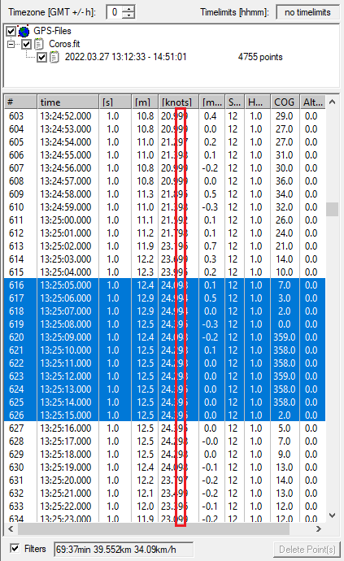

## Doppler Speed Resolution

Author: Michael George

Created: 2 April 2022

Updated: 24 April 2022

### Introduction

I recently decided to determine the "resolution" of Doppler speeds being recorded by various GPS devices; Locosys GW-52 + GW-60, COROS APEX Pro and Motion Mini.

This investigation has been written up in detail after identifying that the COROS APEX Pro produces much lower resolution Doppler speeds than one might reasonably expect.

I'll start this article by summarising the significance of accuracy, precision and resolution in various real-world situations, before going specifics relating to speeds being recorded by the COROS APEX Pro and other popular GPS devices.

## Accuracy / Precision / Resolution

### Precision and Accuracy

#### Example 1 - Athletics

When I used to compete as a 400m + 400m hurdler we were usually hand-timed during competitions. A timekeeper would be responsible for our individual results and used a regular stopwatch showing times to 2 decimal places. Whatever time was on the stopwatch got rounded upwards to the nearest 10th of a second; e.g. 49.90s would become 49.9s whereas 49.91s would become 50.0s.

Major events typically had electronic timing using video technology and although the machines showed 3 decimal places the final results were converted to 2 decimal places. The same method of rounding hand-times was utilised for electronic times but to the nearest 100th of a second; e.g. 49.990s would become 49.99s whereas 49.991s would become 50.00s.

The number of decimal places in the final result is the precision. 50.0 is inherently different to 50.00 because the number of decimals indicates the method of timing and what rounding may have occurred. Hand-timing is by it's very nature less accurate than electronic timing which is why the precision was different for the two methods of timing.

The final results never have decimal places added or removed; e.g. 50.0 should not be stated as 50.00 and vice versa.

#### Example 2 - Speed Cubing

Another niche sport (debatable use of the word "sport") that I have participated in is [speedcubing](https://en.wikipedia.org/wiki/Speedcubing) where [Stackmat](https://www.speedsolving.com/wiki/index.php/StackMat) timers are used during competitions and often during practice. These timers are by the virtue of their design very accurate. The competitor places both hands on the timer and the timer only starts when they lift their hands to reach for the cube. At the end of the solve the competitor puts down the cube and places both hands back on the timer to stop the clock.

Initially the timers only showed 2 decimal places but in 2011, newer timers showed 3 decimal places. To ensure a level playfield regardless of 2 digits and 3 digits a decision was made to ignore the third decimal. A two digit display showing 10.99 essentially means the timer hasn't yet reached 11 seconds (but could potentially be 10.999) so a three digit display showing 10.99x was also be regarded as being 10.99 as it had not reached 11 seconds.

I've included this particular example because despite the use of high accuracy Stackmat timers, precision is intentionally limited to 2 decimal places, despite 3 decimal places being available on the newer timers.

#### Example 3 - Weighing Scales

If I were to stand on some scales and tell you that I weigh "about 75kg" then in reality, I probably saw a number somewhere between 74.5 kg and 75.5 kg. If I said "exactly 75 kg" or "75.0 kg" and you know the scales display one decimal then you can reasonably conclude that I saw 75.0 on the display. However, in the absence of any additional information it would be spurious to write down 75.0 kg (or even 75.00 kg) based on me just saying "75 kg".

The 75 kg / 75.0 kg example relates to the precision of the scales but it says nothing about the accuracy of the measurement. If I were to stand on the same scales repeatedly and always see 75.0 kg then it suggests something about the precision (i.e. 1 decimal place / 3 significant figures) but nothing about the accuracy. If the scales are only accurate to within +/- 2 kg, I could potentially weigh anything between 73.0 kg and 77.0 kg.

So, precision and accuracy are essentially unrelated, although it may be argued that high accuracy measurements are not particularly useful if the precision of the reporting is low. Conversely, high precision reporting is somewhat spurious if the the measurements are inaccurate. Whilst precision and accuracy are essentially different / independent they are both important.

#### Example 4 - GPS-SpeedSurfing

GPS-Speedsurfing.com (GP3S) essentially uses 2 decimal places for speeds being posted and how they are displayed.

Whilst software such as GPSResults uses 3 decimal places for results, uploads to GPS-Speedsurfing will be subject to rounding. Speeds get rounded to the nearest hundredth so 39.994 becomes 39.99 whereas 39.995 becomes 40.00.

Note: Speeds may sometimes be displayed using zero, one or two decimals. This can be seen in one of my recent [sessions](https://www.gps-speedsurfing.com/?mnu=user&val=175922&uid=2640) where the average is shown as "41.9 (42.5 42.48 42.13 41.36 41.04)"

i.e. The average (41.90 knots) and fastest run (42.50 knots) of this session are both displayed with one decimal.

### Resolution

I'm going to use the word "resolution" to describe measurements that can only use a subset of the possible values.

e.g. Let's say that a GPS can report speeds to two decimal places but is limited to .00 .25 .50 and .75.

Whilst it is true to say that the device is using two decimal places, it has only got 4 possible values after the decimal point, rather than the full set of 100 possible values. The precision is actually 25 times lower than expected from 2 decimal places.

To avoid potential confusion with precision (despite being so closely related to resolution), I'll refer to this example as having a "speed resolution" of 0.25 knots. In this example the low "speed resolution" limits the list of possible decimals to .00 .25 .50 and .75.

### Significant Figures

You'll probably recall being taught about "significant figures" at school, probably during a maths or science lesson.

If asked to calculate the average weight of people in a single household, based solely on each of each persons weight to the nearest kg it would be spurious to provide an answer such as 78.893524 kg, instead of a simple 79 kg after rounding.

The [rules of significance arithmetic](https://en.wikipedia.org/wiki/Significance_arithmetic) can be used to determine the appropriate number of significant figures to represent the result of a calculation. Ideally, significance rules should also be applied to the results from GPS devices with known precision and speed resolution.

Once again, I'll re-iterate that precision (and resolution) say nothing about the accuracy of the measurement. They do however let us determine the number of significant figures after any conversions (e.g. cm/s to knots) and how many decimals are appropriate when displaying the result.

## GPS Devices

### Overview

The table below shows the "speed resolution" that I have identified for my own GPS devices.

The methodology that I used to identify the resolutions will be explained later in this article.

|                                   | COROS APEX Pro | Locosys GW-52 + GW-60 | Motion Mini |
| --------------------------------- | ------------------- | -------------------------- | ---------------- |
| Doppler "speed resolution"        | 5 cm/s              | 1 cm/s                     | 1 mm/s           |
| Resolution in km/h                | 0.18                | 0.036                      | 0.0036           |
| Resolution in knots               | 0.09719             | 0.01944                    | 0.001944         |
| Approximate resolution in km/h    | 0.2                 | 0.04                       | 0.004            |
| Approximate resolution in knots   | 0.1                 | 0.02                       | 0.002            |
| Appropriate no. of decimal places | 1                   | 2                          | 3                |

Note: The "speed resolution" doesn't necessarily tell us anything about the accuracy of the speeds being calculated and reported by the GPS. It only indicates the precision and the appropriate number of decimal places to display.

TBH it is somewhat disappointing to see such a low "speed resolution" from the COROS APEX Pro, considering the relatively high price and when considering other known [shortcomings](../data-issues/README.md) relating to the GPS data quality.

### Investigations

#### COROS APEX Pro

##### Initial Observations

It was whilst looking at a track from the COROS APEX Pro that I decided to undertake this investigation.

Putting aside that COROS speeds are often repeated every second (which is concerning in its own right), I noticed that the vast majority of speeds recorded by the COROS had a second decimal digit of "9". I've highlighted this observation in red to make it more obvious.

I thought this was curious so I exported the whole track as a CSV and plotted a histogram to see the frequency distribution of the 3 decimals. This chart confirmed that the second decimal digit did indeed tend to gravitate towards "9"; e.g. decimals of 090-099, 190-199, 290-299, etc.

Looking at the last 2 digits of all the speeds also results in an interesting frequency distribution. The histogram shows that over 80% of the speed readings in my session had a last 2 digits of 95-99 and the other 20% were either 89-94 or 00-01.

It's looked like the COROS speed data was/is essentially constrained to within 0.1 of a knot which was very surprising.

This made me really, really curious... what... how... why?

##### Further Investigations

To dig further, I downloaded a couple of tools to convert the FIT file into something easier to analyse.

I used the tools [FitCSVTool](https://developer.garmin.com/fit/download/) and [FitConVerter 4.60](https://www.pinns.co.uk/osm/fit.html) to convert the original FIT file into CSV files.

- The FIT format apparently stores speeds as an integer (mm/s)
- FitCSVTool (created by Garmin) outputs speeds in m/s to 3 decimal places.
- FitConVerter outputs speeds in tenths of a kilometer per second to 5 decimal places, somewhat bizarrely!
- Despite the different units, speeds present in both of the CSV files were confirmed to be the same.

As an aside, whilst looking at the output of FitCSVTool, I was also able to confirm the presence of three "developer fields" in the FIT data from the COROS APEX Pro. These "developer fields" are recorded every second, supplementing the standard activity data in FIT files such as longitude, latitude, distance and speed:

- "Sat" - number of satellites (integer)
- "hdop" - horizontal dilution of precision (1 decimal place)
- "cog" - course over ground (integer)

By sorting all of the speed data (working in mm/s), I was able to plot a chart that showed that the differences between distinct speed values were always approximately 50, or approximately a multiple of 50.

Converting 50 mm/s to knots gives 0.1 knots which is consistent with the original observations described earlier.

Just out of curiosity, I zoomed in to discover that 50, 52 and 53 are the most common intervals.

The explanation for the slight variations will almost certainly be due to a floating point to integer conversion; either performed by the APEX Pro itself or the onboard GPS chip.

Having confirmed that all of the unique speed values within the FIT file were separated by around 50mm/s, I produced one final plot showing the frequency distribution for all of the speeds after converting to cm/s. This chart shows clear gaps which are not present in the equivalent charts for other GPS devices, later in this article.

##### Coincidence!

The initial observation relating to a "9" as the second decimal is a curious coincidence of the mathematics behind the scenes. When converting a speed from mm/s (or m/s) to knots and when dealing with speeds that are always close to being a multiple of 50-ish, you end up with operations which almost cancel out and result in speeds slightly under multiples of 0.1 knots.

To convert a speed, which we'll call "s" from mm/s to knots, we can use the following formula:

- knots = s / 1,000,000 * 3,600 / 1.852

We can ignore the divide by 1,000,000 (converting from mm to km) because it only moves the decimal point.

3,600 / 1.852 comes to slightly under 2,000 and when multiplied by "s" (multiple of 50-ish), the result typically ends up as a multiple of 0.1 knots. Well, just under to be precise, hence the "9" observation but I've skimped slightly in my explanation, trying to simplify somewhat.

This is the probable explanation for over 93% of all speeds in the track analysed showing a "9" in the second decimal place, when reported in knots... it's something of a freaky coincidence!

##### Conclusions

Despite the FIT protocol representing speeds in mm/s the COROS is clearly recording speeds with a resolution of around 50 mm/s or 5 cm/s. This means the actual precision of the COROS data is basically 50 times lower than one might suspect if simply referring to the FIT specification.

With an actual speed resolution of 50 mm/s or 5 cm/s (around 0.2 km/h or 0.1 knots) it is essentially recording speeds with a precision equivalent to 1 decimal place when reporting in km/h and knots. This is really quite surprising (and disappointing) for a premium sports watch with a dedicated speed sailing mode.

#### Locosys GW-52 + GW-60

The GW-52 and GW-60 tracks (SBP files) were converted to CSV files using GW52Util and GW60Util.

The speeds are integers (cm/s) and it was noted that the full resolution of 1 cm/s was being used by both devices.

1 cm/s is approximately 0.04 km/h or 0.02 knots so it makes sense to report GW-52 and GW-60 speeds to 2 decimal places.

#### Motion Mini

For practical reasons the 1HZ GPX file from the Motion Mini was used for this piece of analysis, instead of the 10 Hz OAO file.

The speeds are integers (mm/s) and it was observed that the full resolution of 1 mm/s was being used by the Motion Mini.

Due to 10x the number of possible speeds, relatively short session and 1 Hz data (not 10 Hz), not all values were confirmed as being possible but the data was plenty good enough to show that the Motion Mini does indeed have a speed resolution of 1 mm/s.

1 mm/s is approximately 0.004 km/h or 0.002 knots so it makes sense to report speeds from the Motion to 3 decimal places, unless it is shown that the GPS accuracy doesn't warrant such high levels of precision when reported.

### Summary

The precision and speed resolution of the Motion Mini > Locosys GW-52 and GW-60 > COROS APEX Pro.

The Motion Mini has a resolution 10 times higher than the Locosys GW-52 and GW-60; 1 mm/s versus 1 cm/s.

The Locosys GW-52 and GW-60 have a precision 5 times higher than the COROS APEX Pro; 1 cm/s versus 5 cm/s.

Displaying 2 or 3 decimal places for speeds coming out of the COROS APEX Pro is misleading when 1 is more appropriate.

### Tracks and Analysis

All of the tracks and Excel analysis are available in the [session](https://logiqx.github.io/gps-guides/sessions/20220327/) dated 27 March 2022.

Further analysis and arguably better charts was undertaken for Mark's [sessions](https://logiqx.github.io/gps-guides/sessions/contacts/newm/) from 2021.
