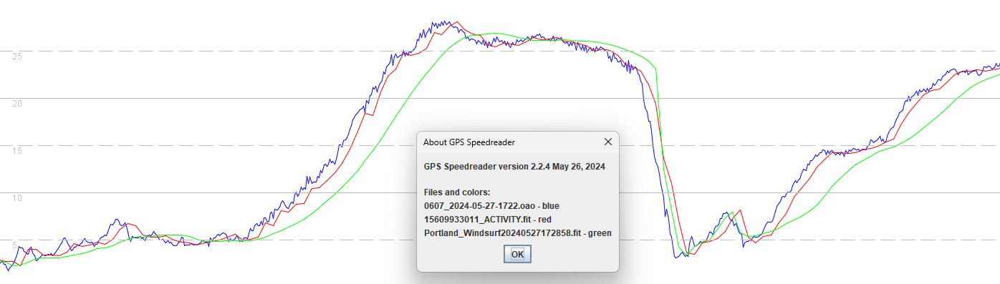
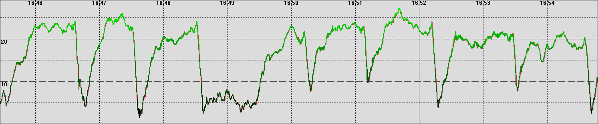

## Smoothing Issues

### Overview

Firmware V3.0408.0 for COROS watches has introduced problems that adversely affect speedsurfing activities.

Analysis of recent sessions from the APEX 2 Pro and VERTIX 2 has shown that the speed data is no longer as good and tends to under-report our speeds. Worst affected are the max 2s results which are typically around 0.6 or 0.7 knots slower with the new firmware, but sometimes over a knot slower.

This document will illustrate the issue and provide some visual examples.

### Devices

Three devices were worn for testing and analysis:

- Motion Mini - our benchmark device which uses the u-blox M10 chipset, logging at 5 Hz
- Garmin Forerunner 255
- COROS APEX 2 Pro - firmware V3.0408.0

n.b. The Forerunner 255 and APEX 2 Pro both use the Airoha AG3335M chipset, or similar.

### Test Session

A number of sessions have been analysed but this document will just report on a speedsurfing session from 27 May 2024

The behavior described in this document is common to all sessions using the new firmware, so this session should be regarded as typical.

The table below shows a comparison of max 2 second results:

|      | Motion | Garmin | COROS |
| ---- | ------ | ------ | ----- |
| 1    | 28.73  | 28.67 | 27.82 |
| 2    | 28.30  | 28.30 | 27.60 |
| 3    | 27.87  | 27.90 | 27.03 |
| 4    | 27.83  | 27.83 | 26.54 |
| 5    | 27.46  | 27.39 | 26.42 |
| average   | 28.04  | 28.02 | 27.08 |

Notes:

- The Forerunner 255 is typically within 0.1 knots of the benchmark device.
- The APEX 2 Pro is consistently reporting lower speeds than the other two devices, and 1.3 knots lower in the case of run 4.

#### Visual Comparison

Since run 4 is so different it will be illustrated in this section. The first graph is showing this run according to the Motion Mini.

The green line is the speed derived from positional data (latitude + longitude) and red line is the speed derived from the Doppler observable. The two measures are very similar because the u-blox chipset makes use of carrier smoothing, improving the pseudorange observable.

The second graph shows the same run according to the Forerunner 255. The data is more choppy than that of the Motion (typical of sports watches) but it is still a good representation of this particular run. The doppler-derived speed (red) is less noisy than the position-derived speed (green) which is what one would expect from a typical consumer-grade GNSS chipset. The doppler-derived speeds are consistent with the data from the Motion.

The third graph shows the same run according to the APEX 2 Pro. For now, let's ignore the spikes in the position-derived speeds (green) which are always been present in COROS data from the VERTIX, VERTIX 2, APEX Pro, APEX 2 Pro. What is most problematic is the smoothing that was implemented in firmware V3.0408.0, shifting the doppler-derived speed data by several seconds and making it quite artificial.

The COROS recorded a max 2s for this specific run which was 1.3 knots lower than the Motion and Forerunner 255, whereas in the past I always found the COROS to be comparable to the other devices.

The graph shown below is a comparison of the 3 devices. The COROS (green) and Garmin (red) used to be almost identical to each other, just slightly delayed from the Motion (blue). The new firmware in the COROS has caused the data to be delayed by a few more seconds during periods of acceleration and steady speeds, but the delay reduces during periods of deceleration. The smoothing also reduces the top-end speeds, obviously affecting 2s and 10s runs the most.

### Multiple Runs

It is possible to show just just how different the behavior of the COROS has become by showing a longer time period - e.g. 9 minutes.

The first graph is from the Motion Mini and can be regarded as the benchmark. Green = position-derived speed, red = doppler-derived speed.

The second graph is from the Forerunner 255 and it is possible to see how the doppler-derived speed (red) is far less noisy than the position-derived speed (green). A visual comparison of the doppler-derived speed against the data from the Motion shows a pretty solid performance.

The final graph shows the behavior of the APEX 2 Pro with firmware V3.0408.0. The position-derived speeds (green) contain a lot of weird spikes during periods of acceleration. The doppler-derived speeds (red) have been aggressively smoothed, visibly delayed and there are some strange dips evident during periods of acceleration.

### Smoothing Artefacts

It is clear that the COROS watches are smoothing the positional data and speed data, somewhat independently of each other. The implementation of smoothing varies by the activity type, but this document will focus solely on the speedsurfing activity.

Weird spikes have always been evident during periods of acceleration all COROS watches; including the VERTIX + APEX Pro (Sony chipset) and VERTIX 2 + APEX 2 Pro (Airoha chipset). The speedsailing community has largely ignored these artefacts, since we care most about the the doppler-derived speeds, but these artefacts (highlighted in blue) do suggest issues with the accuracy of latitude and longitude during periods of acceleration.

The doppler-derived speeds are now being aggressively smoothed, due to the recent firmware releases (V3.0408.0 and V3.0409.0). There are also some peculiar dips during periods of acceleration. The nature of the smoothing and the strange dips during periods of acceleration do however provide a clue into why this might be occurring.

### Two Years Ago

The image below is related to my testing of the Garmin Fenix 7 in April 2022. The smoothing of the doppler-derived speeds and the strange dips during periods of acceleration share more than a passing resemblance with the latest COROS firmware. The Fenix 7 is another watch that uses the Airoha AG3335M chipset, and my suspicion is that the smoothing is a "feature" of the chipset that Garmin had activated.

Garmin watches no longer exhibit this behavior with modern firmware, so it would appear that whatever "feature" of the Airoha was being used back in 2022, they don't use it nowadays. This type of smoothing does way more harm than it does good for activities that are focused on speed, but it is potentially useful for activities that simply want to report a steady pace, despite any swinging of the arm; running, walking, SUP, etc.

### Next Steps

I have yet to find time to do any analysis of the other activity modes, so this document focuses solely on matters relating to the speedsurfing community. IMHO, COROS should undo the change that went into firmware V3.0408.0 (also present in V3.0409.0), at least for the speedsurfing activity, ideally ASAP.

It would also be worthwhile looking more closely at the spikes affecting latitude and longitude during periods of acceleration. These are apparent in COROS watches, regardless of whether they use the Sony chipset or the Airoha chipset. These artefacts affecting latitude and longitude aren't apparent when looking at the the comparable Garmin watches.

It's slightly ironic that the unapproved Garmin Forerunner 255 that I am testing (costing £250) produces better speed data than my approved APEX 2 Pro (£450). Reverting back to the behavior of the previous firmware will at least ensure that the doppler-derived speeds can be trusted from COROS watches, comparable to the Motion and Garmin.

I hope this document will help in resolving the issues that I have highlighted. It's windy, so I'm heading to the water!
