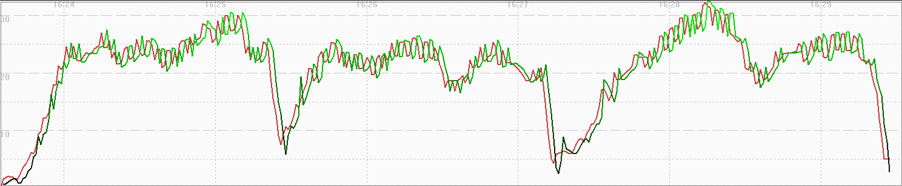
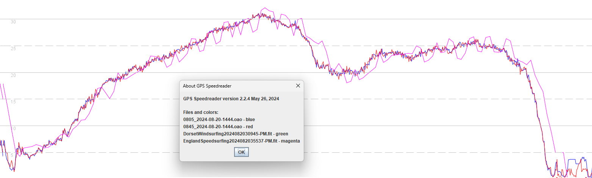

## COROS Smoothing Issues - Aug 2024

Author: Michael George

Created: 22 Aug 2024

### Introduction

This document has been created to provide information that may help to resolve the current issues relating the speedsurfing and windsurfing activities on COROS watches.

It will start with some general background which supplements previous documents, then take a look at the settings of the Airoha AG3335M in the hopes that the root cause of the issues can be resolved.

The goal is to restore the previous accuracy of the speedsurfing mode on all COROS watches; Sony and Airoha GNSS chipsets. The windsurfing mode should also be changed to use exactly the same filtering (or lack thereof) as the speedsurfing mode.

### Background

Firmware V3.0408.0 for COROS watches introduced [smoothing issues](README.md) that adversely affected the speedsurfing activity. This issue was thought to have been resolved in the beta firmware V3.0506.0 which was officially launched in July as V3.0508.0.

Since the V3.0408.0 issue did not affect the APEX Pro or VERTIX there was no expectation that their firmware would be affected by the fix. It has now come to light that there is a new (and arguable worse) [non-doppler issue](../doppler/README.md) present on all COROS watches - Sony and Airoha GNSS chipsets.

The available Airoha technical documentation has been reviewed, attempting to identify settings which may relate to the COROS issues.

### Data Examples

The image below shows the problematic data from a speedsurfing session recorded on an APEX 2 Pro with firmware V3.0408.0.

The green line shows position-derived speed (using latitude + longitude), and the red line shows the speed provided by the Airoha chip.

The next image is from exactly the same time, but recorded by a Garmin Forerunner 255 (Airoha AG3335M) using the "other" activity profile.

The fix in V3.0506.0 appeared to remove the disparity of the issue in V3.0408.0, but additional filtering / smoothing was clearly evident:

The nature of the fix in V3.0506.0 / V3.0508.0 was not apparent until issues were spotted in Aug 2024, affecting the VERTIX and APEX Pro:

Comparing the APEX Pro speeds (magenta) against our two benchmark devices (u-blox M10 chipset, red and blue) shows the data quality issue:

Note: This is just a typical session, we have many worse examples for the APEX Pro and VERTIX using V3.0508.0.

### How it Happened

The changes in V3.0506.0 / V3.0508.0 are thought to be the same for the earlier watches (APEX Pro and VERTIX) as the newer watches (APEX 2, APEX 2 Pro, VERTIX 2, VERTIX 2S). It's hard to be 100% sure that the changes were applied universally, but it seems likely.

Since the original problem did not affect the older watches using the Sony GNSS chipset there was no testing of V3.0506.0 beta on the VERTIX or APEX Pro. The obvious issues now affecting the VERTIX and APEX Pro may be caused by the use of positional data for speeds, instead of the speed calculated by the Sony chip.

This is particularly bad for the COROS watches using the Sony chipset, but also bad for the newer models using the Airoha AG3335M. We expected a tweak to some parameters of the AG3335M, not a wholesale change which (apparently) discards the speed from the GNSS chip.

### Airoha Settings

It is worth noting that Garmin watches also experienced the Airoha issues seen in V3.0408.0 over two years ago. They subsequently found a fix which didn't rely upon filtering / smoothing, but no attempt has been made to determine when their issue was resolved.

The windsurfing / speedsailing community need the same quality speedsurfing data (or better) as we enjoyed back in April 2024. We believe the best way to achieve this goal is to identify and fix the root cause of the issue found in May 2024.

We do not have access to the Airoha_IoT_SDK_for_GNSS_Developers_Guide, so relient on Airoha documentation from SIMCom, Quectel, and Robu.in. Their documentation has been sufficient to provide a list of possible causes for the issue in V3.0408.0.

Topics to explore:

1. Power saving modes
2. Activity modes
3. Fix rate

These topics will be discussed individually in the following sections.

#### Power Saving Modes

Airoha chipsets provide a number of different power saving modes:

- GPS Low Power (GLP)
- Adaptive Low Power (ALP)
- Fitness Low Power (FLP)
- Ultra Low Power (ULP)
- Periodic Power Saving

Power saving options are attractive for sports such as ultra-running and ultra-endurance cycling but they are unnecessary for windsurfing / speedsurfing. Power saving comes at the expense of data quality which in most sports is not hugely important, but for a sport that measures performance using instantaneous top speeds, power saving is highly undesirable.

Power saving could be one of the reasons for the issues seen on the APEX 2 Pro, VERTIX 2 and VERTIX 2S with V3.0408.0. Speedsurfing and windsurfing modes should switch off all power saving options, regardless of whether they caused the issue in V3.0408.0. Power saving will inevitably lead to spikes, which are commonly seen on COROS watches using regular GPS mode for the windsurfing activity (e.g. 50 knots instead of 20 knots).

The following proprietary Airoha (PAIR) commands can be used to turn off all forms of power saving:

- 680 PAIR_GLP_ENABLE - only applies to 1 Hz, GPS only, fitness navigation mode
- 690 PAIR_PERIODIC_SET_MODE
- 700 PAIR_ULP_ENABLE - only applies to fitness navigation mode
- 730 PAIR_FLP_ENABLE - only applies to fitness navigation mode
- 732 PAIR_ALP_ENABLE - only applies to normal and fitness navigation modes

All of these power saving features should be disabled for speedsurfing and windsurfing activities.

#### Activity Modes

Airoha provide a number of activity modes which have different dynamic models, filters and limits:

|      | Name       | Max Altitude (m) | Max Speed (m/s) |
| ---- | ---------- | ---------------- | --------------- |
| 0    | Normal     | 10000            | 100             |
| 1    | Fitness    | 10000            | 30              |
| 2    | Aviation   | 10000            | ?               |
| 3    | Balloon    | 80000            | ?               |
| 4    | Stationary | 10000            | 10              |
| 5    | ?          | ?                | ?               |
| 6    | Drone      | 10000            | 30              |
| 7    | Swimming   | 10000            | 10              |
| 8    | ?          | ?                | ?               |
| 9    | Bike       | 10000            | 30              |

The filtering / smoothing observed in COROS watches running V3.0408.0 may be due to an inappropriate activity mode being selected.

The navigation mode is set by the following proprietary Airoha (PAIR) command:

- 080 PAIR_COMMON_SET_NAVIGATION_MODE

Along with the power saving features, activity modes are perhaps the most likely cause of the issue in V3.0408.0.

#### Fix Rate

It is notable that when capturing raw data from Garmin devices using the same Airoha chipset, artefacts due to arm movement are evident. This is predictable (basic [sampling theory](https://en.wikipedia.org/wiki/Nyquist%E2%80%93Shannon_sampling_theorem)), but is described here because there is a chance it is related to the fix that Garmin implemented.

The example below is from a u-blox logger generating fix solutions at 10 Hz, but logging at 5 Hz and 1 Hz. The true cadence of the arm movement is captured by the 5 Hz data (red), but aliasing is clearly evident when logging at 1 Hz (blue).

This is well understood and explained by the Nyquist theorem, but it is interesting to note that the Forerunner 255 (red) exhibits the same aliasing as the 1 Hz u-blox chip (blue). The Forerunner 255 is using exactly the same AG3335M chip as the COROS watches.

We can only speculate how Airoha have implemented down-sampling within the AG3335M, but it is conceivable that changing the fix rate may trigger other changes of behavior, dynamic models, and / or filters being applied.

The fix rate (and NMEA output rate) are set by the following proprietary Airoha (PAIR) commands:

- 050 PAIR_COMMON_SET_FIX_RATE - default = 1000 ms
- 062 PAIR_COMMON_SET_NMEA_OUTPUT_RATE - default = every 1 fix, range = 0 to 20

If the issue in V3.0408.0 cannot be remedied by disabling the power saving modes (or selecting a different activity mode) then it is probably worth experimenting with these two parameters.

#### Other Settings

The CPU frequency seems less likely to be related, but it might be relevant:

- 106 PAIR_COMMON_SET_CPU_FREQ_LEVEL

We don't think active interference cancellation (AIC) is relevant to this issue:

- 074 PAIR_COMMON_SET_AIC_ENABLE

Definitely unrelated to this issue, but pertinent to the quality of PVT solutions:

- 058 PAIR_COMMON_SET_MIN_SNR - default = 9
- 072 PAIR_COMMON_SET_ELEV_MASK - default = 5

We are not proposing that COROS experiment with minimum SNR or elevation mask at this time, just mentioning them for completeness.

### Way Forward

Speedsurfing mode should be recording the Sony / Airoha data without an additional filtering / smoothing applied. It is particularly important that the speeds calculated by the GNSS chipsets (doppler-derived) are unfiltered. The windsurfing mode should really handle the GNSS data in exactly the same way as speedsurfing, because they are both used by the same community, wanting to know the same thing - trustworthy speeds.

The requirement of the speedsurfing community is to regain the data quality that we had in April, so that we can compete on a level playing field.

To achieve this goal there are two main activities:

1. Roll back the speedsurfing code to how it was prior to V3.0408.0.
2. Address the underlying issue(s) relating to the Airoha speeds in V3.0408.0.

Fixing the root cause must be possible, because Garmin had exactly the same issue over 2 years ago, and have subsequently resolved it.

Hopefully the information in this document will prove to be helpful in diagnosing and fixing the underlying issue(s).

### References

We do not have access to the Airoha_IoT_SDK_for_GNSS_Developers_Guide, so we have used Airoha documentation from SIMCom, Quectel, and Robu.in.

- [SIMCom SIM68D Series NMEA Message User Guide](https://en.simcom.com/technical_files.html?pro_cat=10&pro_li=71&time=0&filetype=0) - confirmed as [AG3335M](https://www.avnet.com/wps/wcm/connect/onesite/3a0ea576-cf1b-4a79-8479-5fff508b3c01/EBV-IoT+-+SIMCom+GNSS+Modules+Info+Sheet.pdf?MOD=AJPERES&CVID=nxzMVxi&CVID=nxvsTVu&srsltid=AfmBOopCaoUOA7bpMqRLKpTbZg2-YQLGgqttJoFp0sA4-TuMiJUObcdp)
- [Quectel LC29H Series & LC79H (AL) GNSS Protocol Specification](https://forums.quectel.com/uploads/short-url/gJTnPOK8MkEJIgLFR7QgjvrpUey.pdf) - confirmed as [AG3335 platform](https://www.quectel.com/news-and-pr/gnss-lc29h-launch/)
- [REYAX RYS352x PAIR Command Guide](https://robu.in/wp-content/uploads/2024/07/RYS352x_PAIR_Command_Guide.pdf)

