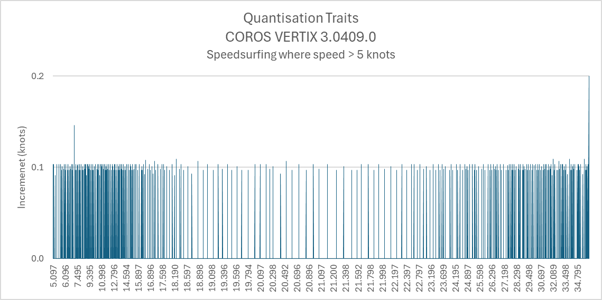
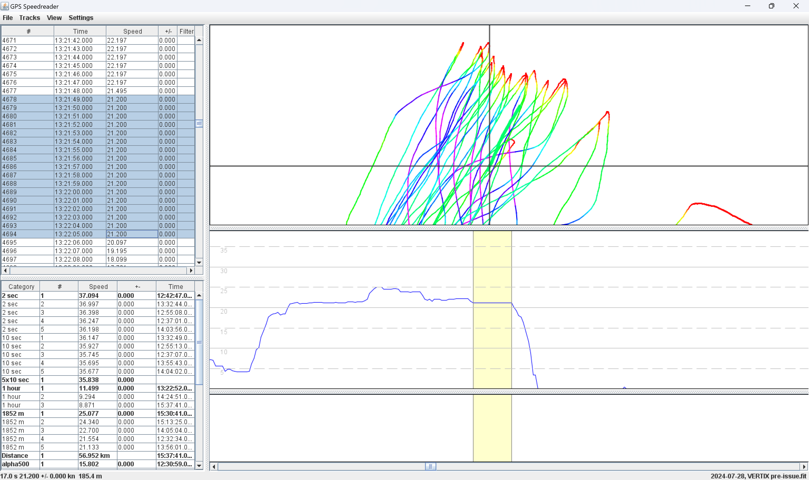
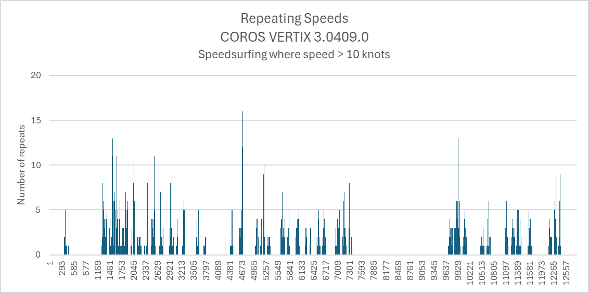
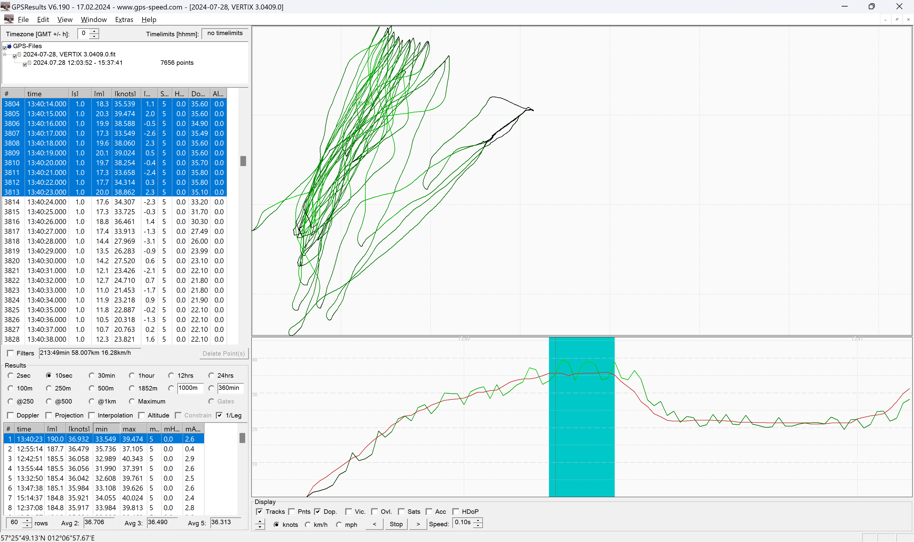
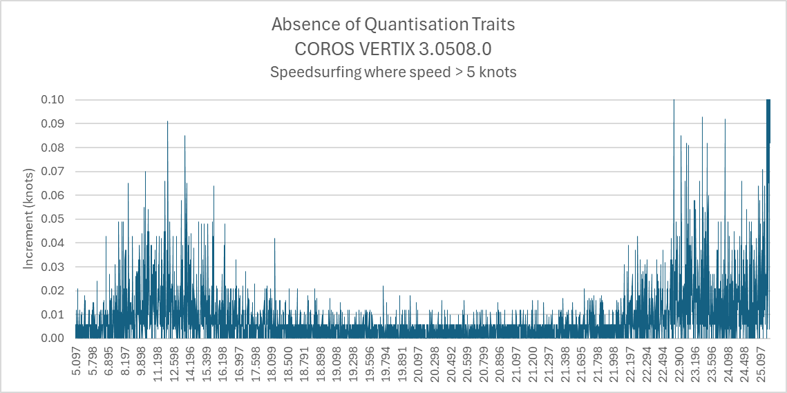
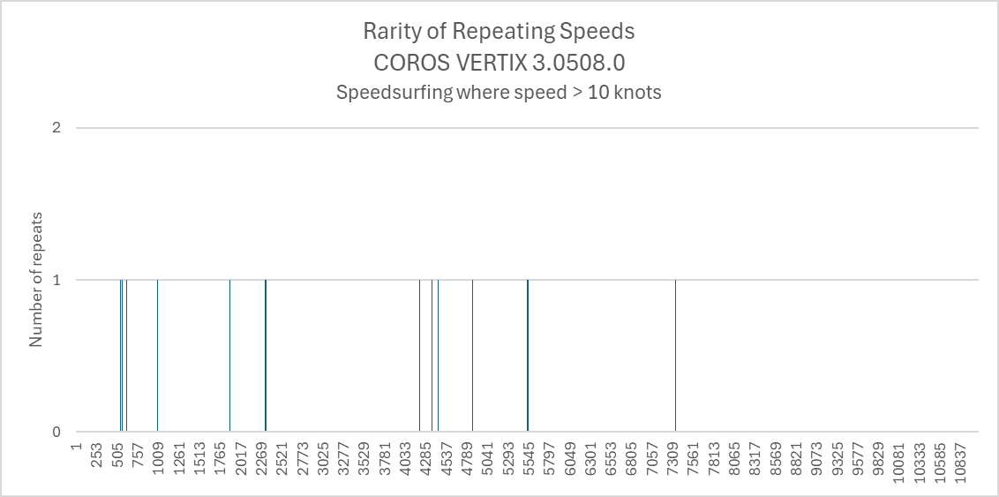
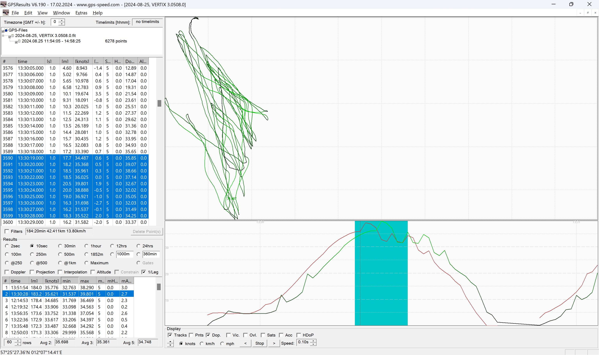

## COROS - Sony Traits

Author: Michael George

Created: 1 Jan 2025

### Overview

COROS speedsurfing activities from the Sony CXD56xxxx chipset have always had a number of traits / characteristics, making them easily identifiable. It is worth noting tat these traits are not unique to COROS watches.

The Sony traits have always been present in speedsurfing data of the VERTIX and APEX Pro, including firmware 3.0409.0. It should be noted that the same traits are also present in data from Garmin and Suunto watches using the Sony CXD56xxxx.

The reason for documenting the Sony traits on this page is to demonstrate that the VERTIX and APEX Pro watches changed their speed processing in firmware  3.0508.0, which was released in Aug 2024.

All of the data and the Excel workbook used in this article can be downloaded using the link(s) at the end.

### Original Behavior

#### Quantization 

In April 2022, I wrote an [article](../resolution/README.md) about the resolution of speeds being recorded by the APEX Pro and VERTIX.

The resolution / quantization effect can easily be demonstrated by sorting all of the speeds within a file, then displaying the differences as a simple chart (see below).

TLDR - Quantization is evident in the speed data and there is a resolution of around 0.1 knots.

#### Repeating Speeds

In April 2022, I wrote an [article](../issues/README.md#repeated-speeds) describing how speeds will often be repeated, sometimes for more than 15 seconds.

The image below shows a VERTIX speedsurfing session from 28 Jul 2024, where the a speed of 21.200 knots was recorded continuously for 17 seconds. This is clearly unrealistic but something that the Sony chipset does quite regularly.

Repeated speeds are a feature of the CXD56xxxx chipset and are also evident in watches from the likes of Garmin and Suunto.

Whilst 17 seconds was the most extreme example of repeating speeds during this particular session, repeating speeds appear throughout the track as shown by the chart below.

#### Doppler-derived Speed

It should be noted that the explanations of quantization and repeated speeds both relate to the speed data in the FIT file. The speed data is believed to be the speed over ground (SOG) being output by the Sony CXD56xxxx. It is also believed to be Doppler-derived, but with quantization trait and repeating speeds that are believed to be due to the Sony chipset.

The chart below compares the (assumed) Doppler-derived speeds (red) and position-derived speeds (green). Despite the shortcomings of the Doppler-derived speed from the Sony chipset, it is still a lot less noisy than the position-derived speeds. It is also less prone to reporting speeds which are several knots higher than the reality. 

### New Behavior

#### Firmware 3.0508.0

The feature release in Aug 2024 significantly changed the behavior of speedsurfing on the VERTIX and APEX Pro. The quantization trait and repeated speeds both disappeared and the speed data now appears to be derived from the positional data.

Evidence of changes can also be illustrated by looking for quantization traits, repeating speeds and differences between the speed data and positional data in the FIT.

#### Quantization 

The quantization trait which was evident up until 3.0409.0 has clearly disappeared.

Whilst the quantization trait (resolution of 0.1 knots) was never desirable, there has clearly been a change in 3.0508.0.

Note: It was never clear whether the original quantization trait was due to the COROS firmware, or due to the Sony chipset.

#### Repeating Speeds

The tendency of the Sony CXD56xxxx to report identical speeds for many seconds was also evident until 3.0409.0.

This trait has been present on Garmin and Suunto watches using similar Sony chipsets, but it disappeared in 3.0508.0.

Note: It was never clear whether this trait was due to filtering (e.g. handling swinging arms), or duty-cycling in the Sony chipset.

#### Doppler-derived Speed

The quantization trait and repeated speeds were never desirable, but they make the change(s) in 3.0508.0 very apparent.

The biggest problem with 3.0508.0 is that what was originally thought to be the Doppler-derived speed has been replaced by something that contains noise closely resembling the position-derived speeds.

The screenshot below compares the speed (red) and position-derived speed (green) from the FIT file. The COROS watches never used to show such a close correlation prior to 3.0508.0 and the new behavior is extremely undesirable.

As a consequence of the change in 3.0508.0, the speedsurfing community has started to see a lot of inaccurate speeds (too high) being recorded. This issue has been verified by multiple riders using high accuracy GPS loggers during side-by-side testing.

### Summary

The speed data in FIT files from the VERTIX and APEX Pro clearly changed in 3.0508.0. Hopefully this short document gives an insight into how the changes became apparent, besides people recording unrealistic speeds.

It would appear that the speed data is being derived from the positional data when using firmware 3.0508.0, rather than the (assumed) Doppler-derived speed data as it was in 3.0409.0 (and prior).

### Data

All of the data relating to this article is available for download - [sony-traits.zip](sony-traits.zip)

- VERTIX data - sessions with 3.0409.0 and 3.0508.0
- APEX Pro data - sessions with 3.0409.0 and 3.0508.0
- Fenix 6 data - illustrates repeated speeds from the Sony chipset
- Excel analysis - VERTIX data used in this article
