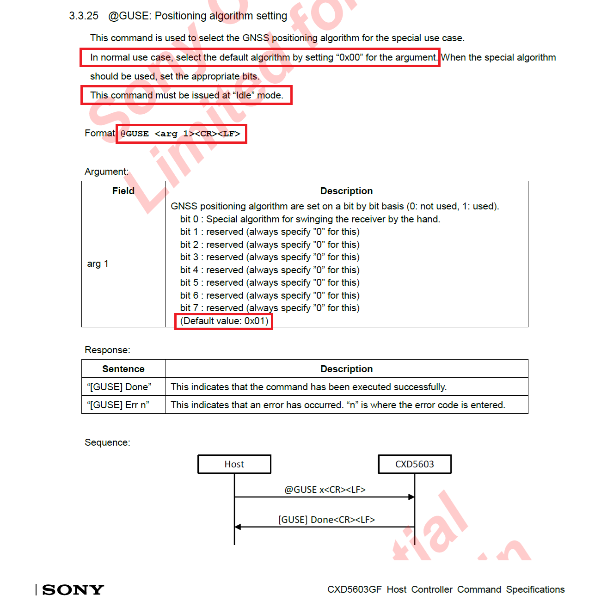

## COROS Repeating Speeds

Author: Michael George

Created: 16 Mar 2025

### Overview

The APEX Pro and VERTIX have a tendency to produce repeating speeds when using the speedsurfing activity.

The chart below compares the speedsurfing mode of an APEX Pro with firmware 3.0508.0219 (red) against a Motion GPS recording at 5 Hz (blue).

Repeating speeds from the Sony GNSS chipset are clearly evident, and visible as flat spots on the graph above.

### Possible Cause

Documentation for the Sony CXD5603GF describes how the default GNSS positioning algorithm is a special algorithm for the "swinging of the receiver by the hand". Such an algorithm would be beneficial for activities such as walking and running, but undesirable for windsurfing and speedsurfing. The special algorithm could well be the cause of repeating speeds on the APEX Pro and VERTIX.

It would be well worth testing the default positioning algorithm for both windsurfing and speedsurfing modes - i.e. `@GUSE 0` or `@GUSE 0x00`. This may remedy the long-standing issue of repeating speeds on the APEX Pro and VERTIX. It is also worth noting that repeating speeds are also evident on Garmin watches that uses a Sony GNSS chipset, presumably for the same reason.

### Reference

Sony CXD5603GF user manual.

