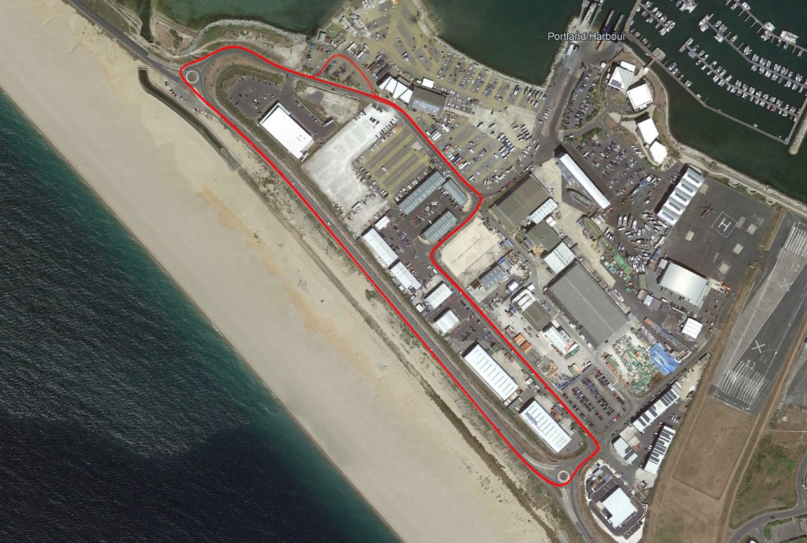

## COROS Activity Comparison

Author: Michael George

Created: 28 Aug 2024

### Background

This article attempts to show the differences between speedsurfing and windsurfing modes on COROS watches.

Several different firmware versions are used to illustrate the problems in 3.0408.0, 3.0409.0, 3.0508.0, and 3.0510.0.

All of the examples use data gathered whilst driving around a short test circuit; 3 laps with total distance of 5 km.

### APEX / VERTIX

Two separate pages illustrate the speedsurfing and windsurfing modes on the APEX Pro / VERTIX.

- [Speedsurfing](speedsurfing-sony/README.md)
- [Windsurfing](windsurfing-sony/README.md)

The Garmin vivoactive 4 has also been included because it uses a GNSS chipset from the same Sony CXD56xxxx family.

The 3.0508.0 firmware (7 Aug 2024) is highly detrimental to the APEX Pro / VERTIX, introducing non-Doppler speeds to the speedsurfing mode.

### APEX 2 / APEX 2 Pro / VERTIX 2 / VERTIX 2S

Two separate pages illustrate the speedsurfing and windsurfing modes on the APEX 2 / APEX 2 Pro / VERTIX 2 / VERTIX 2S.

- [Speedsurfing](speedsurfing-airoha/README.md)
- [Windsurfing](windsurfing-airoha/README.md)

The Garmin Forerunner 255 has also been included because it uses the Airoha AG3335M chipset, just like the COROS watches.

The 3.0408.0 firmware (10 May 2024) was highly detrimental to the APEX 2 / APEX 2 Pro / VERTIX 2 / VERTIX 2S.

3.0508.0 (15 Jul 2024) was meant to fix the 3.0408.0 issue, but is inferior to 3.0308.0 (31 Jan 2024) and highly detrimental to the APEX Pro / VERTIX.

### Summary

- Speedsurfing mode prior to 3.0408.0 used the Doppler-derived speeds, which are calculated by the Sony / Airoha chipsets.
  - The 3.0508.0 firmware (and newer) appears to calculate speeds using positional data from the Sony / Airoha chipsets.
- The calculation of speeds using positional data has always been undesirable for the windsurfing mode.
  - GP3S regularly see inaccurate speeds and spikes from COROS watches when using the windsurfing mode.
- The issue in 3.0508.0 needs to be resolved, so that speedsurfing mode on all watches uses Doppler-derived speeds.
  - The windsurfing mode should also use the same approach as speedsurfing - i.e. Doppler-derived speeds.
- Thoughts and guidance on the resolution of the original issue in 3.0408.0 were [documented](../smoothing/update.md) on 22 Aug 2024.

