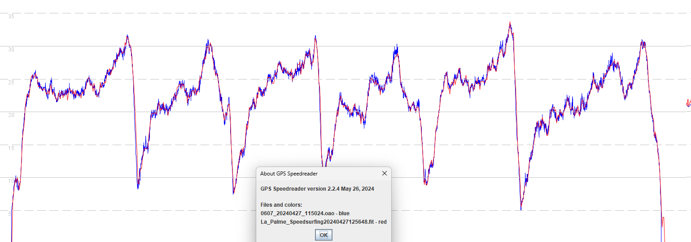
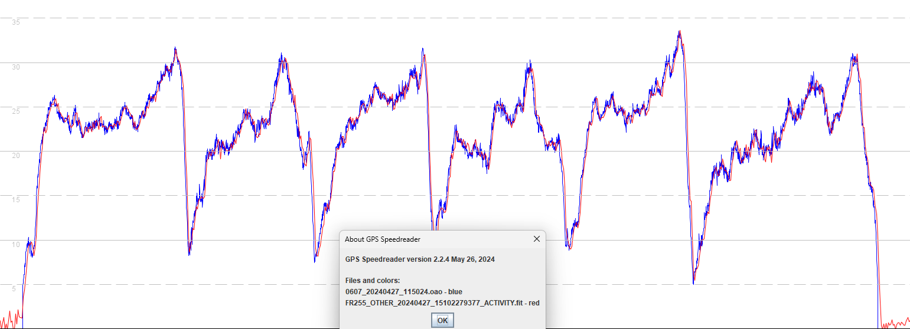
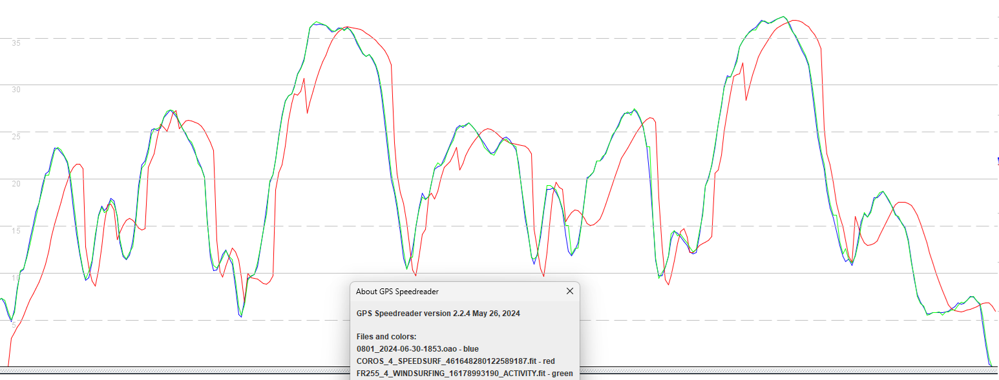
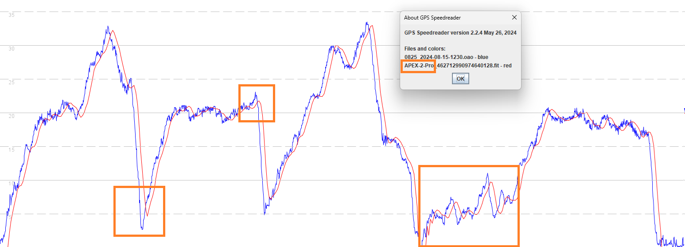
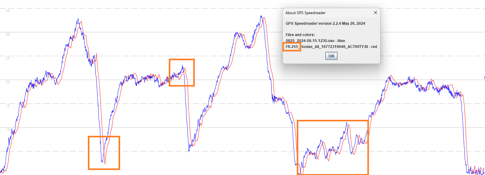

## COROS - Speedsurfing

### APEX 2 / APEX 2 Pro / VERTIS 2 / VERTIX 2S

#### 3.0308

Firmware 3.0308 (shown in red) was able to faithfully capture the dynamics of a windsurfer, evident when comparing to a 5 Hz [Motion GPS](https://www.motion-gps.com/motion/index.html) (blue).

The Garmin Forerunner 255 performed almost identically, since both the COROS and Garmin watches use the same Airoha AG3335M chipset.

#### 3.0408

Firmware 3.0408 introduced a problem which is believed to be related to one or more [settings](../smoothing/update.md) of the Airoha GNSS chipset.

Excessive filtering / smoothing and sharp dips during periods of acceleration are evident in data from the APEX 2 Pro (red).

#### 3.0508

Firmware 3.0508 attempted to fix the problem in 3.0408 but this has subsequently been shown to be inappropriate - see details for 3.0510

It is believed that the speed data is now derived from the positional data, probably after some filtering / smoothing.

#### 3.0510

The COROS APEX 2 Pro loses a lot of the finer details, due to the filtering / smoothing introduced in 3.0508:

The Garmin Forerunner 255 continues to faithfully capture the dynamics of a short test drive:

