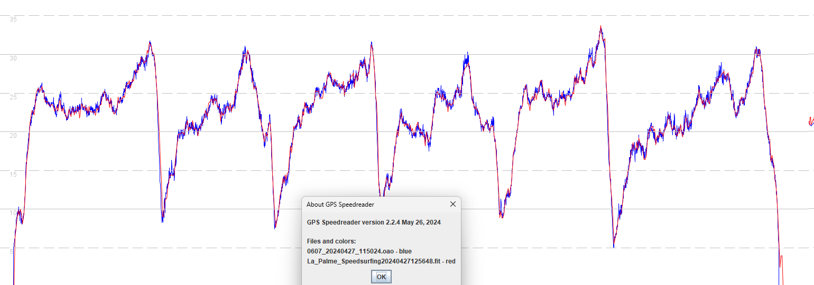
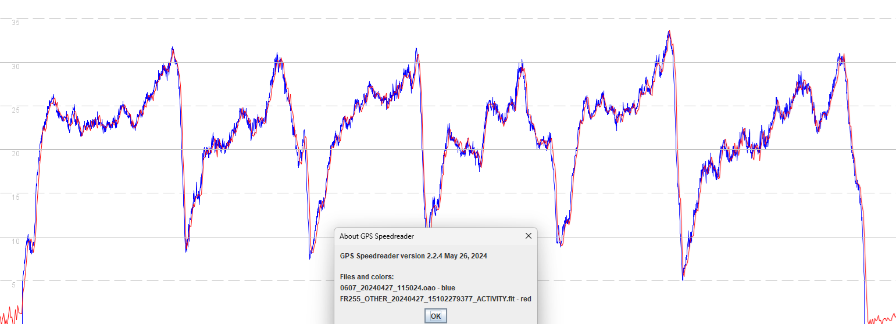
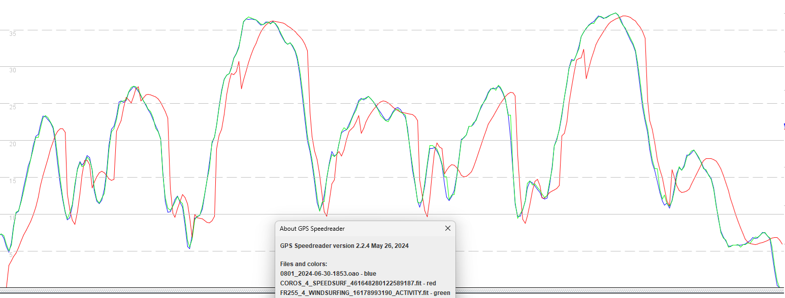
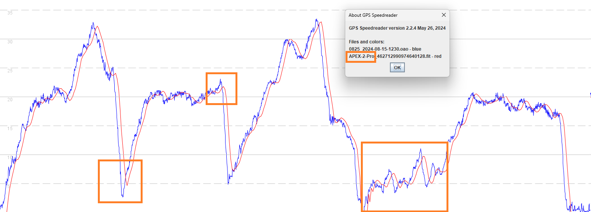
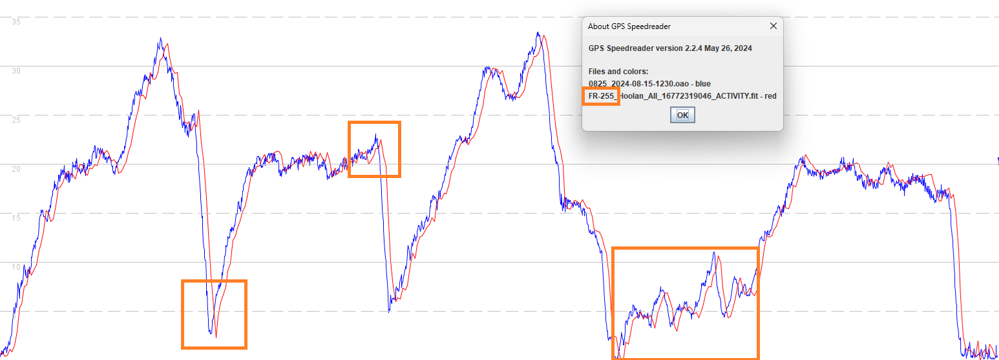

## COROS APEX 2 / APEX 2 Pro / VERTIX 2 / VERTIX 2S

### Speedsurfing

#### 3.0308.0

Firmware 3.0308.0 (red) was able to faithfully capture the dynamics of a windsurfer, evident when comparing to a 5 Hz [Motion GPS](https://www.motion-gps.com/motion/index.html) (blue).

The Garmin Forerunner 255 performed almost identically, since both the COROS and Garmin watches use the same Airoha AG3335M chipset.

#### 3.0408.0

Firmware 3.0408.0 introduced a problem which is thought to be caused by one (or more) [settings](../../smoothing/update.md) of the Airoha AG3335M chipset.

Excessive filtering / smoothing and strange dips during periods of acceleration are evident in the data from the APEX 2 Pro (red).

Notes

- Garmin watches using the same Airoha AG3335M (e.g. Fenix 7 and Forerunner 255) had exactly the same issue in 2022.
- Thoughts and guidance regarding a resolution of the underlying issue in 3.0408.0 were [documented](../../smoothing/update.md) on 22 Aug 2024.

#### 3.0508.0

Firmware 3.0508.0 attempted to fix the issue in 3.0408.0. The speedsailing mode of 3.0508.0 somewhat resembled the windsurfing mode.

The significance of the change(s) only became fully apparent after the release of 3.0508.0 for the APEX Pro / VERTIX - see 3.0510.0 (below).

It is believed that the speeds in 3.0508.0 were being derived from positional data, quite possibly after some upfront filtering / smoothing.

#### 3.0510.0

The COROS APEX 2 Pro lost a lot of the subtle detail in 3.0308.0, presumably due to the filtering / smoothing introduced in 3.0508.0.

The Garmin Forerunner 255 managed to faithfully capture the dynamics of this test drive.

A visual comparison makes it quite clear that the APEX 2 Pro and Forerunner 255 are now behaving quite differently, with the Garmin being far more suitable for speedsurfing and windsurfing. This is just one test session, but every other test shows exactly the same behavior.

### Outstanding Issue

Due to the speedsurfing observations for the APEX Pro and VERTIX it is believed that the APEX 2 / APEX 2 Pro / VERTIX 2 / VERTIX 2S have also been using non-Doppler speeds since 3.0508.0. The suspicion is that positional data is being filtered / smoothed to calculate speeds, instead of using the Doppler-derived speed data from the Airoha chipset.

It should also be noted that GP3S are starting to observe more spikes being posted from the APEX 2 Pro and VERTIX 2. These issues are consistent with what would be expected when calculating speeds using the positional data, instead of the Doppler-derived speeds.

It would appear that the release of 3.0508.0 in July did not resolve the underlying Airoha-related issue, and was essentially a hack that calculates speeds using the positional data. Thoughts and guidance regarding a resolution of the underlying issue in 3.0408.0 were [documented](../../smoothing/update.md) on 22 Aug 2024.

