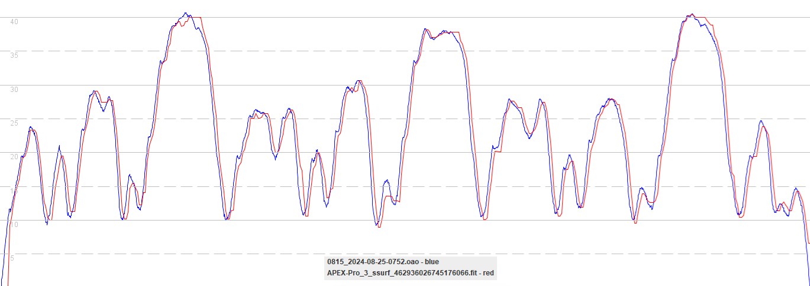
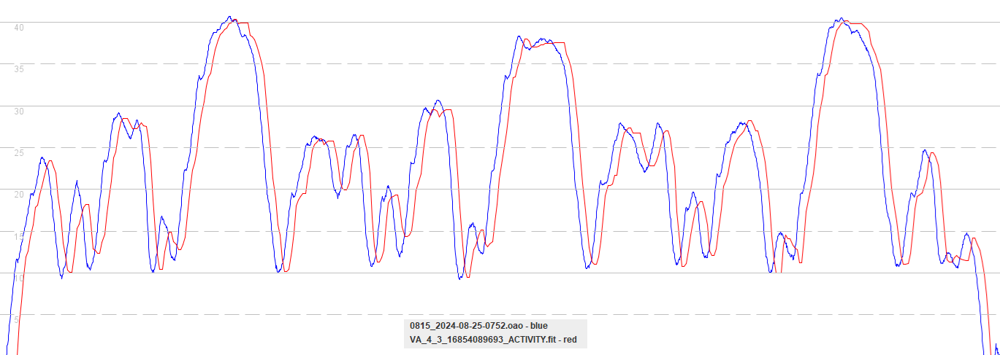
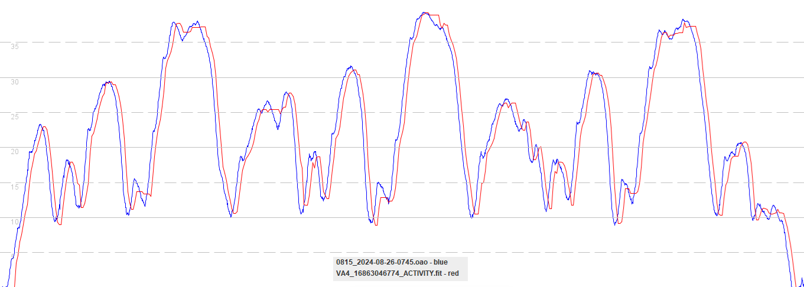

## COROS APEX Pro / VERTIX

### Speedsurfing

#### 3.05.0

Firmware 3.05.0 (red) is capturing the speed data from the Sony GNSS chipset, evident when comparing to a 5 Hz [Motion GPS](https://www.motion-gps.com/motion/index.html) (blue).

This release is working as well as can be expected for a watch using the Sony GNSS chipset, noting the propensity for repeated speeds / flat spots.

The Garmin vivoactive 4 (red) is also capturing the speed data from the Sony GNSS chipset, albeit with a slightly different timestamp offset.

The Garmin is working as well as can be expected for a watch using the Sony GNSS chipset, noting the propensity for repeated speeds / flat spots.

#### 3.0308.0

TODO:

- Test speedsurfing using an APEX Pro that has been downgraded to 3.0308.0.

Expectations:

- 3.0308.0 is expected to exhibit identical behavior to 3.05.0.

#### 3.0508.0

The COROS APEX Pro (red) appears to be using the positional data for speeds, exhibiting spikes in the maximum speeds.

This is the non-Doppler issue that was reported to the contacts within COROS on 19 Aug 2024.

The Garmin vivoactive 4 (red) is capturing the speed data from the Sony GNSS chipset, which is better than the positional data.

The Garmin is working as well as can be expected for a watch using the Sony GNSS chipset, noting the propensity for repeated speeds / flat spots.

### Outstanding Issue

Due to the observations shown above it is believed that the APEX Pro and VERTIX are using non-Doppler speeds. The suspicion is that positional data is being used to calculate speeds, instead of using the speed data from the Sony chipset.

It should also be noted that GP3S observe more spikes being posted from the APEX Pro and VERTIX when using speedsurfing mode. These issues are consistent with what would be expected when calculating speeds using the positional data, instead of the Doppler-derived speeds.

It would appear that the release of 3.0508.0 in July did not resolve the Airoha-related issue, but instead introduced an even worse problem affecting the APEX Pro and VERTIX. Thoughts and guidance regarding a resolution of the underlying issue in 3.0408.0 were [documented](../../smoothing/update.md) on 22 Aug 2024.

