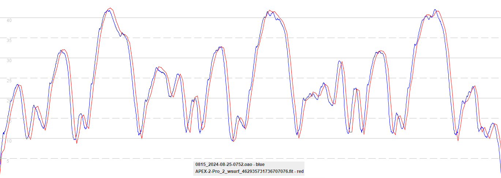

## COROS APEX 2 / APEX 2 Pro / VERTIX 2 / VERTIX 2S

### Windsurfing

#### 3.0508.0 and earlier

Test data is not available for windsurfing mode on the APEX 2 / APEX 2 Pro / VERTIX 2 prior to firmware 3.0510.0.

#### 3.0510.0

The COROS APEX 2 Pro loses a lot of the subtle details relating to speed, presumably due to the filtering / smoothing that is implemented:

The Garmin Forerunner 255 faithfully captures the dynamics of the test drive, with subtle variations being no greater than two motions:

### Outstanding Issue

GP3S have observed that accuracy issues / spikes are far more prevalent on the APEX 2 Pro / VERTIX 2 when using windsurfing mode. This is almost certainly due to the use of positional data for speeds, rather than the Doppler-derived speeds of the Airoha chipset. This behavior is somewhat undesirable because people within the wider community also use the windsurfing mode, prone to inaccuracies and spikes.

Our suggestion / preference would be for the windsurfing mode to process GNSS data in exactly the same way as the speedsurfing mode, once fixed.
