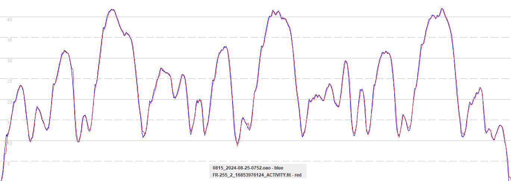

## COROS APEX 2 / APEX 2 Pro / VERTIX 2 / VERTIX 2S

### Windsurfing

#### 3.0508.0 and earlier

Test data is not available for windsurfing mode in firmware 3.0508.0 and earlier.

#### 3.0510.0

The COROS APEX 2 Pro loses a lot of the finer details, due to the filtering / smoothing introduced in 3.0508:

The Garmin Forerunner 255 continues to faithfully capture the dynamics of a short test drive:

