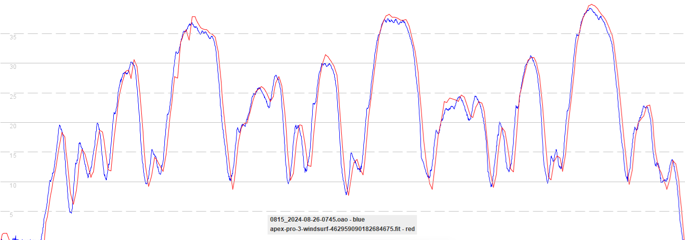

## COROS APEX Pro / VERTIX

### Windsurfing

#### 3.05.0

Firmware 3.05.0 (red) appears to be using the positional data for speeds in windsurfing mode. Spikes are clearly evident when comparing to a 5 Hz [Motion GPS](https://www.motion-gps.com/motion/index.html) (blue).

This is undesirable because people within the wider community also use the windsurfing mode, which is prone to inaccuracies and spikes.

The Garmin vivoactive 4 (red) is capturing the speed data from the Sony GNSS chipset, and there are no spikes present during this test.

The Garmin is working as well as can be expected for a watch using the Sony GNSS chipset, noting the propensity for repeated speeds / flat spots.

#### 3.0308.0

TODO:

- Test windsurfing using an APEX Pro that has been downgraded to 3.0308.0.

Expectations:

- 3.0308.0 is expected to exhibit identical behavior to 3.05.0.

#### 3.0508.0

The COROS APEX Pro (red) still appears to be using the positional data for speeds, exhibiting somewhat elevated maximum speeds.

This is undesirable because people within the wider community also use the windsurfing mode, prone to inaccuracies and spikes.

The Garmin vivoactive 4 (red) is capturing the speed data from the Sony GNSS chipset, which is better than the positional data.

The Garmin is working as well as can be expected for a watch using the Sony GNSS chipset, noting the propensity for repeated speeds / flat spots.

### Outstanding Issue

GP3S have observed that accuracy issues / spikes are far more prevalent on the APEX Pro / VERTIX when using windsurfing mode. This is almost certainly due to the use of positional data for speeds, rather than the Doppler-derived speeds of the Sony chipset. This behavior is somewhat undesirable because people within the wider community also use the windsurfing mode, prone to inaccuracies and spikes.

Our suggestion / preference would be for the windsurfing mode to process GNSS data in exactly the same way as the speedsurfing mode, once fixed.
