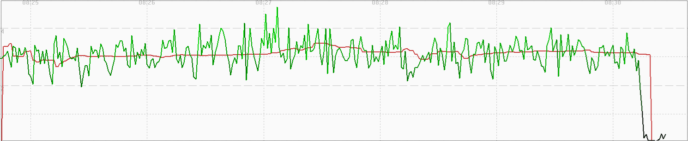
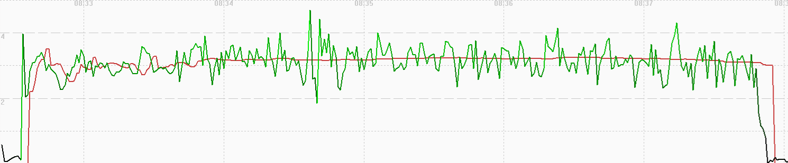
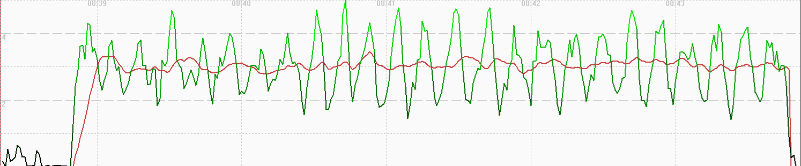
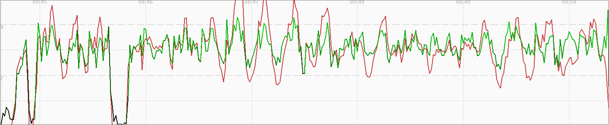
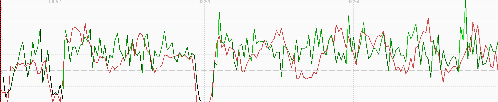

## Garmin Activity Testing

Author: Michael George

Created: 9 July 2024

### Overview

This page documents activity testing that was performed on 2024-05-27.

- Forerunner 255
  - Running
  - Hiking
  - Stand Up Paddling
  - Cycling
  - Other

The testing was relatively unstructured but has been documented for completeness.

### Data

All of the FIT data is available for download in ZIP format:

- [2024-05-27-walking-garmin.zip](2024-05-27-walking-garmin.zip) - Forerunner 255

### Observations

#### Running

The image below shows how speed (red) is heavily smoothed. Positional data (green) is relatively noisy, and possibly closer to the raw GNSS data, unlike COROS.

#### Hiking

The image below shows how speed (red) is heavily smoothed. Positional data (green) is relatively noisy, and possibly closer to the raw GNSS data, unlike COROS.

#### Stand Up Paddling

The image below shows how speed (red) is heavily smoothed, but not as much as running or hiking. Positional data (green) exhibits the type of aliasing that is often observed in unfiltered speed data from 1 Hz devices (re: Nyquist).

#### Cycling

The image below shows how speed (red) does not appear to be smoothed. Positional data (green) is not dissimilar to running and hiking.

#### Other

The image below shows how speed (red) does not appear to be smoothed. Positional data (green) is not dissimilar to running, hiking, or cycling.

### Summary

Running / Hiking:

- Speed is heavily filtered / smoothed.
- Positional is relatively noisy, and possibly closer to the raw GNSS data, unlike COROS.

Stand Up Paddling:

- Speed is heavily smoothed, but not as much as running or hiking.
- Positional exhibits the type of aliasing that is often observed in unfiltered speed data from 1 Hz devices (re: Nyquist).

Cycling / Other:

- Speed does not appear to be smoothed.
- Positional data is not dissimilar to running, hiking, or cycling.
