## Garmin Activity Testing

Author: Michael George

Created: 10 July 2024

### Overview

This page documents activity testing that was performed on 2024-06-30, whilst driving around a short circuit.

It compares the performance of several activity types.

- Garmin Forerunner 255
  - Hiking
  - Cycling
  - Stand Up Paddling
  - Windsurfing
  - Other #1
  - Other #2

1 Hz and 5 Hz data was also collected using Motion Minis.

The devices were carried as shown in this photograph, including a COROS APEX 2 Pro on the left:

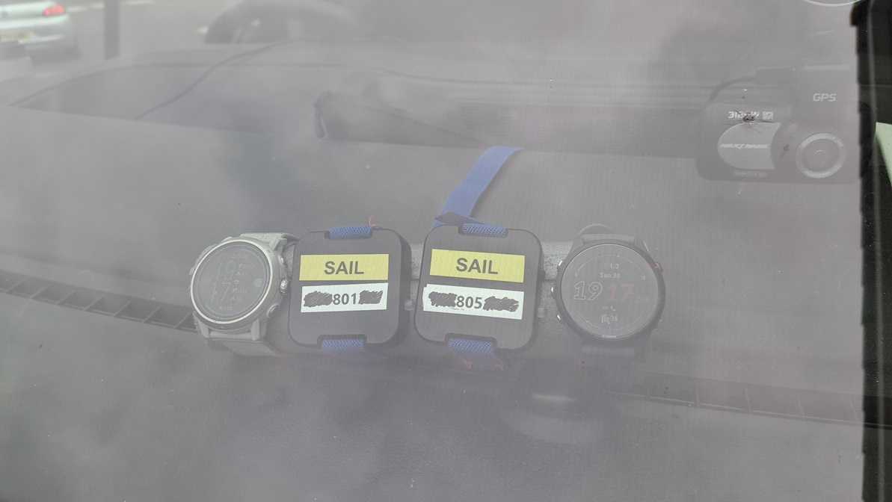

### Data

All of the FIT data is available for download in ZIP format:

- [2024-06-30-driving-fr-255.zip](2024-06-30-driving-fr-255.zip) - APEX 2 Pro

The OAO data from the Motions is available for download in ZIP format:

- [2024-06-30-driving-motion.zip](2024-06-30-driving-motion.zip) - Motions @ 1 Hz and 5 Hz

### Observations

#### Hiking

The image below shows how position-derived speed (green) and recorded speed (red) differ.

The positional data seems to be relatively noisy, suggesting there is not a lot of filtering being applied.

The recorded speeds clearly lag behind the positional data, and the spike at 18:30 suggests that speed may actually be derived from the positional data.

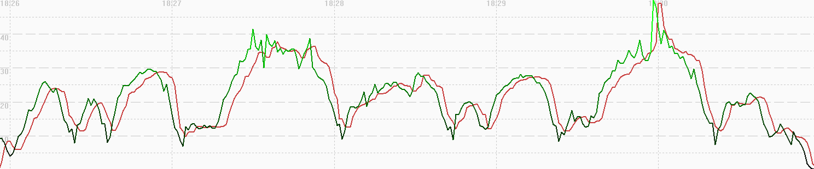

A comparison of 5 Hz Motion data (red), 1 Hz Motion data (blue) and 1 Hz Garmin data (green) shows the speed related issues for this activity type.

The speed from the hiking activity exhibits a lag of around 4 or 5 seconds, and it is quite different from the speed of the two motions.

It's clear that the speed data from the hiking activity is unsuitable for activities such as speedsurfing.

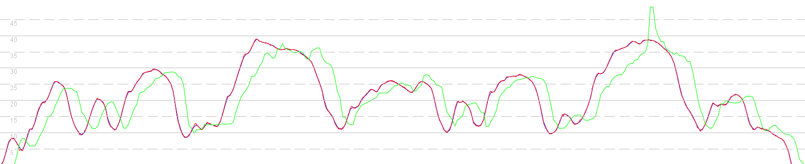

#### Cycling

The image below shows how position-derived speed (green) and Doppler-derived speed (red) differ.

It looks like the positional data has been filtered (due to the relative smoothness), but it seems likely that the speed data is the Doppler-derived speed.

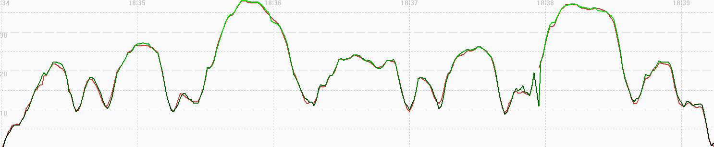

A comparison of 5 Hz Motion data (red), 1 Hz Motion data (blue) and 1 Hz Garmin data (green) shows the good performance of this activity type.

This Garmin speed data is much better than the hiking activity, but it is worth noting the absence of one data point just before 18:38.

After the missing data point the Garmin data appears to lag behind the Motion data by 1 second.

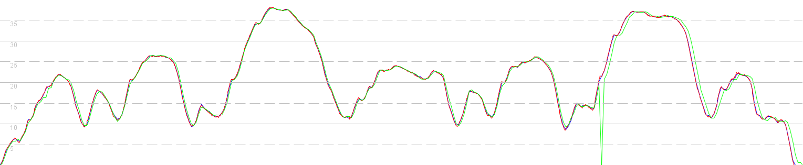

#### Stand Up Paddling

The image below shows how position-derived speed (green) and Doppler-derived speed (red) differ.

The recorded speeds clearly lag behind the positional data and are heavily filtered, which will be to cope with the paddling action.

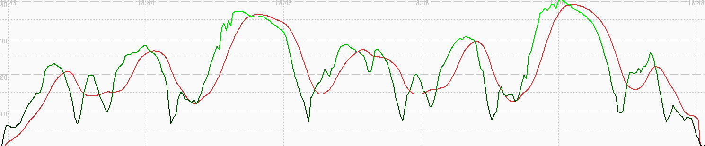

A comparison of 5 Hz Motion data (red), 1 Hz Motion data (blue) and 1 Hz Garmin data (green) shows the performance of this activity type.

It's clear that the speed data from the stand up paddling activity is unsuitable for activities such as speedsurfing.

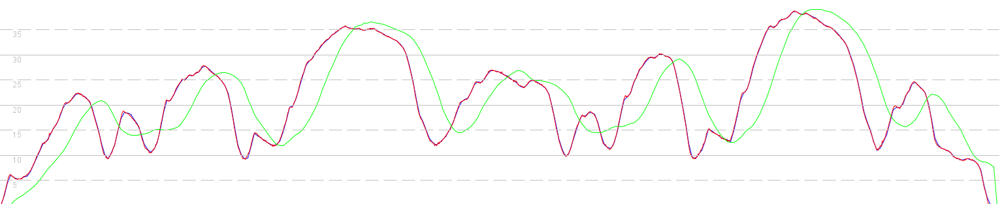

#### Windsurfing

The image below shows how position-derived speed (green) and Doppler-derived speed (red) differ.

It looks like the positional data hasn't been filtered (unlike the cycling activity), and it appears that the speed data is the Doppler-derived speed.

It's worth noting that some data points do not update the latitude and longitude, resulting artefacts in position-derived speeds (green).

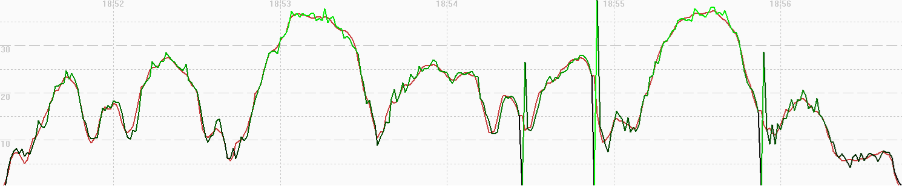

A comparison of 5 Hz Motion data (red), 1 Hz Motion data (blue) and 1 Hz Garmin data (green) shows the good performance of this activity type.

It appears that the speed data is the Doppler-derived speed, correlating closely with the benchmark devices; 1Hz and 5 Hz Motions.

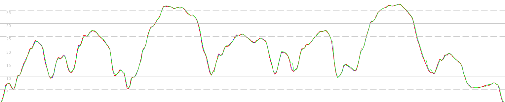

#### Other #1

The image below shows how position-derived speed (green) and Doppler-derived speed (red) differ.

It looks like the positional data hasn't been filtered (unlike the cycling activity), and it appears that the speed data is the Doppler-derived speed.

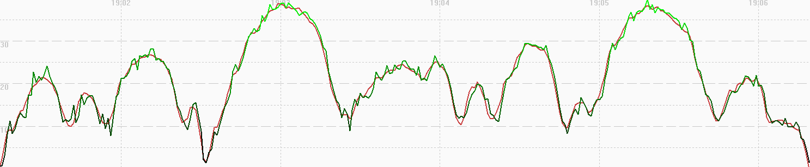

A comparison of 5 Hz Motion data (red), 1 Hz Motion data (blue) and 1 Hz Garmin data (green) shows the good performance of this activity type.

It appears that the speed data is the Doppler-derived speed, correlating closely with the benchmark devices; 1Hz and 5 Hz Motions.

Note how there is a visible lag of around 1 second, but this varies from one session to the next - see other #2.

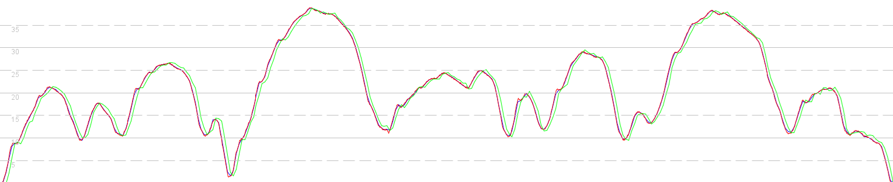

#### Other #2

The image below shows how position-derived speed (green) and Doppler-derived speed (red) differ.

It looks like the positional data hasn't been filtered (unlike the cycling activity), and it appears that the speed data is the Doppler-derived speed.

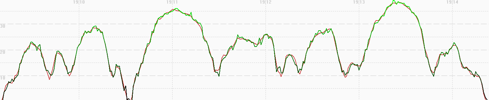

A comparison of 5 Hz Motion data (red), 1 Hz Motion data (blue) and 1 Hz Garmin data (green) shows good performance of this activity type.

It appears that the speed data is the Doppler-derived speed, correlating closely with the benchmark devices; 1Hz and 5 Hz Motions.

There no lag present during this session.

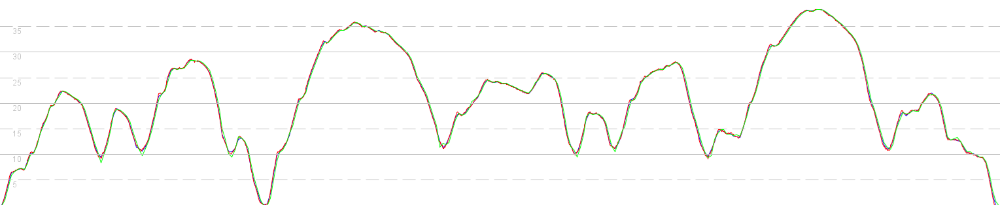

### Comparison

It is interesting to contrast this data with that of the COROS APEX 2 Pro, since it uses the same Airoha AG3335M chipset.

The APEX 2 Pro results for these test sessions can be found on a separate [page](../../../coros/activities/driving-2024-06-30/README.md).

### Summary

#### Hiking

- The positional data seems to be relatively noisy, suggesting there is not a lot of filtering being applied.
- Speed may actually be derived from the positional data, due to the presence of near-identical spikes.
- The speed from the hiking activity exhibits a lag of around 4 or 5 seconds, and it is quite different from the speed of the two motions.
- It's clear that the speed data from the hiking activity is unsuitable for activities such as speedsurfing.

#### Cycling

- It looks like the positional data has been filtered, due to the relative smoothness.
- It seems likely that the speed data is the Doppler-derived speed, correlating closely with the benchmark devices; 1Hz and 5 Hz Motions.
- Missing data points can occur during this activity type and may introduce a lag in the data.

#### Stand Up Paddling

- The recorded speeds clearly lag behind the positional data and are heavily filtered, which will be to cope with the paddling action.
- It's clear that the speed data from the stand up paddling activity is unsuitable for activities such as speedsurfing.

#### Windsurfing

- It looks like the positional data hasn't been filtered (unlike the cycling activity)
  - It's worth noting that some data points do not update the latitude and longitude, resulting artefacts in position-derived speeds.
- It appears that the speed data is the Doppler-derived speed, correlating closely with the benchmark devices; 1Hz and 5 Hz Motions.

#### Other

- It looks like the positional data hasn't been filtered (unlike the cycling activity), and it appears that the speed data is the Doppler-derived speed.
- It appears that the speed data is the Doppler-derived speed, correlating closely with the benchmark devices; 1Hz and 5 Hz Motions.
  - There can be a slight lag (typically around 1 or 2 seconds), but this varies from one session to the next.

