## Garmin Activity Testing

Author: Michael George

Created: 9 July 2024

### Overview

This page documents activity testing that was performed on 2024-06-25, whilst walking in an open-sky environment.

- Session 1 - Forerunner 255
  - Cycling
  - Stand Up Paddling
  - Windsurfing
  - Other
- Session 2 - Forerunner 255
  - Running
  - Trail Running
  - Hiking
  - Walking

These tests were more structured than the earlier test in May 2024.

1 Hz and 5 Hz data was also collected using Motion Minis.

The devices were carried as shown in this photograph, including a COROS APEX 2 Pro on the left:

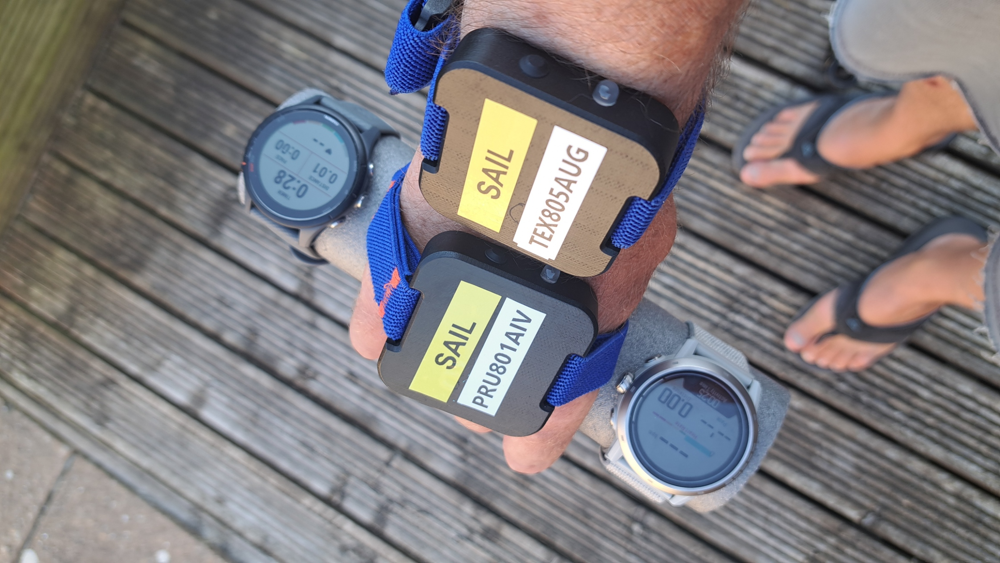

### Data

All of the FIT data is available for download in ZIP format:

- [2024-06-25-walking-fr-255.zip](2024-06-25-walking-fr-255.zip) - Forerunner 255

The OAO data from the Motions is available for download in ZIP format:

- [2024-06-25-walking-motion.zip](2024-06-25-walking-motion.zip) - Motions @ 1 Hz and 5 Hz

### Session 1

#### Cycling

The image below shows how speed (red) does not appear to be filtered / smoothed, and exhibits the type of aliasing that is often observed in unfiltered speeds from 1 Hz devices (re: Nyquist).

Note: The first half of this data is rather noisy, but the reason for this is not understood. It is conceivable that the filtering applied to cycling activities may change during a session, depending on certain factors.

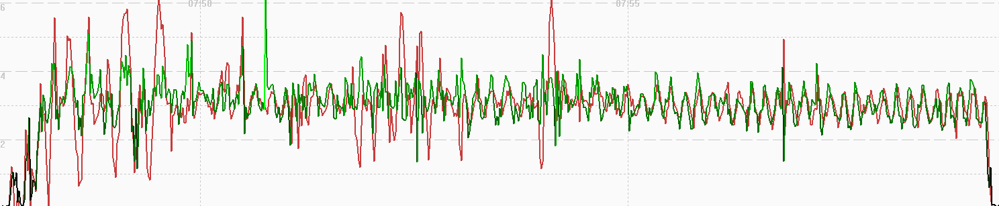

A comparison of 5 Hz Motion data (red), 1 Hz Motion data (blue) and 1 Hz Garmin data (green) shows the 1 Hz sampling artefacts (re: Nyquist theorem).

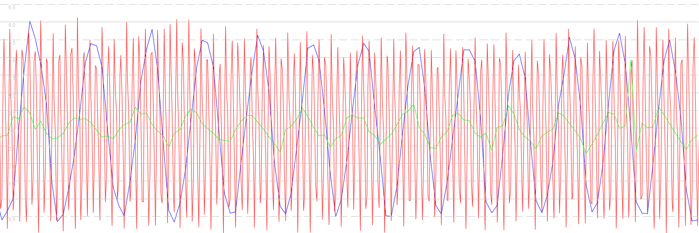

#### Stand Up Paddling

The image below shows how speed (red) is heavily filtered / smoothed, and exhibits the type of aliasing that is often observed in unfiltered speeds from 1 Hz devices (re: Nyquist). This behavior is very different to the Flatwater mode of COROS watch which behave like cycling, windsurfing, etc.

Note: One data point in the middle did not update latitude + longitude, giving the impression of a spike in GPSResults.

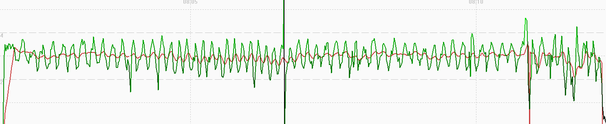

A comparison of 5 Hz Motion data (red), 1 Hz Motion data (blue) and 1 Hz Garmin data (green) shows the 1 Hz sampling artefacts (re: Nyquist theorem).

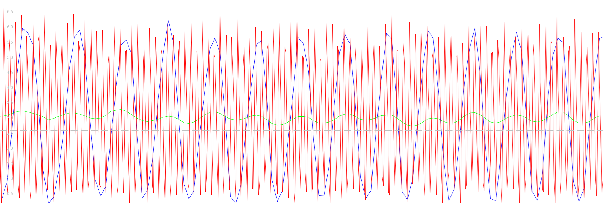

#### Windsurfing

The image below shows how speed (red) does not appear to be filtered / smoothed, and slightly exhibits the type of aliasing that is often observed in unfiltered speeds from 1 Hz devices (re: Nyquist).

Note: An early data point did not update latitude + longitude, giving the impression of a spike in GPSResults.

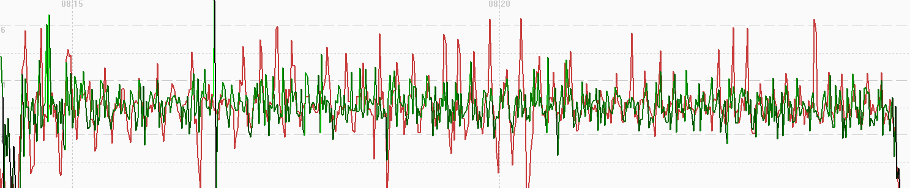

A comparison of 5 Hz Motion data (red), 1 Hz Motion data (blue) and 1 Hz Garmin data (green) shows the 1 Hz sampling artefacts (re: Nyquist theorem).

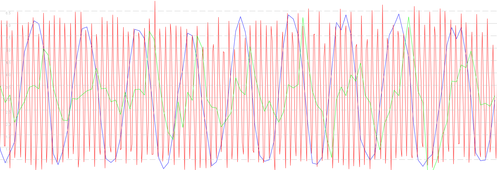

#### Other

The image below shows how speed (red) does not appear to be filtered / smoothed, and exhibits the type of aliasing that is often observed in unfiltered speeds from 1 Hz devices (re: Nyquist).

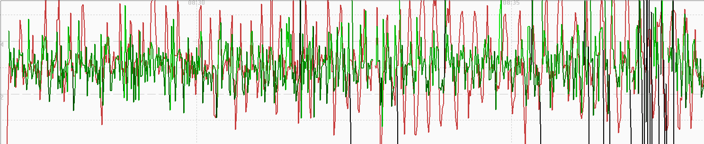

A comparison of 5 Hz Motion data (red), 1 Hz Motion data (blue) and 1 Hz Garmin data (green) shows the 1 Hz sampling artefacts (re: Nyquist theorem).

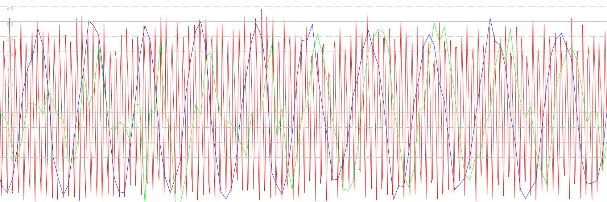

### Session 2

#### Running

The image below shows how speed (red) is heavily filtered / smoothed. Positional data (green) is relatively noisy, and possibly closer to the raw GNSS data (unlike COROS).

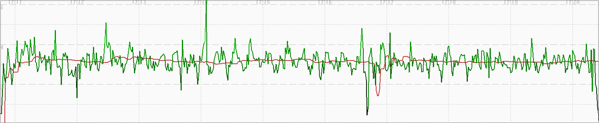

#### Trail Running

The image below shows how speed (red) is heavily filtered / smoothed. Positional data (green) is relatively noisy, and possibly closer to the raw GNSS data (unlike COROS).

Note: There is only a few minutes worth of trail running data due to not starting the recording correctly. It takes almost 2 minutes for the filtering to settle down to something resembling the other tests.

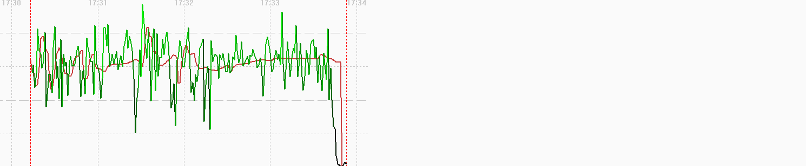

#### Hiking

The image below shows how speed (red) is heavily filtered / smoothed. Positional data (green) is relatively noisy, and possibly closer to the raw GNSS data (unlike COROS).

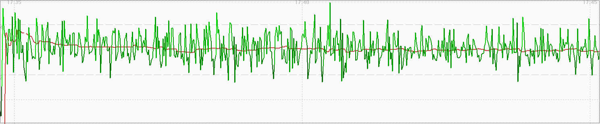

#### Walking

The image below shows how speed (red) is heavily filtered / smoothed. Positional data (green) is relatively noisy, and possibly closer to the raw GNSS data (unlike COROS).

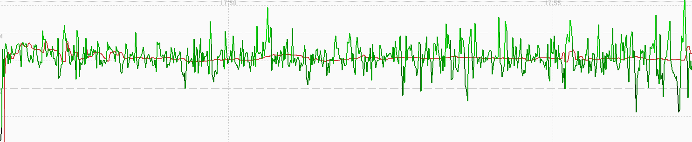

### Comparison

Comparison of the speeds for Cycling (red), Stand Up Paddling (green), Windsurfing (magenta), Other (yellow) vs 5 Hz Motion (blue):

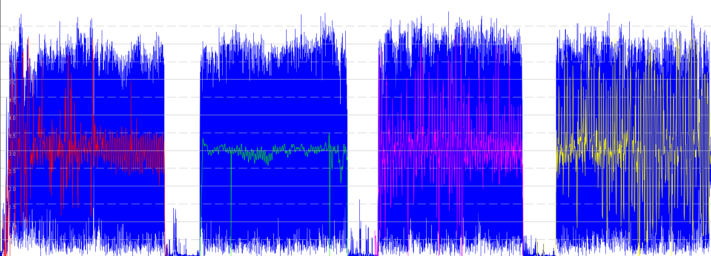

Comparison of the speeds for Running (red), Trail Running (green), Hiking (magenta), Walking (yellow) vs 5 Hz Motion (blue):

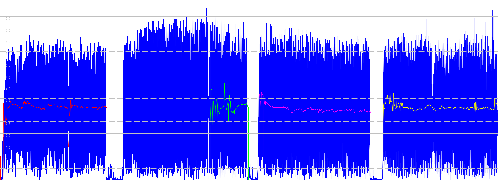

Notes:

- The hiking data is incomplete due to failing to start the recording properly.
  - The majority of the hiking data is the time taken for the filtering to settle down.
  
- The two graphs above show two distinct types of filtering / smoothing:
  - Cycling / Windsurfing / Other are the closest to the raw GNSS speeds, certainly closer than the COROS.
  - Stand Up Paddling is clearly applying quite heavy filtering / smoothing the speed data, unlike the COROS.
  - Running / Trail Running / Hiking / Walking apply the most aggressive levels of filtering / smoothing.

- It is interesting to contrast this data with that of the COROS APEX 2 Pro, since it uses the same Airoha AG3335M chipset.
  - The APEX 2 Pro results for these test sessions can be found on a separate [page](../../../coros/activities/walking-2024-06-25/README.md).

### Summary

Running / Trail Running / Hiking / Walking:

- Speed is heavily filtered / smoothed.
- Positional data is relatively noisy, and possibly closer to the raw GNSS data (unlike COROS).

Stand Up Paddling:

- Speed is heavily filtered / smoothed, but not as much as running / hiking / walking.
- Speed and positional data exhibits the type of aliasing that is often observed in unfiltered speeds from 1 Hz devices (re: Nyquist).

Cycling / Windsurfing / Other:

- Speed does not appear to be filtered / smoothed, and exhibits the type of aliasing that is often observed in unfiltered speeds from 1 Hz devices (re: Nyquist).
- Positional data is not dissimilar to running, hiking, or cycling.
