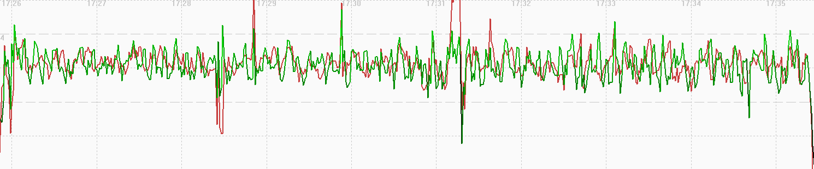

## Garmin Activity Testing

Author: Michael George

Created: 9 July 2024

### Overview

This page documents activity testing that was performed on 2024-06-30, whilst walking in an open-sky environment.

It compares the two activities - Cycling and Other.

- Forerunner 255
  - Cycling
  - Other
  - Cycling
  - Other

1 Hz and 5 Hz data was also collected using Motion Minis.

The devices were carried as shown in this photograph, including a COROS APEX 2 Pro on the left:

### Data

All of the FIT data is available for download in ZIP format:

- [2024-06-30-walking-fr-255.zip](2024-06-30-walking-fr-255.zip) - Forerunner 255

The OAO data from the Motions is available for download in ZIP format:

- [2024-06-30-walking-motion.zip](2024-06-30-walking-motion.zip) - Motions @ 1 Hz and 5 Hz

### Observations

#### Cycling

The image below shows how speed (red) does not appear to be filtered / smoothed, and exhibits the type of aliasing that is often observed in unfiltered speeds from 1 Hz devices (re: Nyquist).

A comparison of 5 Hz Motion data (red), 1 Hz Motion data (blue) and 1 Hz Garmin data (green) shows the 1 Hz sampling artefacts (re: Nyquist theorem).

#### Other

The image below shows how speed (red) does not appear to be filtered / smoothed, and exhibits the type of aliasing that is often observed in unfiltered speeds from 1 Hz devices (re: Nyquist).

Note: Several data points did not update latitude + longitude, giving the impression of spikes in GPSResults.

A comparison of 5 Hz Motion data (red), 1 Hz Motion data (blue) and 1 Hz Garmin data (green) shows the 1 Hz sampling artefacts (re: Nyquist theorem).

#### Cycling

This interval is quite interesting because it is not behaving like the first cycling activity. This has similarities with the filtering seen in the cycling data from 2024-06-25. It appears that the filtering applied during a cycling activity can actually vary.

A comparison of 5 Hz Motion data (red), 1 Hz Motion data (blue) and 1 Hz Garmin data (green) shows just how different this cycling data is to the 1 Hz Motion data, quite unlike the cycling data at the start of this test.

#### Other

The image below shows how speed (red) does not appear to be filtered / smoothed, and exhibits the type of aliasing that is often observed in unfiltered speeds from 1 Hz devices (re: Nyquist).

A comparison of 5 Hz Motion data (red), 1 Hz Motion data (blue) and 1 Hz Garmin data (green) shows the 1 Hz sampling artefacts (re: Nyquist theorem).

### Comparison

Comparison of the speeds for Cycling (red), Other (green), Cycling (magenta), Other (yellow) vs 5 Hz Motion (blue):

Notes:

- The filtering seen during the second cycling test (magenta) is quite unlike the first test.
  - It would appear that the filtering for cycling can change quite substantially!
- It is interesting to contrast this data with that of the COROS APEX 2 Pro, since it uses the same Airoha AG3335M chipset.
  - The APEX 2 Pro results for these test sessions can be found on a separate [page](../../../coros/activities/walking-2024-06-30/README.md).

### Summary

Cycling:

- The filtering seen during the second cycling test (magenta) is quite unlike the first test.
- It would appear that the filtering for cycling can change quite substantially!

Other:

- Speed does not appear to be filtered / smoothed, and exhibits the type of aliasing that is often observed in unfiltered speeds from 1 Hz devices (re: Nyquist).
- Positional data is not dissimilar to running / hiking / cycling in previous tests.
