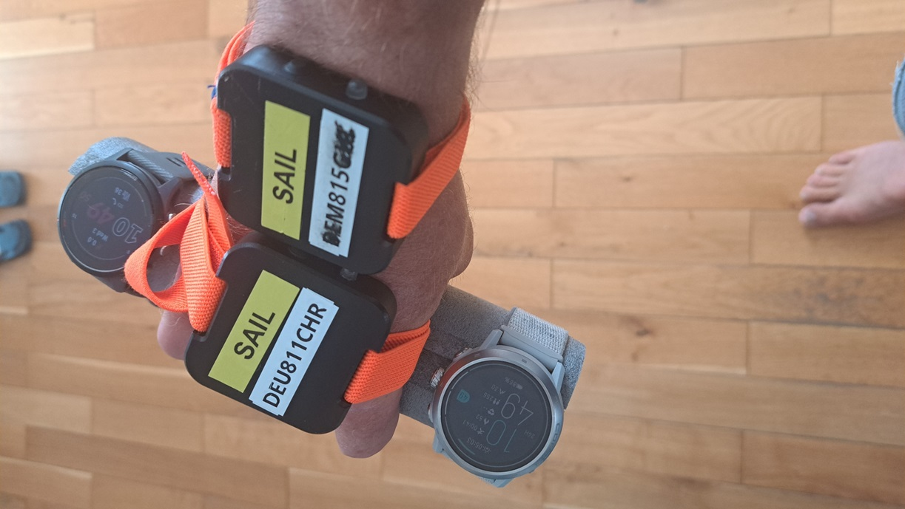
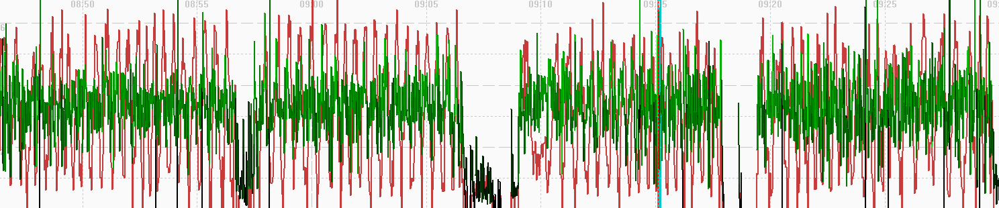
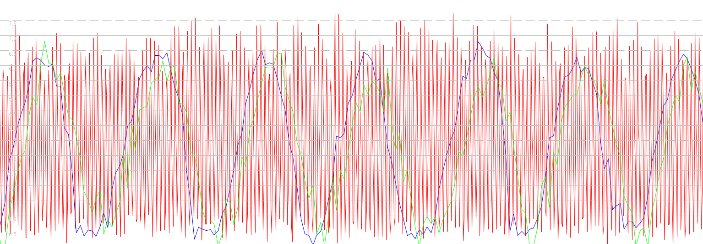
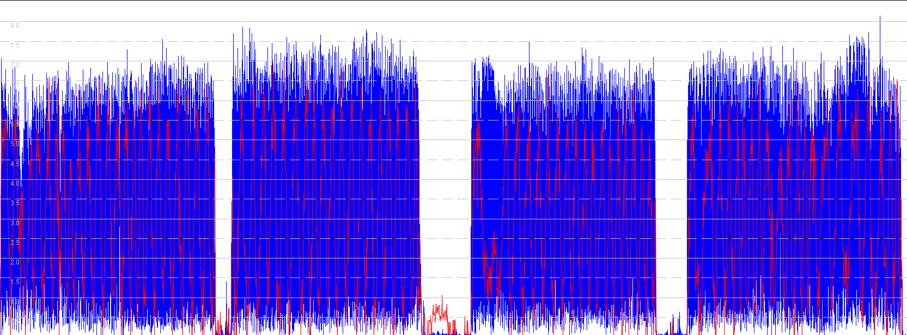
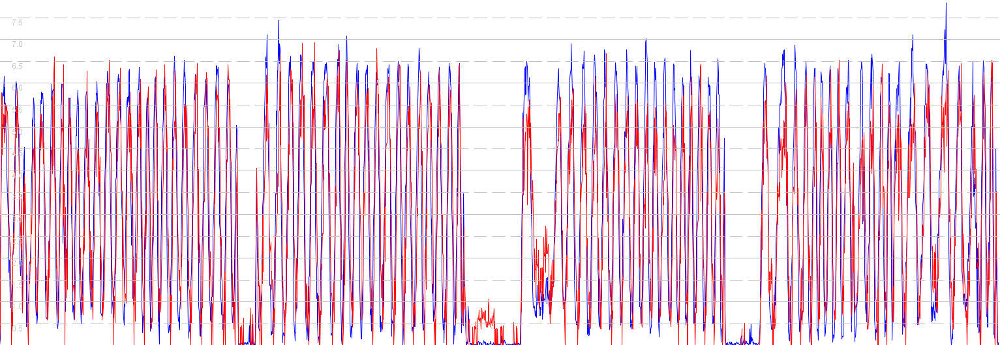

## Garmin Activity Testing

Author: Michael George

Created: 9 July 2024

### Overview

This page documents activity testing that was performed on 2024-07-03, whilst walking in an open-sky environment.

One continuous activity was recorded using the [Windsurfing Application](https://apps.garmin.com/en-US/apps/9d47be43-2724-44e4-8f5e-3005b0766087) by ViVSurfer.

- Forerunner 255
  - Windsurfing

1 Hz and 5 Hz data was also collected using Motion Minis.

The devices were carried as shown in this photograph, including a COROS APEX 2 Pro on the left:

### Data

All of the FIT data is available for download in ZIP format:

- [2024-07-03-walking-fr-255.zip](2024-07-03-walking-fr-255.zip) - Forerunner 255

The OAO data from the Motions is available for download in ZIP format:

- [2024-07-03-walking-motion.zip](2024-07-03-walking-motion.zip) - Motions @ 1 Hz and 5 Hz

### Observations

#### Windsurfing

The image below shows how speed (red) does not appear to be filtered / smoothed, and exhibits the type of aliasing that is often observed in unfiltered speeds from 1 Hz devices (re: Nyquist).

A comparison of 5 Hz Motion data (red), 1 Hz Motion data (blue) and 1 Hz Garmin data (green) shows the 1 Hz sampling artefacts (re: Nyquist theorem).

### Comparison

Comparison of the speeds for Windsurfing (red) vs 5 Hz Motion (blue):

Comparison of the speeds for Windsurfing (red) vs 1 Hz Motion (blue):

Notes:

- The behavior of the filtering throughout the entire session remains fairly constant.
  - The data from the Garmin is very similar to that of the 1 Hz Motion, just exhibiting more noise.

- It is interesting to contrast this data with that of the COROS APEX 2 Pro, since it uses the same Airoha AG3335M chipset.
  - The APEX 2 Pro results for these test sessions can be found on a separate [page](../../../coros/activities/walking-2024-07-03/README.md).

### Summary

#### Windsurfing

- Speed does not appear to be filtered / smoothed, and exhibits the type of aliasing that is often observed in unfiltered speeds from 1 Hz devices (re: Nyquist).
- Positional data is not dissimilar to running / hiking / cycling in previous tests.
