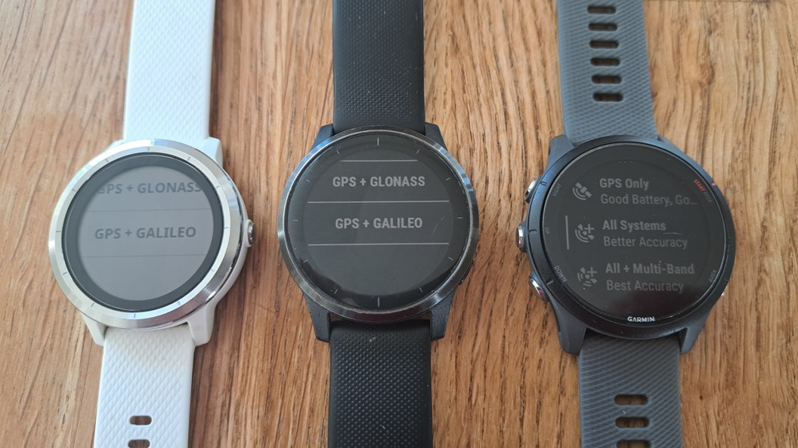
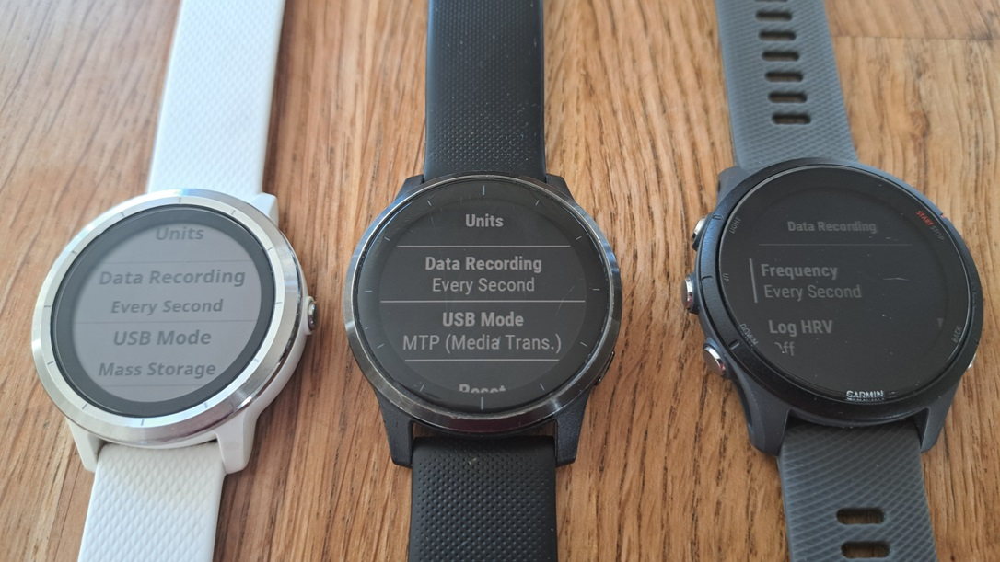
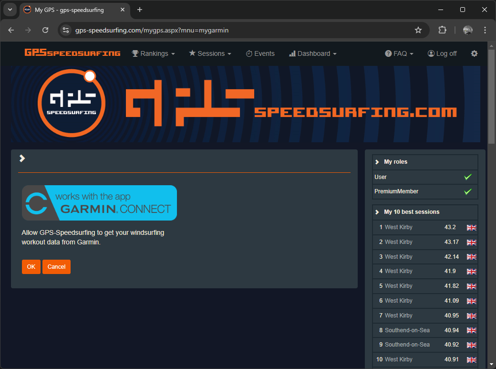
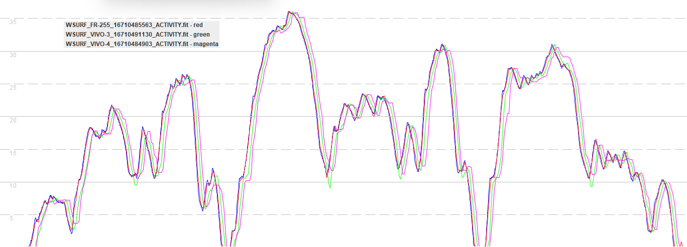
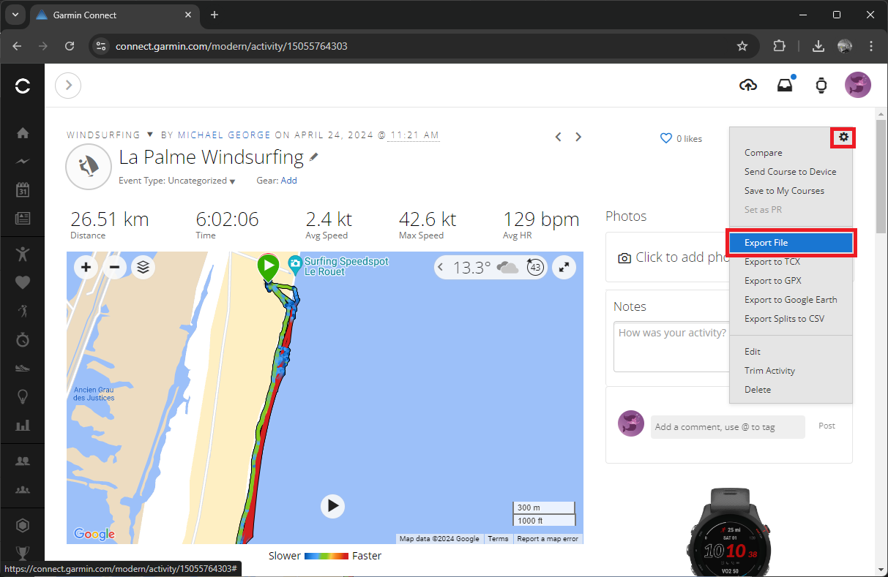
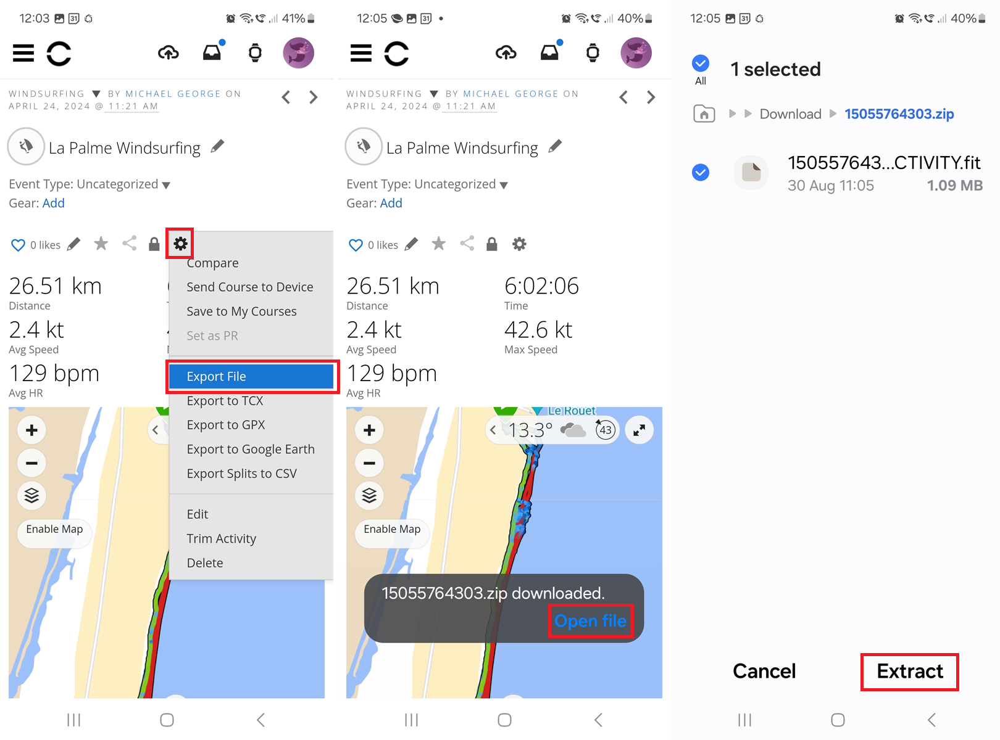

## Introduction

This article will focus specifically on the Garmin range

The problem with max speeds, popular at all levels... most prone to errors

The GNSS chipset is probably the most significant factor when it comes to the accuracy and reliability of GPS watches. Additional factors include antenna design, GNSS firmware, watch firmware, and user settings. The activity mode and / or app choice are also really important.

Important factors to avoid speed sailing roulette, plus additional tips:

- Watch choice - GNSS chipset, general features
- Watch setup - firmware, watch settings, applications
- Linked accounts - GP3S, Hoolan, Waterspeed, Strava, Relive
- Watch usage - wearing the watch, recording an activity, additional tips
- Data analysis - reviewing results, exporting activities, importing activities
- Known issues

Until earlier this year, I'd have advised against a Garmin

Last couple of years, good watches started to appear

## Watch Choice

Not as simple as Garmin, or Fenix.

### GNSS Chipset

Create coloured timeline?

- GNSS chipset is a primary factor
  - pre-2012 = SiRF
  - 2012 to 2018 = MediaTek
  - 2019 to 2021 = Sony (and Jan-Feb 2022 for the Instinct 2 and Venu 2 Plus)
    - Repeated speeds
    - Spikes after loss of lock
  - 2022 onwards = Airoha (except Jan-Feb 2022 for the Instinct 2 and Venu 2 Plus
    - Decent data when using the right firmware, settings, activity / application
    - Can be pretty terrible data if you get these things wrong!

Link to my chipset details.

### General Features

Activity profiles / applications
- Windsurfing activity - not available on Forerunner
- Windsurfing application, APPro Windsurf, GPSTC V4
- I've reviewed every other application

Things to consider:
- Satellite systems (Multi-Band, All Systems, GPS + Galileo / GPS + GLONASS)
- AMOLED display
- HR monitor
- Buttons or touchscreen (e.g. vívoactive / Venu) - relevant in water!
- Battery life

Mileage might vary... excuse the pun!

### Recommendations

Cheapest
- Forerunner 165 £250 (GPSTC, no APro or wsurf)
- vívoactive 5 £260 (APPro + wsurf, no GPSTC)
- Forerunner 255 £300 *dual band* (all apps)

Mid-range
- Instinct 2X (no apps)
- Forerunner 265 / 265S £430 (GPSTC + wsurf, no APro)
- Forerunner 955 £440 (all apps)
- Venu Sq. 2 (no wsurf)
- Venu 3 / 3S £450 (wsurf, no GPSTC or APPro)
- quatix 7 £500 (all apps)
- fēnix 7 £520 (all apps)

Most expensive
- fēnix E 
- Forerunner 965 £600 (GPSTC + wsurf, no APPro)
- epix (gen 2) £700 (all apps)
- Enduro 2 £729 (all apps)
- tactix 7 £800 (all apps)
- Enduro 3
- fēnix 8 £999

Airoha
fēnix 8, fēnix E, fēnix 7, epix (Gen 2), quatix 7, tactix 7 ... Instinct 2X (no apps)
Forerunner 165/255/265/955/965, Enduro 3, Enduro 2, vívoactive 5, Venu Sq 2, Venu 3
n.b. 165/265 and Venu 3 not supported by APPro Windsurf. Venu Sq. 2 not by Windsurfing App

Sony
fēnix 6, quatix 6, tactix Delta ... Instinct Solar, Instinct Esports, Instinct 2
Forerunner 45/55/158/245/745/945, Enduro, vívoactive 4, Venu, Venu Sq, Venu 2, Venu 2 Plus
IGNORE the Sony models!

MediaTek
fēnix [2/3/Chronos/5], epix, quatix [3/5], tactix [Bravo/Charlie] ... Instinct
Forerunner 10/15/25/30/35/220/225/230/235/620/630/645/735XT/920XT/935, vívoactive HR, vívoactive 3
n.b. fēnix® Chronos is too posh. Unsure if vívoactive HR is supported by the apps but no Galileo

Recommended watches from 2015 onwards, due to MT3333 and app support:
  fēnix® 3, fēnix® 5, quatix® 3, quatix® 5, tactix® Bravo, tactix® Charlie
  Forerunner [645/935], vívoactive® 3 - Galileo + both apps
  Forerunner [230/235/630/735XT] - No Galileo + only one app

## Watch Setup

### Firmware

Dodgy

- GP3S Fenix 7
  - 3865 (GNSS) = 2.23
- Mark + zugm - Fenix 7 
  - 3866 = 2.27
- John FR-255
  - 3865 (GNSS) = 2.33

OK

- Mike FR-255
  - 3865 (GNSS) = 9.03 and 10
  - 3955 = 30.2
  - 3992 (FR-255) = 19.18

Be sure to re-check your settings after a firmware update.

### Watch Settings

Sats

Recording

- Satellite settings = all systems, GPS + Galileo, or GPS + GLONASS

- Data recording = every 1 second
- Phone Apps
  - Device Settings -> System -> Data recording = Every 1 Second (default = Smart)
- Watch
  - Vivoactive 3
    - Settings -> Activities & Apps -> [Activity] -> [Activity] settings -> GPS = GPS + Galileo (default = On)
    - Alternatively, can change it before you start the activity by swiping
  - Vivoactive 4
    - Settings -> Activities & Apps -> [Activity] -> [Activity] settings -> GPS = GPS + Galileo (default = On)
    - Alternatively, can change it before you start the activity by swiping
  - FR 255
    - Settings -> System -> Satellites = All Systems (default = GPS)
    - Settings -> Activities & Apps -> [Activity] -> [Activity] Settings -> Satellites = All Systems (default = GPS)
    - Alternatively, can change it before you start the activity by pressing the menu button

### Applications

IMPORTANT - Application will select the activity profile and satellite settings

- Activity profile / app / data field
  - Activity type = other / windsurfing / kitesurfing
  - Satellite settings = all systems, GPS + Galileo, or GPS + GLONASS
- Apps / data fields
  - Windsurfing application, APPro Windsurf, GPSTC V4
  - Windsurf PRO and Any Sport PRO do not support all systems

APPro
https://forums.garmin.com/developer/connect-iq/f/showcase/2976/app-appro-windsurf

## Linking Accounts

### GP3S

Link to Garmin Connect to GP3S

[https://www.gps-speedsurfing.com/mygps.aspx?mnu=mydevices](https://www.gps-speedsurfing.com/mygps.aspx?mnu=mydevices)

Garmin

It knows how to process speeds correctly, when provided with  a FIT upload

Filters will remove the worst spikes, but other errors will still be present

### Hoolan + Waterspeed

Link to Garmin Connect to Hoolan and Waterspeed

They know how to process speeds correctly, when provided with  a FIT upload

### Strava + Relive

Link to Garmin Connect to Strava and Relive as an activity diary.

They do not know how to process speeds correctly, even when provided with  a FIT upload

You will see bogus numbers recorded

## Watch Usage

### Wearing the Watch

- How to wear - over wetsuit, back hand, not underhand

### Recording an Activity

Firmware and setttings

What is the latest GPS data?

Activity profiles / filters - SUP example

- DO NOT use SUP, swim, walk, run, etc.

Built in activities

- windsurfing - not available on Forerunner
- other

Recommended applications

- Windsurfing application, APPro Windsurf, GPSTC V4
- Mention
  - Windsurfing - older devices
  - Lots of people use JMG-APP Wind-Kite Pro (does wingfoil), 
  - Other mention Sail Racer Lite, Kite Tracker, Zef

IMPORTANT - Remember that the app will choose the satellite mode and activity profile.

### Additional Tips

- Find my phone + find my watch

## Data Analysis

### Reviewing Results

Ignore max and take 2s with a pinch of salt, compare to 10s / 100m / 250m

- [GPSResults](https://www.gps-speed.com/download_e.html) by Manfred Fuchs
- [GpsarPro](http://gpsactionreplay.free.fr/index.php?menu=2) by Yann Mathet
- [GPS Speedreader](https://github.com/prichterich/GPS-Speedreader/) by Peter Richterich

### Exporting Activities

- Export FIT - actually a ZIP file

App - web browser

Explain ZIP and warn against converting to GPX with GPSBabel.

### Importing Activities

- Import to suitable platform
  - GP3S using FIT
  - Ignore Strava and SportsTrackLive
    - Don't know about Relive which is also popular
  - Waterspeed will import GPX but not suitable for Garmin

## Known Issues

Firmware in 2022, but fixed some time before 2024

GPX

## Summary

Choose an Airoha watch, set it up properly

Use  windsurfing (or other) activity profile, or recommended application

Be mindful of the pitfalls when exporting and importing sessions. Use FIT.

Known issues.

Sail fast, and have fun!
