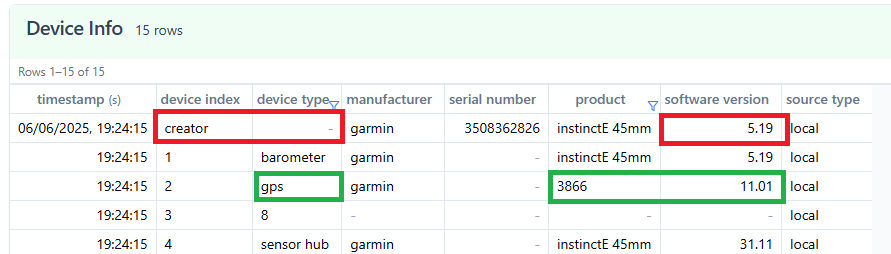
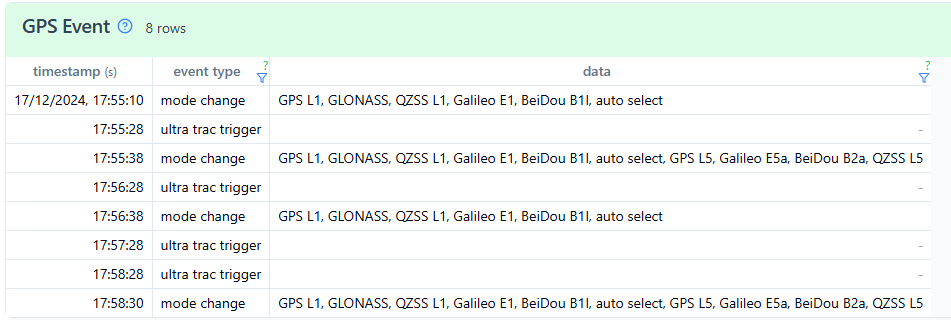
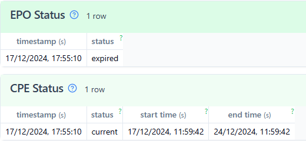
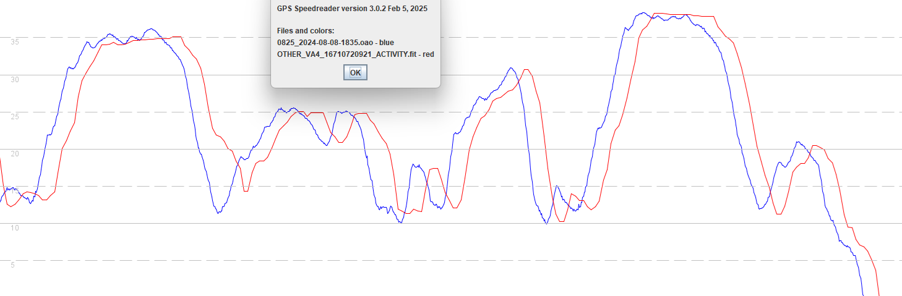
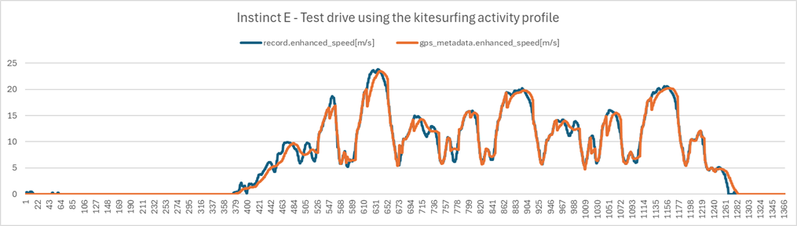
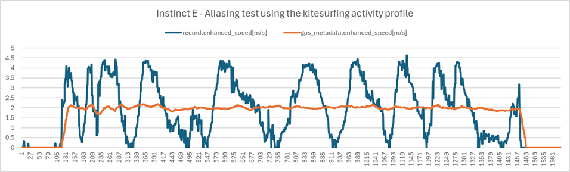

## Garmin - GNSS Chipsets

Author: Michael George

Created: 7 Jun 2025

### Introduction

The GNSS chipset is probably the most significant factor when it comes to the accuracy and reliability of GPS watches. Additional factors include antenna design, GNSS firmware, watch firmware, and user settings. The activity profile and / or app choice are also really important.

This page provides some details about the different GNSS chipsets used in Garmin watches, including their unique traits and means of identification. A separate page lists most of the Garmin watches and their GNSS chipset. The list of Garmin watches is available via this [link](../watches/README.md).

### Chipsets

The following GNSS chipsets have been used in Garmin watches, listed chronologically:

- SiRFstarII, SiRFstarIII, SiRFstarIV
- MediaTek MT3333
- Sony CXD5603GF and CXD5605GF
- Airoha AG3335M and AG3335MN
- Synaptics SYN4778

### Identification

Various pieces of information can be helpful when trying to ascertain the GNSS chipset inside a Garmin watch.

- Physical teardown
- Product specification + manual
  - GNSS capabilities
- Device information
  - System software version
  - GPS software version
  - GPS product number
- Additional information
  - GPS events
  - EPO status / CPE Status
  - Recorded speeds
  - GPS metadata

The following sections will describe each of the topics individually.

#### Physical Teardown

Physical teardowns are a good source of definitive proof about what is inside a specific watch.

Links to numerous teardowns are available in the list of Garmin watches, available via this [link](../watches/README.md).

#### Product Specification

If the product specification states the battery life for "GPS only" and "All Systems" then it is almost certainly using Airoha or Synaptics.

The satellite settings described in the user manual can also provide a clue:

- "GPS + GLONASS" or "GPS + Galileo" will be SiRF, MediaTek or Sony.
- "All Systems" will be Airoha or Synaptics.
- "All Systems + Multi-Band" will be the AG3335M (single-band is AG3335MN) or Synaptics SYN4778.
- Likewise for SatIQ which is dependent on multi-band.

The presence (or absence) of BeiDou and GZSS in the product specification does not tell us anything. All of the Airoha-based watches support BeiDou and QZSS, which can easily be confirmed by looking at the mode_change records in gps_event records within their FIT files. The omission of BeiDou and QZSS on Garmin product pages is simply an oversight.

The vívoactive 5 and vívoactive 6 both support BeiDou and QZSS, despite it only being mentioned for the vívoactive 6.

#### Software Version

The device_info records in the FIT file are a good source of information. The example below is from the Instinct E using the online [Fit File Viewer](https://www.fitfileviewer.com/).

The system software version (creator device) is often identical on a number of related watches:

- Fenix 8 AMOLED, Fenix 8 Solar, Enduro 3, Fenix E, and Tactix 8
- Fenix 7 and 7 Pro, Epix and Epix Pro (42mm/47mm/51mm), Enduro 2, Quatix 7, and MARQ Gen 2
- Forerunner 965, 955, 265, 255, 165
- Instinct 3 Solar, Instinct 3 AMOLED, and Instinct E
- Venu 3, Venu 3S, and Vivoactive 5

There is a possibility of related watches (i.e. identical system software) all using the same brand of GNSS chipset.

This does NOT always hold true though. e.g. Instinct 2 (Sony) and Instinct 2X (Airoha) have identical software versions.

#### GPS Details

Different watch ranges will likely be using the same brand of GNSS chipset if they receive identical GPS software versions.

e.g. Fenix 7 and 7 Pro, Epix and Epix Pro, Enduro 2, Quatix 7, MARQ Gen 2, Forerunner 965, 955, 265, 255, 165 currently have GPS software 13.00.

The GPS software version can also be a good differentiator of watches. e.g. 8.07 for the Instinct2X (Airoha) vs 6.10 for the Instinct 2 (Sony).

There is the also the GPS product number (e.g. 3866 = Airoha AG3335MN) which is described on another page, available via this [link](products.md).

Beware though because the fenix 7 Sapphire incorrectly lists the GNSS product number as 3866 (AG3335MN), despite being multi-band.

#### GPS Events

The gps_event records were introduced in the Sony-era of Garmin watches and can be a useful diagnostic tool. The example below shows "all systems" being used by the Venu 3S. It cannot be the Sony chipset and worth noting that it supports BeiDou and QZSS, despite the Garmin product specification.

Although the GNSS mode is chosen by the user, multi-band (L1 + L5) and SatIQ will always be evident when they are active.

All of the possible GNSS configurations are listed in the [Toybox.Position](https://developer.garmin.com/connect-iq/api-docs/Toybox/Position.html) documentation for Garmin developers.

QZSS is not chosen by the user (or app developer) and is activated automatically by the Garmin watch, when applicable.

#### EPO / CPE Status

Another clue in the FIT file relates to the epo_status and cpe_status records. CPE records are only present for Airoha and Synaptics chipsets, but the absence of CPE can be misleading. The Instinct 2X and Venu Sq 2 both have the Airoha chipset but only have epo_status records. Nonetheless the presence of up-to-date CPE status indicates an Airoha or Synaptics chipset.

#### Recorded Speeds

Activity profiles such as windsurfing, kitesurfing and "other" are supposed to record the Doppler-derived speed from the GNSS chipset. The Sony chipset performs rather badly and one of its traits is exactly the same speed being repeated for several seconds. The chart shows a test drive for a [Motion GPS](https://www.motion-gps.com/motion) (blue, extremely precise logger with u-blox chipset recording at 5 Hz) and vívoactive 4 (red, Sony chipset). The highs and lows are not always accurate on the Sony and repeated speeds are obvious when looking at the actual data. It may not be so apparent for this test drive but it is very obvious in real windsurfing data.

#### GPS Metadata

The topic of GPS metadata will be described in more detail on a separate page, but Airoha-based watches exhibit curious dips in the speed data during controlled tests such as test drives. This unusual approach to filtering is only implemented by Garmin in the Airoha-based watches.

Tests designed to produce aliasing artefacts during a brisk walk (with exaggerated swinging of arms) are also a useful because the data differs greatly for the Sony, Airoha and Synaptics devices.

I still need to be document what Garmin are doing for each chipset and why I think it has been implemented in their GPS software. It's quite an involved topic, but the observations that can be made provide useful insights about the GNSS chipset.

