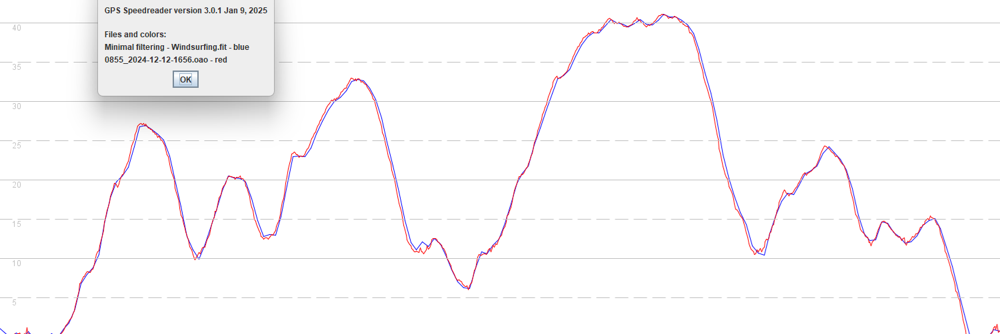
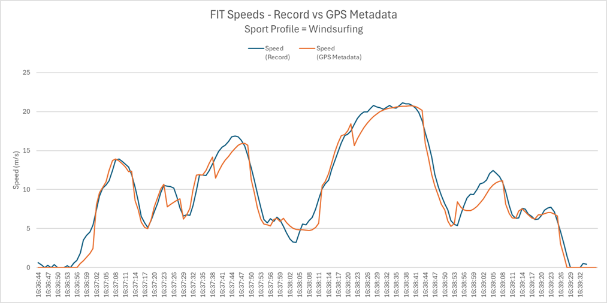
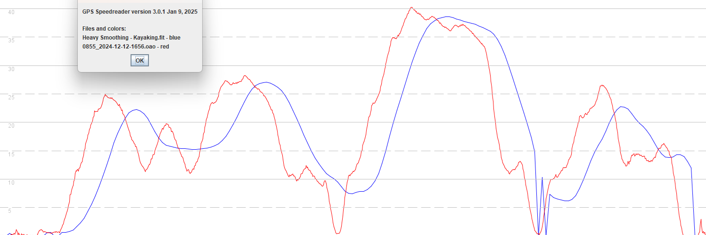
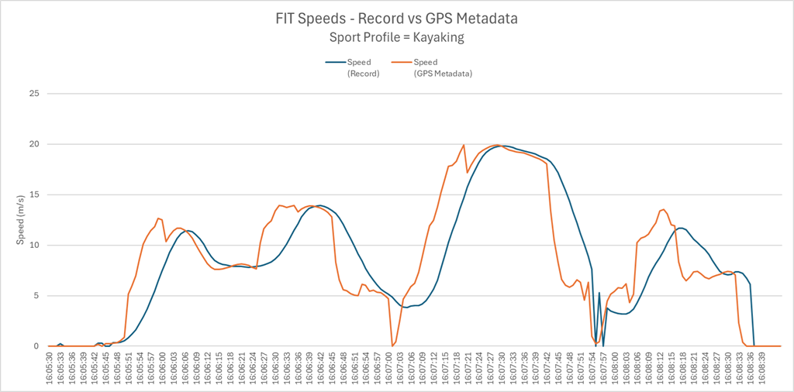
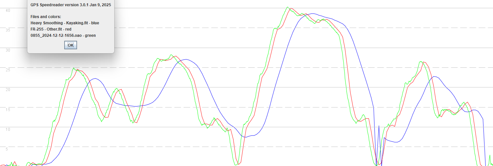
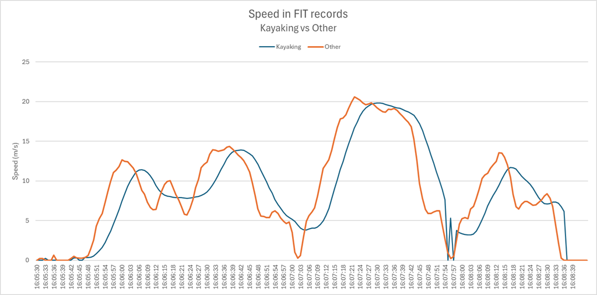
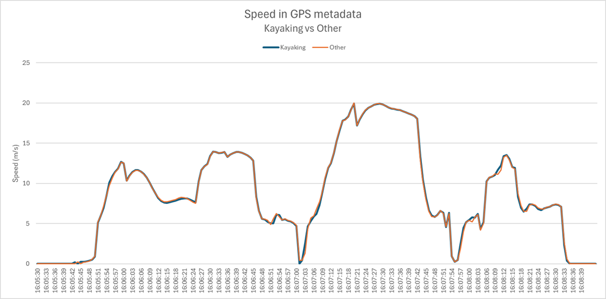

## Garmin - Filtering

Author: Michael George

Created: 18 Jan 2024

### Introduction

This is a continuation of the investigation into the [GPS Metadata](../metadata/README.md) found in Garmin FIT files.

Whilst the original investigation primarily used the data from a short walk, this one looks at the data from short test drives.

### Sport Profiles

#### Windsurfing

The windsurfing activity does not implement any significant filtering of the Doppler-derived speeds.

This can be seen when comparing the FIT records (blue) against the data from a Motion GPS (red).

The GPS metadata (orange) in the FIT file does not match the speeds in the FIT records (blue). It can be seen that the speeds in GPS metadata are filtered / smoothed and there are some peculiar drop-offs in the speed.

#### Kayak

The kayaking sport profile is already known to implement heavy filtering / smoothing, just like the stand up paddling profile.

This can be seen when comparing the speeds in FIT records (blue) against the speeds from a Motion GPS (red).

The GPS metadata (orange) is clearly not the raw Doppler-derived speeds, but appears to use similar filtering to the windsurfing profile. Note it also includes the peculiar drop-offs in the speed, just like the windsurfing profile.

### Hypothesis

- The FIT records contain speed data that has been filtered (or not) according to the sport profile.
- The GPS metadata contains speed data that has been through a generic filter, perhaps used for live speeds or pace information?

### Validation

#### Approach

To test the hypothesis, two Garmin watches recording the same test drive were directly compared.

- Kayaking - heavy filtering
- Generic - no significant filtering

The expectation is for the GPS metadata to be near-identical from both watches, whilst the speed in FIT records should differ greatly.

#### Results

Let's begin with a comparison of the various GPS receivers.

- Garmin (kayaking) - blue
- Garmin (other) - red
- Motion GPS - green

Aside from the usual 1 second delay it can be seen how the "other" activity (red) compares favorably to the Motion (green), whilst the kayaking activity (blue) implements some heavy filtering / smoothing.

Just as a sanity check the data from the FIT records can also be plotted in Excel.

The comparison of GPS metadata from both watches confirms that the filtering is identical for both activities; kayaking and other.

### Conclusions

- The various sport profiles on Garmin watches filter the speed data, whatever is is deemed appropriate.
  - There are activities with minimal filtering (e.g. windsurfing, kiteboarding, other).
  - There are activities with heavy filtering (e.g. kayaking, stand up paddleboarding, surfing).
- GPS metadata contains speeds which have been filtered in a consist manner, regardless of the activity.
  - The filtering is much less than FIT records for kayaking, stand up paddleboarding, surfing, etc.
  - The speeds in GPS metadata are unsuitable for speed sailing, because of the peculiar drop-offs.
- The filtering used for GPS metadata appears similar to the FIT records of Garmin watches during 2022.
  - Subsequent testing might compare FIT records and GPS metadata from Garmin watches in 2022.
  - The filtering is also reminiscent of the problematic COROS firmware(s) on their watches during 2024.
- The purpose of the speeds in GPS metadata is unclear.
  - They are not used for speed graphs in Garmin Connect, or headline statistics such as max speed.
  - Perhaps GPS metadata is used for live speeds or pace information, primarily for activities with lots of arm movement?

That's it for this investigation. The nature of the GPS metadata is far less of a mystery now!
