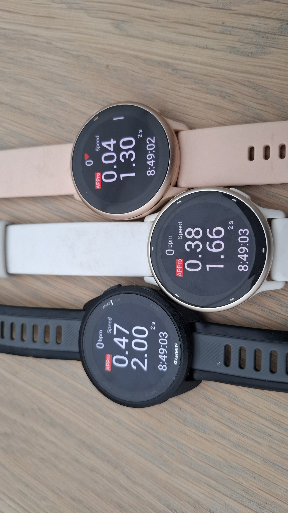
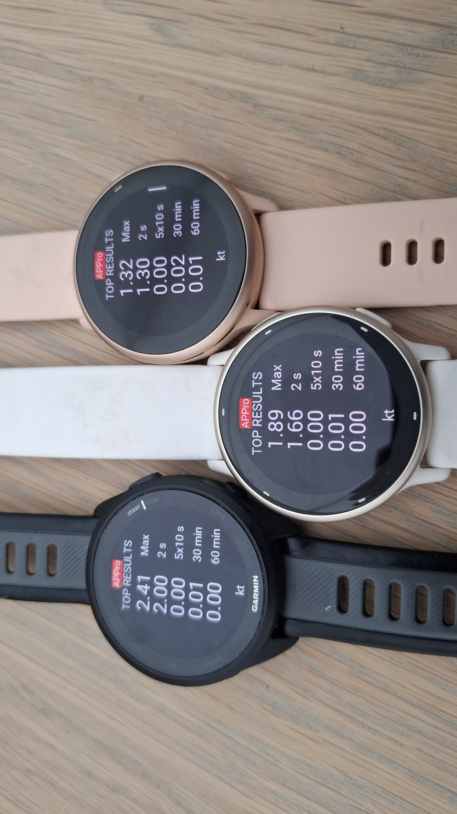
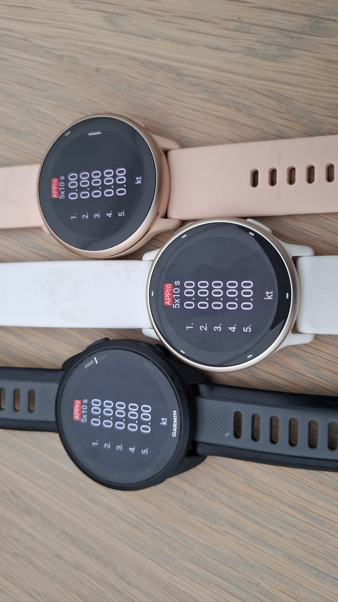
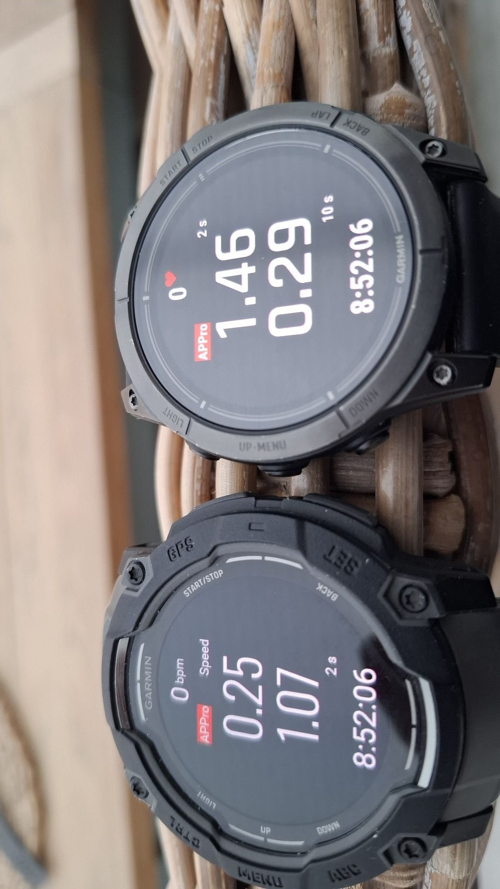
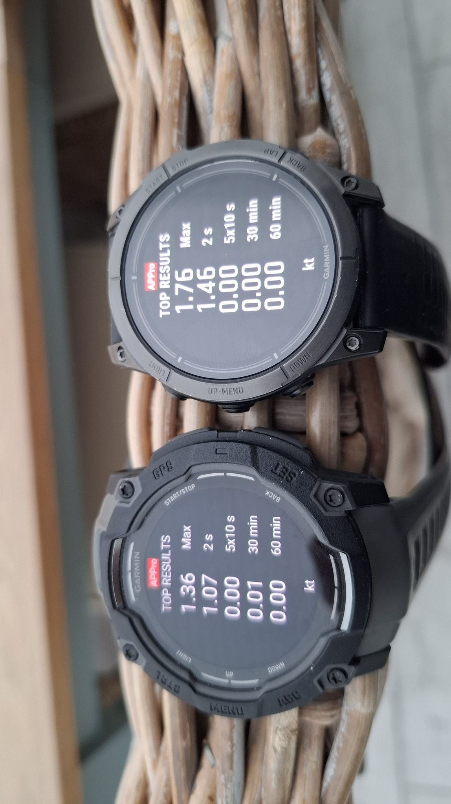
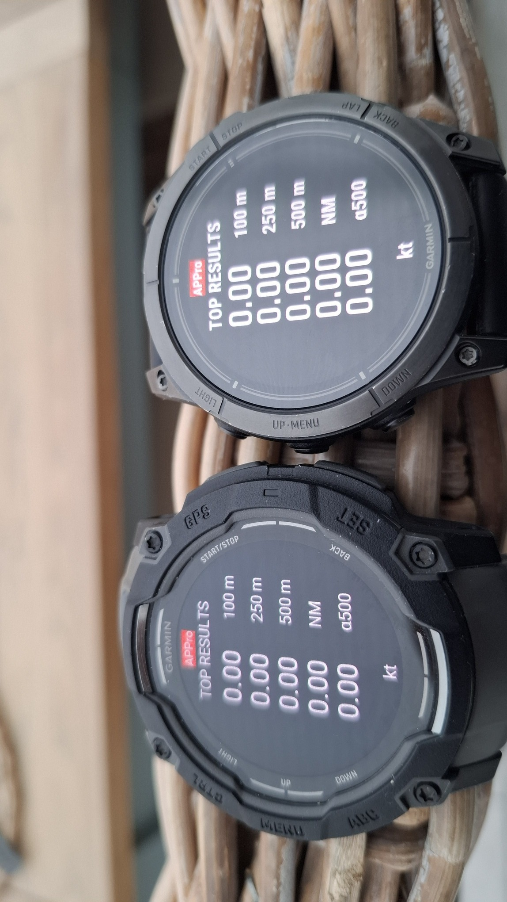
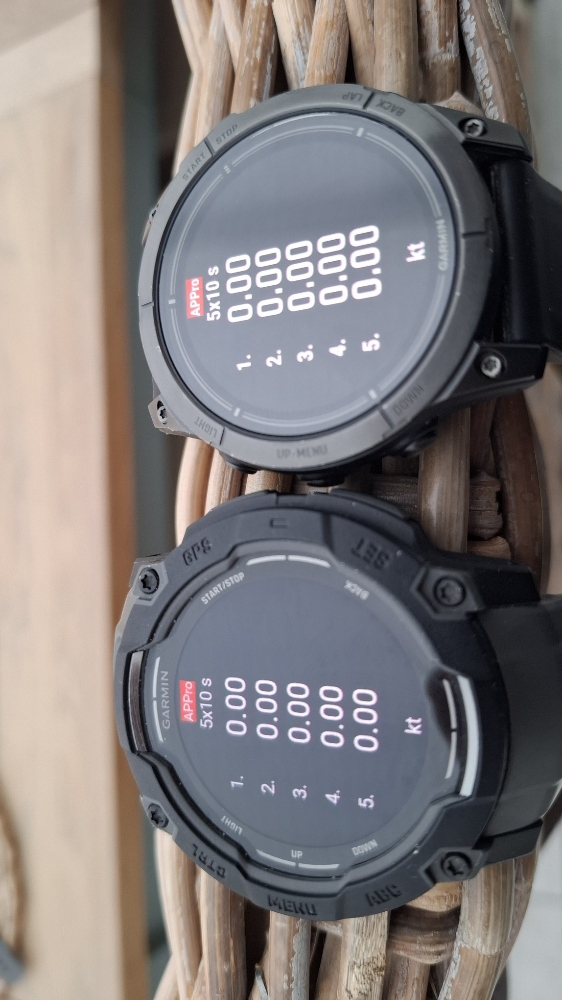
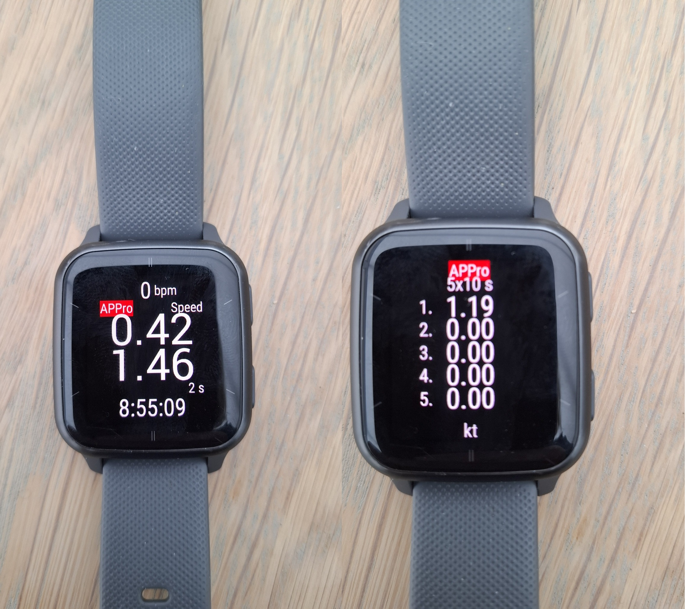
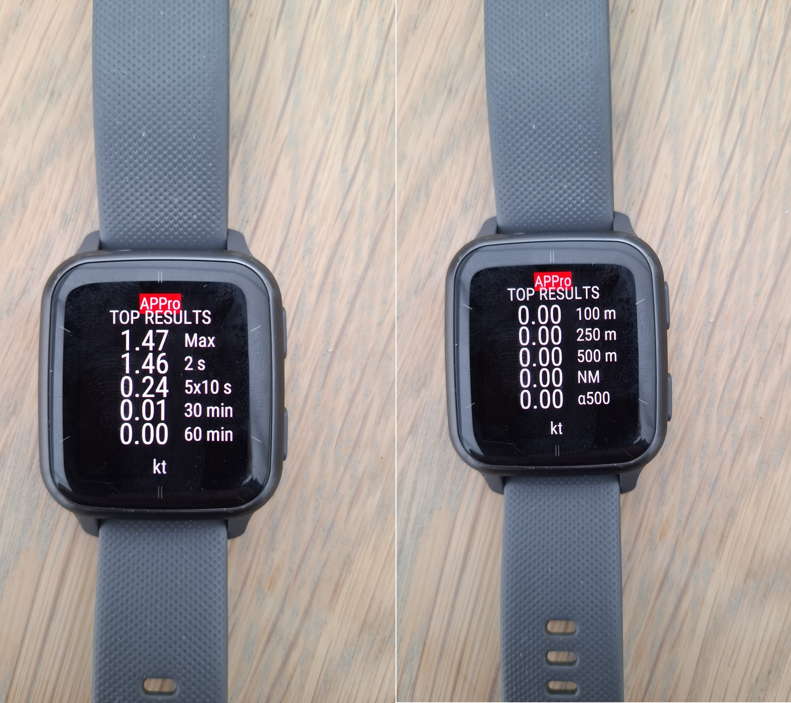

## Screen Comparisons

These are some brief notes after comparing different watch models with the pre-release versions of APPro v5.

All fonts for a specific watch determined from the Connect IQ SDK:

```sh
jq -r '.fonts[] | select(.fontSet == "ww") | .fonts[].filename' fenix7pro/simulator.json | sed 's/_[0-9][0-9]PX//' | sort -u
```

Medium fonts determined as follows:

```sh
jq -r '.fonts[] | select(.fontSet == "ww") | .fonts[] | select(.name == "medium" or .name == "numberThaiHot") | .filename' fenix7/simulator.json
```


### MIP Displays

#### fenix and Forerunner

The fenix 7 has been included as a comparator, but is very different to the four watches that use fenix 5 fonts.

| Model                | Resolution | Font                                           |
| -------------------- | ---------- | ---------------------------------------------- |
| fenix 7 Pro          | 260x260    | FENIX6_CDPG_ROBOTO + FENIX6_BIONIC_BOLD_NUMBER |
| fenix 5              | 240x240    | FENIX5_ROBOTO + FENIX5_CHRONOS                 |
| fenix 5 plus         | 240x240    | FENIX5_ROBOTO + FENIX5_CHRONOS                 |
| Forerunner 935       | 240x240    | FENIX5_ROBOTO + FENIX5_CHRONOS                 |
| Forerunner 645 Music | 240x240    | FENIX5_ROBOTO + FENIX5_CHRONOS                 |


The live screen is the same on the four rightmost watches. The live speeds on the fenix 7 are very different to the other watches.


Top results are the same on the four rightmost watches. The fenix 7 on the left is quite different to the other watches.


Top results are the same on the four rightmost watches. The fenix 7 on the left is quite different to the other watches.


#### vivoactive and Forerunner

The vivoactive 3 is quite similar to the other 3 watches in terms of fonts and layout, so it has been included in this group.

| Model          | Resolution | Font                                          |
| -------------- | ---------- | --------------------------------------------- |
| vivoactive 3   | 240x240    | NOTO_SANS_BOLD + NOTO_SANS_BOLD_NMBR          |
| Forerunner 245 | 240x240    | FR945_CDPG_ROBOTO + FR945_ROBOTO_BC_NUMBER    |
| Forerunner 255 | 260x260    | FR255_CDPG_ROBOTO + FR255_ROBOTO_BLACK_NUMBER |
| vivoactive 4   | 260x260    | VIVOACTIVE4_ROBOTO + VIVOACTIVE4_BOLD_NUMBER  |


The rightmost 3 watches appear to be using the exact same font, but the vivoactive 3 also looks quite similar.


The rightmost 3 watches appear to be using the exact same font and layout.


The rightmost 3 watches appear to be using the exact same font and layout.


#### 260 x 260

There are 3 watches in my collection with 260x260 resolution, but the fenix 7 is the odd one out in terms of font and layout.

| Model          | Resolution | Font                                           |
| -------------- | ---------- | ---------------------------------------------- |
| Forerunner 255 | 260x260    | FR255_CDPG_ROBOTO + FR255_ROBOTO_BLACK_NUMBER  |
| vivoactive 4   | 260x260    | VIVOACTIVE4_ROBOTO + VIVOACTIVE4_BOLD_NUMBER   |
| fenix 7 Pro    | 260x260    | FENIX6_CDPG_ROBOTO + FENIX6_BIONIC_BOLD_NUMBER |

The Forerunner 255 and vivoactive 4 appear to be using the same font and layout, but the fenix 7 Pro is clearly different.


The Forerunner 255 and vivoactive 4 appear to be using the same font and layout, but the fenix 7 Pro is clearly different.


### AMOLED

#### Forerunner and vivoactive

There are 3 watches in my collection with 390x390 resolution, pretty much identical in terms of fonts and layouts.

| Model          | Resolution | Font                                            |
| -------------- | ---------- | ----------------------------------------------- |
| Forerunner 165 | 390x390    | Roboto-Regular (TTF)                            |
| vivoactive 5   | 390x390    | VIVOACTIVE5, VIVOACTIVE5_NUMBER                 |
| vivoactive 6   | 390x390    | Roboto-Regular (TTF), Yantramanav-Regular (TTF) |

The Forerunner 165 and vivoactive 6 both use TrueType fonts, but look almost identical to the vivoactive 5 (centre).









#### epix Pro and Instinct 3

There are 2 watches in my collection with 416x416 resolution, which are both very different in appearance.

| Model              | Resolution | Font                                                   |
| ------------------ | ---------- | ------------------------------------------------------ |
| epix Pro - 47 mm   | 416x416    | EPIX2_CDPG_ROBOTO, EPIX2_BIONIC_SEMI_BOLD_NUMBER       |
| Instinct 3 - 50 mm | 416x416    | INSTINCT3AMOLED50MM_ROBOTO, INSTINCT3AMOLED50MM_OSWALD |

The epix Pro and Instinct 3 are very different in terms of the fonts, especially the live speeds.










#### Venu Sq 2

The Venu Sq 2 has a fairly unique specification, but is handled well by APPro v5.

| Model     | Resolution | Font                                                 |
| --------- | ---------- | ---------------------------------------------------- |
| Venu Sq 2 | 320x360    | VENUSQ2_ROBOTO_CONDENSED, VENUSQ2_YANTRAMANAV_NUMBER |






