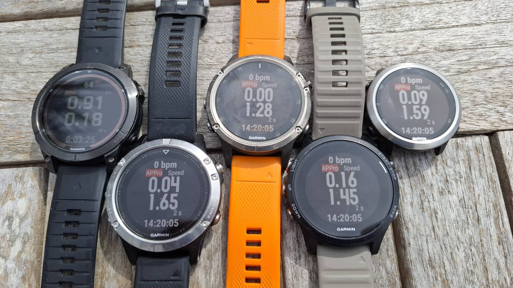
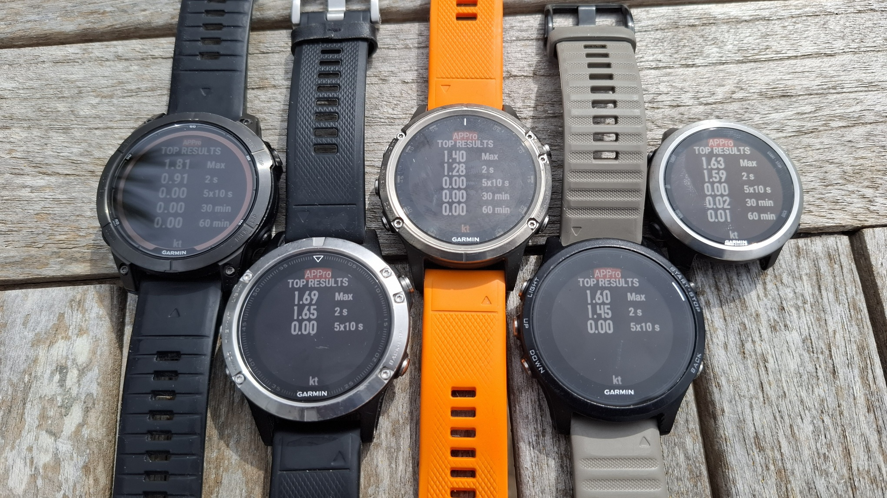
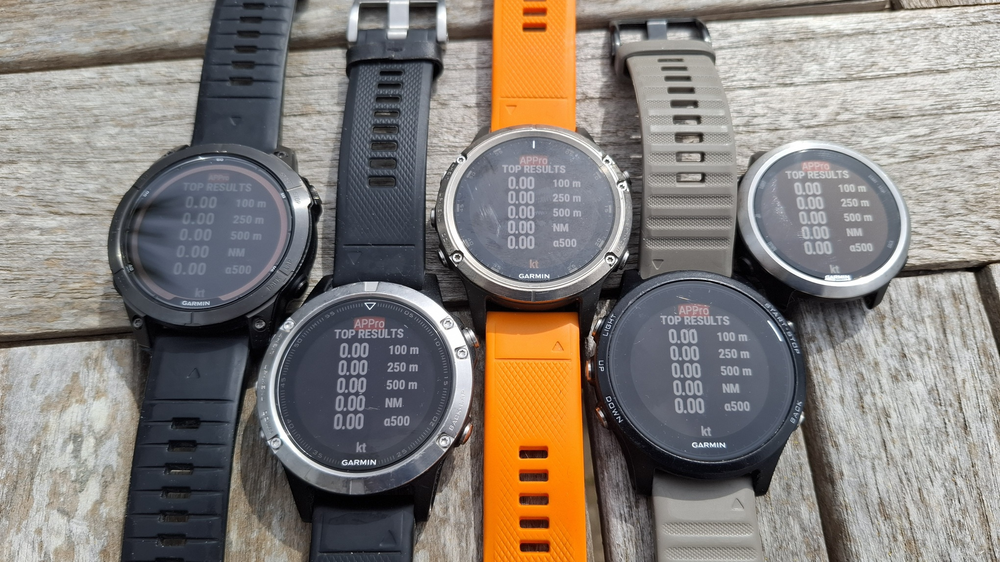
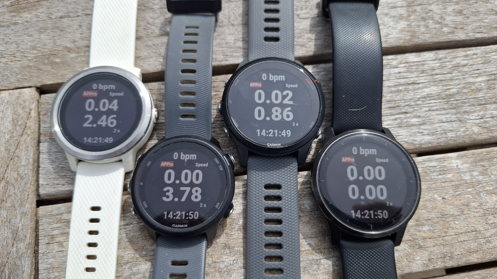
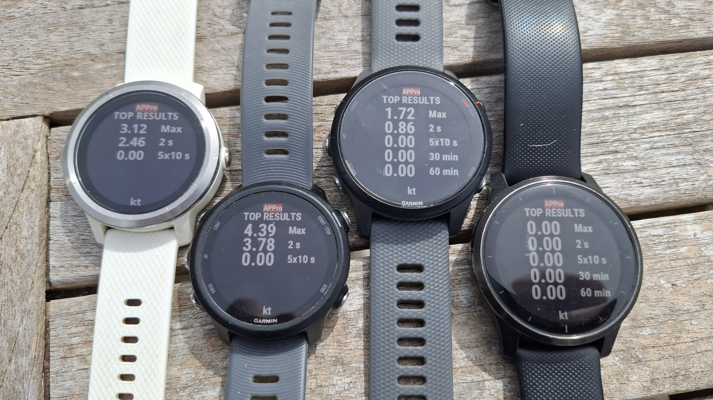
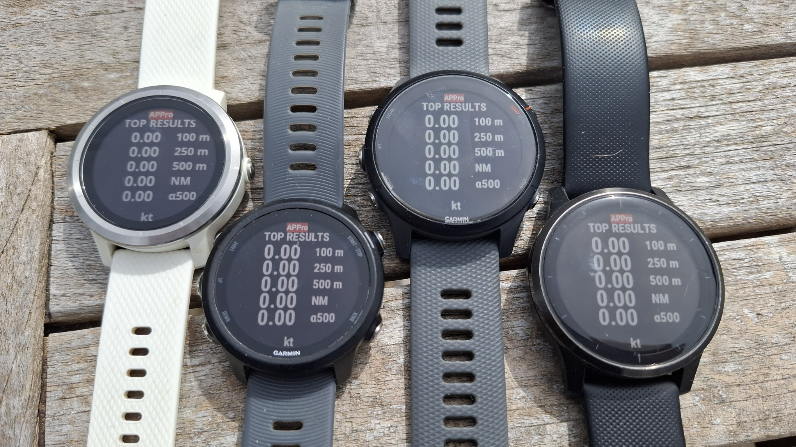
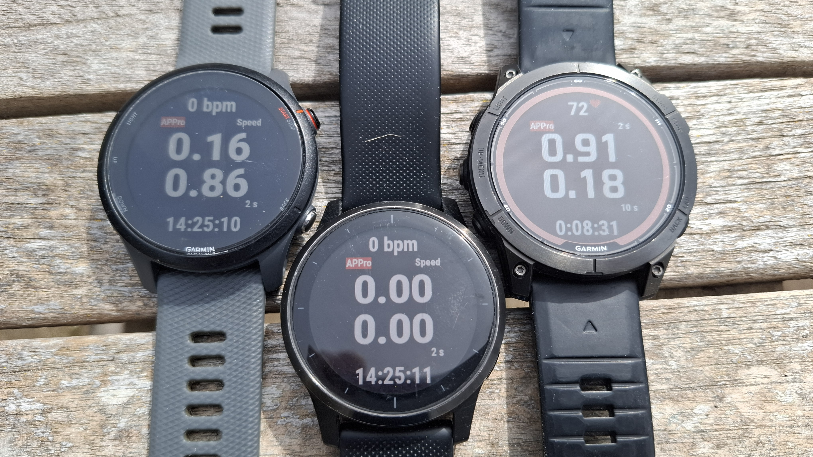
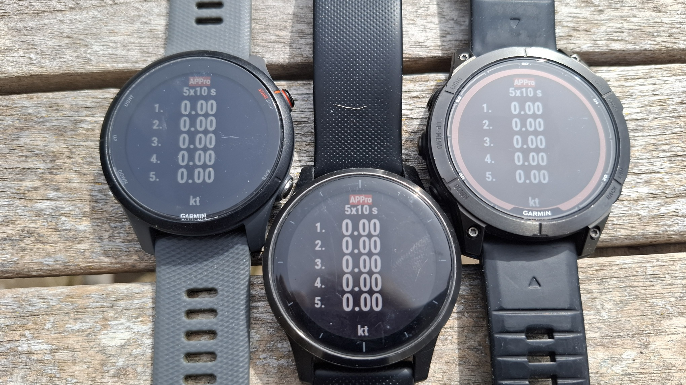

## Screen Comparisons

These are some brief notes after comparing different watch models with the pre-release versions of APPro v5.

All fonts for a specific watch determined from the Connect IQ SDK:

```sh
jq -r '.fonts[] | select(.fontSet == "ww") | .fonts[].filename' fenix7pro/simulator.json | sed 's/_[0-9][0-9]PX//' | sort -u
```

Medium fonts determined as follows:

```sh
jq -r '.fonts[] | select(.fontSet == "ww") | .fonts[] | select(.name == "medium" or .name == "numberThaiHot") | .filename' fenix7/simulator.json
```


### MIP Displays

#### fenix and Forerunner

The fenix 7 has been included as a comparator, but is quite different to the four watches that use fenix 5 fonts.

| Model                | Resolution | Font                                           |
| -------------------- | ---------- | ---------------------------------------------- |
| fenix 7 Pro          | 260x260    | FENIX6_CDPG_ROBOTO + FENIX6_BIONIC_BOLD_NUMBER |
| fenix 5              | 240x240    | FENIX5_ROBOTO + FENIX5_CHRONOS                 |
| fenix 5 plus         | 240x240    | FENIX5_ROBOTO + FENIX5_CHRONOS                 |
| Forerunner 935       | 240x240    | FENIX5_ROBOTO + FENIX5_CHRONOS                 |
| Forerunner 645 Music | 240x240    | FENIX5_ROBOTO + FENIX5_CHRONOS                 |


The live screen is the same on the four rightmost watches. The font of the fenix 7 is quite different to the other watches.




Top results are the same on the four rightmost watches. The fenix 7 on the left is subtly different to the other watches.




Top results are the same on the four rightmost watches. The fenix 7 on the left is subtly different to the other watches.




#### vivoactive and Forerunner

The vivoactive 3 is quite similar to the other 3 watches in terms of fonts and layout, so it has been included in this group.

| Model          | Resolution | Font                                          |
| -------------- | ---------- | --------------------------------------------- |
| vivoactive 3   | 240x240    | NOTO_SANS_BOLD + NOTO_SANS_BOLD_NMBR          |
| Forerunner 245 | 240x240    | FR945_CDPG_ROBOTO + FR945_ROBOTO_BC_NUMBER    |
| Forerunner 255 | 260x260    | FR255_CDPG_ROBOTO + FR255_ROBOTO_BLACK_NUMBER |
| vivoactive 4   | 260x260    | VIVOACTIVE4_ROBOTO + VIVOACTIVE4_BOLD_NUMBER  |


The rightmost 3 watches appear to be using the exact same font, but the vivoactive 3 also looks quite similar.




The rightmost 3 watches appear to be using the exact same font and layout.




The rightmost 3 watches appear to be using the exact same font and layout.




#### 260 x 260

There are 3 watches with 260x260 resolution, but the fenix 7 is the odd one out in terms of font and layout.

| Model          | Resolution | Font                                           |
| -------------- | ---------- | ---------------------------------------------- |
| Forerunner 255 | 260x260    | FR255_CDPG_ROBOTO + FR255_ROBOTO_BLACK_NUMBER  |
| vivoactive 4   | 260x260    | VIVOACTIVE4_ROBOTO + VIVOACTIVE4_BOLD_NUMBER   |
| fenix 7 Pro    | 260x260    | FENIX6_CDPG_ROBOTO + FENIX6_BIONIC_BOLD_NUMBER |

The Forerunner 255 and vivoactive 4 appear to be using the same font and layout, but the fenix 7 Pro is clearly different.




The Forerunner 255 and vivoactive 4 appear to be using the same font and layout, but the fenix 7 Pro is clearly different.

