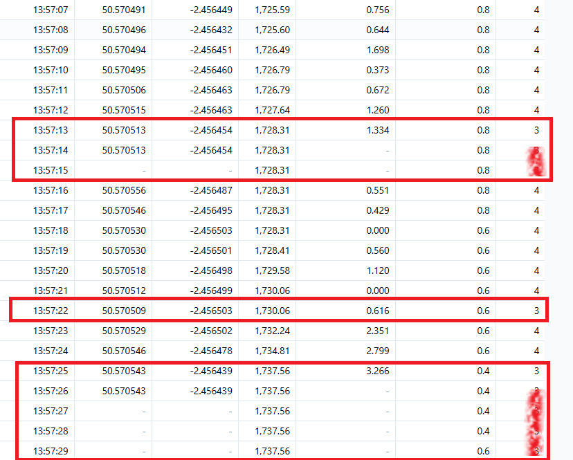

## Garmin - GPS Metadata

Author: Michael George

Created: 17 Jan 2024

### Introduction

This is a very brief document to report some observations relating the "GPS Metadata" in Garmin FIT files.

The test data was recorded on a Fenix 7 Pro using APPro with multi-band enabled.

### Observations

#### Speed

A quick comparison of the speed data in FIT records and GPS metadata.

- Speed in the FIT record is believed to be the raw Doppler-derived speed.
- Speed in the GPS metadata is believed to be a smoothed version of the Doppler-derived speed.
- Position speed is calculated by GPS Speedreader using changes latitude + longitude.
  - The positional accuracy wasn't great, due to the watch being worn under winter clothing.

#### Altitude

A quick visual comparison of the altitude / elevation data in FIT records and GPS metadata.

- Altitude in the FIT record is derived from the barometer in the watch.
- Altitude in the GPS metadata is probably just the altitude from the GNSS receiver.
  - The accuracy wasn't great, probably due to the watch being worn under winter clothing.

#### Timestamps

It is worth noting that the timestamps in FIT records and GPS metadata differ.

This appears to be the difference between the Garmin system time (timestamp in FIT records) vs GPS metadata (originating from the NMEA).

This is most obvious when examining a test file that has intentionally had the GNSS signals blocked using aluminium foil.

It is important to bear timestamp differences in mind in the following sections of the document.

#### Loss of Lock

It can be seen that GPS metadata is not saved when there is a loss of lock.

This is particular evident in a short test file when the GNSS signals were deliberately blocked using aluminium foil.

#### Fix Quality

In addition to complete loss of lock there is a more subtle factor, showing that GPS metadata is only saved when the fix quality is 4 (QUALITY_GOOD).

Take the following example where GPS metadata is missing:

- 13:57:12 to 13:57:14
- 13:57:21
- 13:57:24 to 14:16:08

The corresponding FIT records have a fix quality of 3 (QUALITY_USABLE) at those same moments in time.

- 13:57:13 to 13:57:15
- 13:57:22
- 13:57:25 to 14:16:09

It should be noted that the FIT records have a timestamp which is 1 second later than GPS metadata. This is almost probably corresponds to the 1 second delay that is seen in the speed data from Garmin FIT watches, when compared to something like a Motion GPS.

#### Frozen Records

A short test walk had one missing entry in GPS metadata at 17:09:17.

This occurred when a frozen latitude + longitude + speed was evident in the FIT records.

Bearing in mind that the timestamps in FIT records and GPS metadata do not necessarily match, it may be that the NMEA record at 17:09:17 was somehow lost. Either it was never generated by the GNSS chipset, or it was lost due to unpredictable timings within the Garmin event handling.

### Summary

- The speed in GPS metadata is a smoothed version of the Doppler-derived speed and no use to speed sailors.
- The altitude may well be the altitude / elevation, relative to MSL (or more accurate terminology the orthometric height).
- Timestamps in the FIT records (Garmin system time) and GPS metadata (NMEA timestamp) often differ by a second.
- Unlike FIT records, GPS metadata is not saved when the fix quality is not 4 (QUALITY_GOOD).
  - GPS metadata is not saved when there is a loss of lock because fix quality would be 0 (QUALITY_NOT_AVAILABLE).
- Frozen records may also be accompanied by missing records in GPS metadata.
  - This could be due to unpredictable timings within the Garmin event handling, or the related to the NMEA data.
