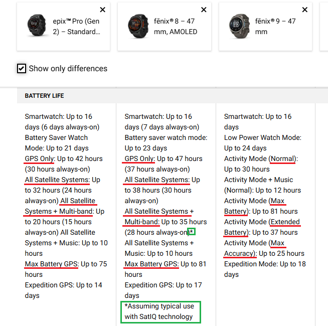

## Garmin Power Modes

Author: Michael George

Created: 29 Aug 2026

### Overview

There is currently some debate about the "new" satellite settings on the fenix 9.

This is a quick document which shares my thoughts, which will be tested in the near future.

### Power Modes

Garmin introduced the concept of "[power modes](https://support.garmin.com/en-GB/?faq=UKdcLjyUEZ4xdiX5HWzgp7)" for the fenix 6, and they have been present on all subsequent models of the fenix.

The default satellite settings for each of the power modes are as follows:

|                  |  fenix 6  |     fenix 7      |     fenix 8      |     fenix 9      |
| ---------------- | :-------: | :--------------: | :--------------: | :--------------: |
| **Normal**       |     -     |   Auto Select    |   Auto Select    |      Normal      |
| **Extended**     |     -     |     GPS Only     |     GPS Only     | Extended Battery |
| **Max Battery**  | UltraTrac |    UltraTrac     |    UltraTrac     |   Max Battery    |
| **Max Accuracy** |     -     | All + Multi-Band | All + Multi-Band |   Max Accuracy   |
| **Jacket Mode**  |   None    |       None       |       None       |       None       |

It would appear that Garmin have simply renamed the satellite settings on the fenix 9 to match the corresponding power modes.

Notes about some Garmin trademarks:

- [SatIQ](https://www.garmin.com/en-GB/blog/garmin-engineer-talks-satiq-longer-battery-life-same-precise-tracking/) will "auto select" the right satellite mode for your environment
- [UltraTrac](https://www8.garmin.com/manuals/webhelp/forerunner935/EN-US/GUID-AFF93BBA-2F68-4C2A-9667-DE3168B3C49C.html) will only record track points and sensor data once per minute

### Satellite Settings

There is currently some confusion about the "new" satellite settings on the fenix 9, but these are my expectations:

|                      |   Historically   | Description in fenix 8 owner's manual                        |
| -------------------- | :--------------: | ------------------------------------------------------------ |
| **Max Accuracy**     | All + Multi-Band | Prioritizes maximum positioning accuracy while reducing battery life. This setting provides increased performance in challenging environments for short-duration activities. |
| **Normal**           |   Auto Select    | Balances average positioning accuracy and average battery life. This setting provides the best positioning accuracy while still prioritizing battery life. |
| **Extended Battery** |   All Systems    | Balances above-average battery life and below-average positioning accuracy. This setting provides the best battery life while still prioritizing positioning accuracy. |
| **Max Battery**      |    UltraTrac     | Prioritizes maximum battery life while reducing positioning accuracy. This setting records track points and sensor data less frequently for long-duration activities. |

Note: The above expectations are different to some prominent reviewers on YouTube.

#### Max Accuracy

> Prioritizes maximum positioning accuracy while reducing battery life. This setting provides increased performance in challenging environments for short-duration activities.

I am pretty sure that "Max Accuracy" is the same as "All + Multi-Band", not "Auto Select" as suggested by some people on YouTube.

All + Multi-Band is described in more detail in the fenix 7 and fenix 8 manuals, but I am pretty sure that "Max Accuracy" will be the same.

#### Normal

> Balances average positioning accuracy and average battery life. This setting provides the best positioning accuracy while still prioritizing battery life.

I am pretty sure "Normal" is the same as "Auto Select" (aka SatIQ) on the fenix 7 and fenix 8 watches.

n.b. The phrase "*best positioning accuracy while still prioritizing battery life*" also appears in the fenix 7 and fenix 8 manuals:

> **Auto Select** - Enables the watch to use SatIQ™ technology to dynamically select the best multi-band GNSS system based on your environment. The Auto Select setting offers the best positioning accuracy while still prioritizing battery life.

#### Extended Battery

> Balances above-average battery life and below-average positioning accuracy. This setting provides the best battery life while still prioritizing positioning accuracy.

I am fairly confident "Extended Battery" will be using "All Systems", not "GPS Only" as suggested by some people on YouTube.

This will be confirmed by [GPS Events](../developer/gps-events.md) in the FIT files of activities using this power mode / satellite setting.

#### Max Battery

> Prioritizes maximum battery life while reducing positioning accuracy. This setting records track points and sensor data less frequently for long-duration activities.

I am pretty sure "Max Battery" is the same as "UltraTrac", which only records track points and sensor data once per minute.

n.b. The phrase "*records track points and sensor data less frequently*" also appears in the fenix 7 and fenix 8 manuals:

> **UltraTrac** - Records track points and sensor data less frequently. Enabling the UltraTrac feature increases battery life but decreases the quality of recorded activities. You should use the UltraTrac feature for activities that demand longer battery life and for which frequent sensor data updates are less important.

### Next Steps

I believe that Garmin have simply renamed the satellite settings to match the power modes. This makes a lot of sense from a user perspective, because the average user doesn't really need to know the technical GNSS terms (or Garmin trademarks UltraTrac and SatIQ).

It is possible to confirm all the the satellite settings by examining [GPS Events](../developer/gps-events.md) in FIT files. This is planned for the near future, once I receive some FIT files from the fenix 9. It is also worth noting that the battery estimates go a long way to corroborating what I have said in this document.
