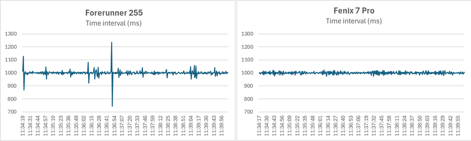
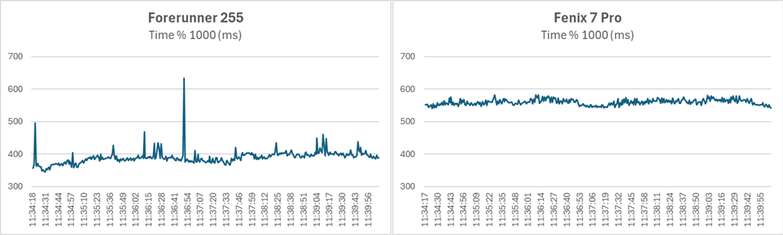
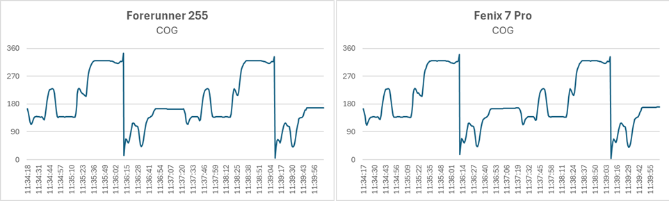
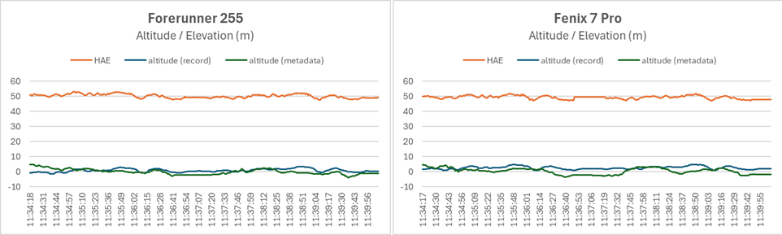

## Garmin - PVT Data

Author: Michael George

Created: 18 Jan 2024

### Introduction

This is a quick investigation into some additional data that can be logged to FIT files by APPro.

The primary focus of this investigation is the timing of location events, but some additional data items are also discussed.

3 laps of a short test circuit were used to obtain some test data from a Forerunner 255 and Fenix 7 Pro.

### Timer

This is obtained from [Toybox.System.getTimer](https://developer.garmin.com/connect-iq/api-docs/Toybox/System.html#getTimer-instance_function) which is a millisecond timer (32-bit signed integer), which wraps around approximately every 49 days.

The test version of APPro only stores the lower 16-bits of the time which means the timer wraps around every 65 seconds. However, it is a relatively simple matter to cope with the frequent wrap around and to use it as a continuous timer. 

#### Time Interval

This is the time between each location event in milliseconds and the data shows the Fenix 7 to be far more consistent:

- Fenix 7 Pro
  - min=973, median=1000, max=1022, range = 49
  - mean=1000, stdev=9
- Forerunner 255
  - min=743, median=1001, max=1236, range = 493
  - mean=1000, stdev=25

What is most striking about the Forerunner 255 is the variability of the location event intervals, jumping from 743 ms to 1236 ms. This equates to 0.493 seconds and could make quite difference when it comes to getting data ready for the FIT writer.

Further testing is required, but this early finding does suggest the potential for timing issues.

#### Absolute Time

This is the time of each location event (% 1000 ms) and the data shows the Fenix 7 to be more consistent:

- Fenix 7 Pro
  - min=540, median=559, max=582, range = 42
  - mean=559, stdev=9
- Forerunner 255
  - min=345, median=389, max=633, range = 288
  - mean=390, stdev=22

It should be noted that the absolute timings do not bear any real significance, because the timer was recorded to the FIT as a 16-bit value, rather than the full 32-bits. The timer is perfectly fine for relative comparisons, but the absolute values may not reflect the true timings.

What is most striking about the Forerunner 255 is the variability of the location event timings, jumping from a median of 389 to 633 for a single location. This equates to 0.244 seconds and could make quite difference when it comes to getting data ready for the FIT writer.

Further testing is required, but this early finding does suggest the potential for timing issues.

### UTC

This is obtained from [Toybox.Position.Info.when](https://developer.garmin.com/connect-iq/api-docs/Toybox/Position/Info.html#whenvar) and corresponds to the time of the PVT solution from the GNSS chipset.

The test version of APPro currently stores the lower 16-bits of the UTC timestamp in the FIT file, which makes it tricky to decode. However, even the lower 16-bits made it clear that logging of 32-bit UTC timestamps will be very useful for diagnostic purposes.

### Course Over Ground

This is obtained from [Toybox.Position.Info.heading](https://developer.garmin.com/connect-iq/api-docs/Toybox/Position/Info.html#heading-var) and is derived by the GNSS chipset.

It is a useful piece of data to have recorded since it is related to the Doppler-derived speed.

### Height Above Ellipsoid

This is obtained from [Toybox.Position.Info.altitude](https://developer.garmin.com/connect-iq/api-docs/Toybox/Position/Info.html#altitude-var) and is derived by the GNSS chipset.

This is the [height above ellipsoid](https://nextnav.com/hae/) (HAE), which is also called the ellipsoidal height, or geodetic height.

It is a useful piece of data because it represents the altitude / elevation as calculated by the GNSS chipset.

### Next Steps

This is just a quick analysis of the data that can be written to the FIT file by APPro.

The UTC timestamp and miilisecond timer need to be changed to 32-bit, but were still useful during this investigation.

Preliminary findings suggest the potential for timing issues on the Forerunner 255, between the NMEA consumption and FIT writing.

Future testing will focus on diagnosis of frozen / repeated data from the Forerunner 255 using 32-bit UTC and millisecond timestamps.

### Data

The GPS logs and the Excel analysis are available for download:

- [GPS logs](gps-logs.zip)
- [Excel Analysis](excel-analysis.zip)

