## Garmin - Repeat Values

Author: Michael George

Created: 16 Jan 2024

### Introduction

It has been observed that FIT files generated by the Forerunner 255 sometimes contain repeated values; latitude, longitude and speed.

This is evident by position-derived speeds dropping to zero, then doubling and an extreme number of repeated values is shown below.

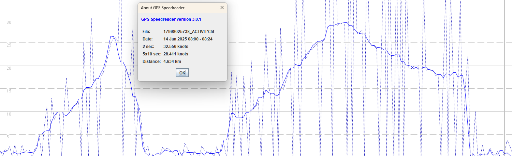

The extent of this issue can vary throughout a session and the image below was from earlier in the day.

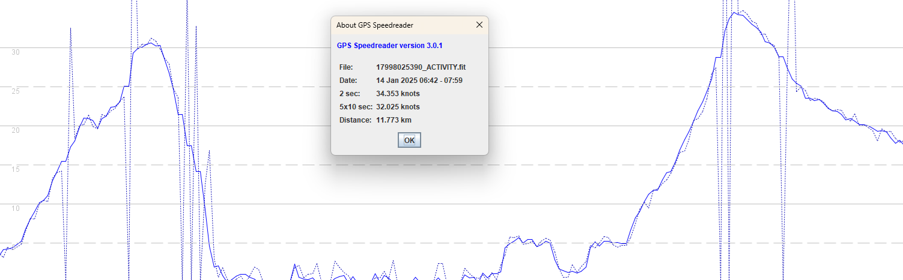

It has been suggested that the extreme number of repeated values in the first example may have been due to the way the watch is being worn, next to a rolled up sleeve.

This document describes some land-based testing in an attempt to ascertain whether degraded signals may be the underlying cause, or whether they are unrelated.

### Approach

One simple way to degrade GNSS signals is to wrap the receiver in aluminium foil, making it possible to repeat the same test(s) with good reception and severely impaired signals. This may not be the same as water-logged neoprene, but still deemed worthy of testing.

Prior to the actual tests it was determined that a single layer of foil is sufficient to cause reception issues. Between 1 and 5 layers of foil were tested, but it was found that 2 layers or more completely blocked the signals on both Garmin and COROS watches.

Multiple tests were then performed over two different days.

- GNSS receivers
  - 2 x Motion Mini for reference
  - 4 x Airoha AG3335M
    - Garmin Fenix 7 Pro + Forerunner 255
    - COROS Apex 2 Pro + VERTIX 2
- 8 trials x 4 GNSS receivers = 32 trials
  - Fenix 7 Pro = 8 trials
  - Forerunner 255 = 8 trials
  - Apex 2 Pro = 8 trials
  - VERTIX 2 = 8 trials
- Each trial period used the same 3 lap circuit
  - Total distance for 3 laps = 5 km
  - Total distance for 8 trials = 40 km

### Findings

It was possible to demonstrate a significant degradation in the accuracy and precision of the GNSS receivers when wrapped in aluminium foil. Both the positional data and velocity data was affected and dropped points were also evident, presumably where there was no data from the GNSS receiver. When data was unavailable from the GNSS receiver, all watches continued to record other sensor data such as altitude, derived from the barometer.

It was not possible to demonstrate a relationship between poor GNSS signals and repeated values as described earlier; latitude + longitude + speed. There were 4 individual occurrences of repeated values during the trials, all on the Forerunner 255 and none on the Fenix 7 Pro. Half of the occurrences were whilst the watch was wrapped in foil, and half whilst the watch was operating normally.

The calculation for the odometer ("distance" field in the FIT file) was confirmed to use changes in latitude + longitude, not SOG. The odometer wasn't intended to be part of the investigation but the degraded data presented an opportunity. The calculation was very easy to confirm, simply by looking for points where the positional speed and doppler speed differed greatly, and comparing them to the odometer change.

The fix quality indicator saved by APPro provides some additional insights, both in terms of HDOP and the manner in which fields get written to FIT files, including how they "freeze" if they are not updated prior to the next FIT record. The [FitContributor](https://developer.garmin.com/connect-iq/api-docs/Toybox/FitContributor/Field.html) documentation mentions an issue with time sensitive data, how values may be lost if not already written to the file, and there is an implication that values will persist, if not updated.

The COROS files provided limited insight, due to the heavy filtering that COROS apply to the latitude + longitude data, but they did give an idea of the typical ranges for HDOP from the Airoha AG3335M, both when the watch has a clear view of the sky, and when it is wrapped in foil. The normal value for the APEX 2 Pro and VERTIX 2 was 0.4, but values exceeding 3.0 (and sometimes up to 5.0) occurred when the watches were wrapped in foil.

### Test Circuit

The image below shows 3 laps of the test circuit and is from the Forerunner 255. The Garmin watches were set up for multi-band and the accuracy + precision of the tracks is self-evident, despite 3 individual laps being displayed. There was no significant deviation in accuracy or precision when the watches were not wrapped in foil.

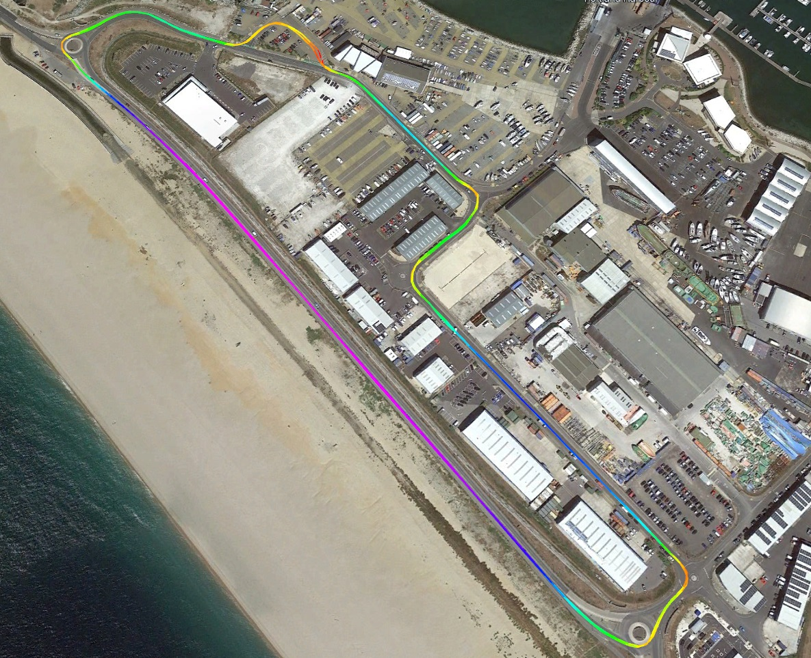

It was also very evident how the aluminium foil affected the Forerunner 255. The image below shows just one of the trials.

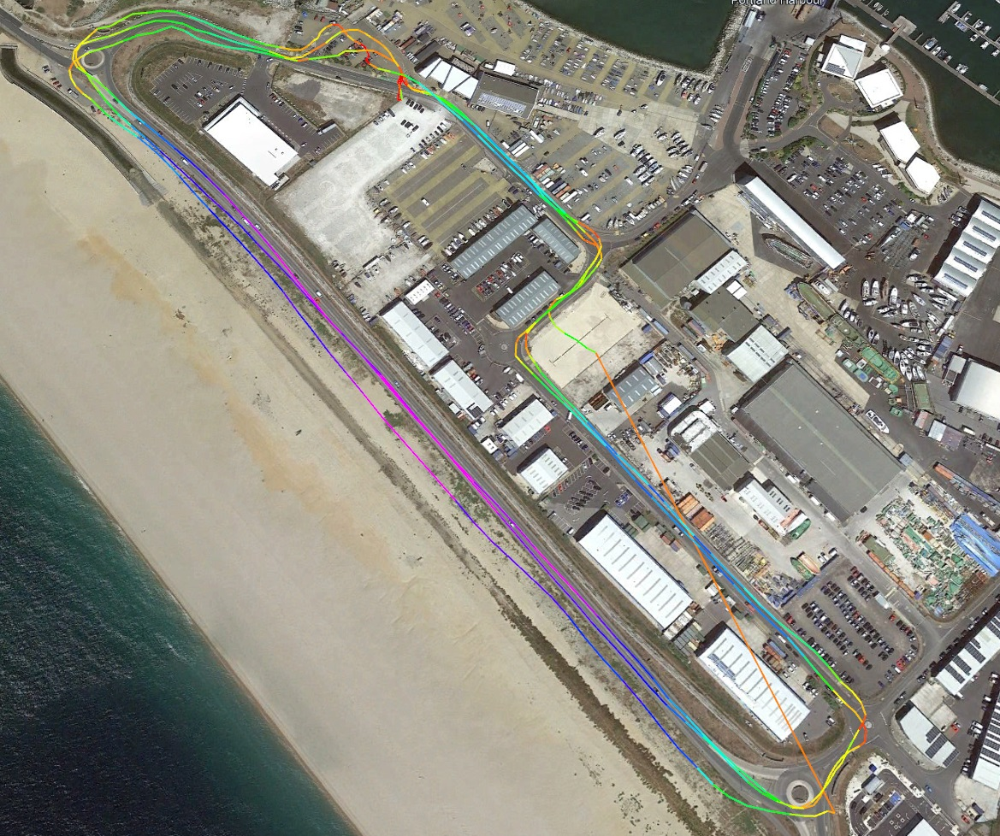

The image below also shows the degraded performance Fenix 7 Pro when wrapped in foil.

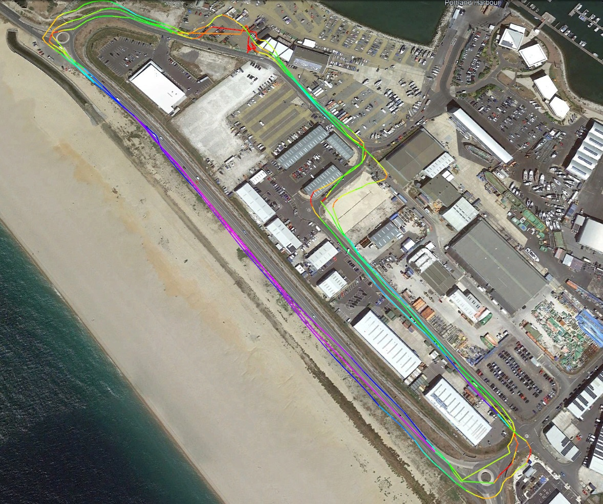

The APEX 2 Pro had one especially bad trial when it was wrapped in foil, which is shown in the screenshot below.

It should be noted that the COROS watches were set up to use all systems, and not multi-band like the Garmin watches.

The impact of the foil did vary for all of the watches, sometimes completely blocking the signals during entire trials.

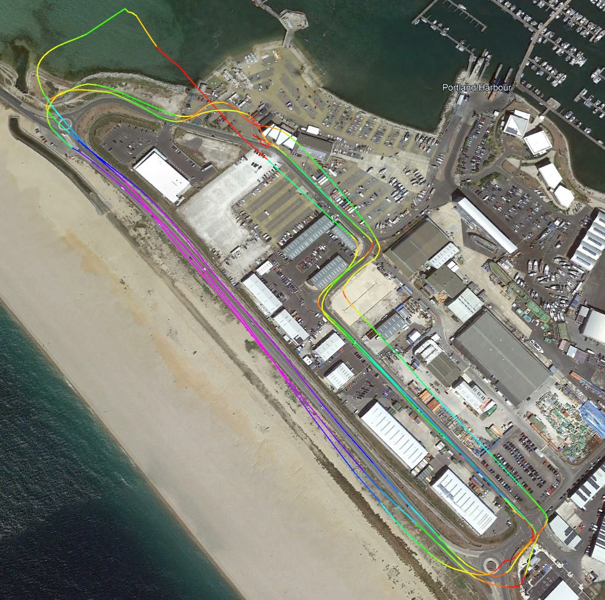

### Fenix 7 Pro

The image below compares the Doppler speeds from one of the Motions (blue) with the Fenix 7 Pro (red) when it was wrapped in foil.

The general degradation in speed accuracy is clearly evident and it is pretty obvious where the GNSS data has dropped out completely.

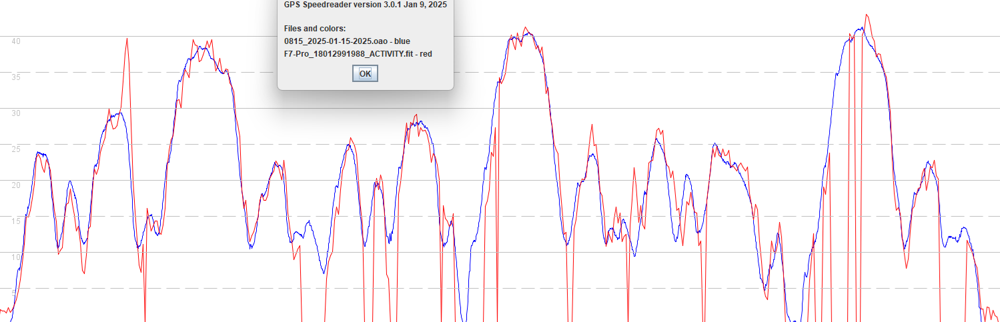

The position-derived speeds can also be compared to the Doppler-derived speeds for the Fenix 7 Pro, showing a greater difference than usual.

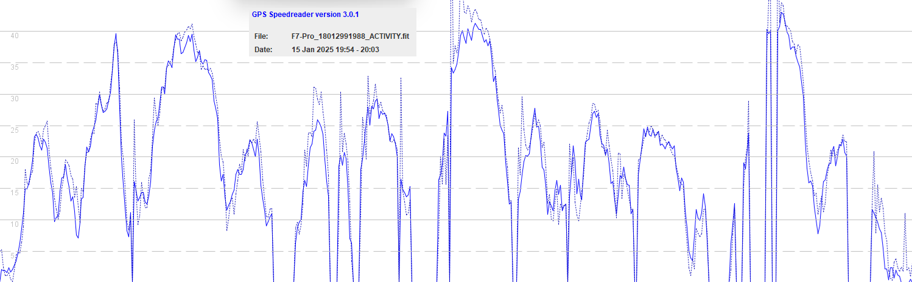

The GPS events in the FIT file show an abundance of issues, due to event type 3. However, the actual timestamps do not always match to the obvious dropouts in the FIT file.

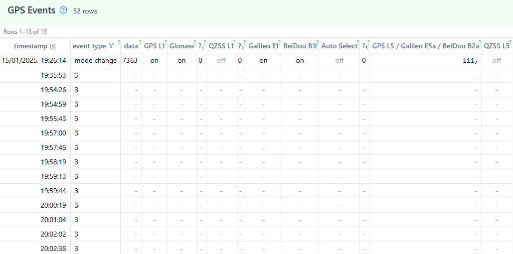

One example of a GNSS dropout and the following records is show in the screenshot below.

Notes:

- The speed disappears immediately.
- The longitude and latitude may persist for another second, but never more.
- Distance is frozen, because there are no changes to longitude and latitude.
- Altitude continues to be updated, since it is derived from the barometer.
- Fix quality is frozen, because there are no location events passing [Position.Info](https://developer.garmin.com/connect-iq/api-docs/Toybox/Position/Info.html) to APPro.

### Forerunner 255

One of the trials on the first day shows some brief GNSS dropouts from the Forerunner 255.

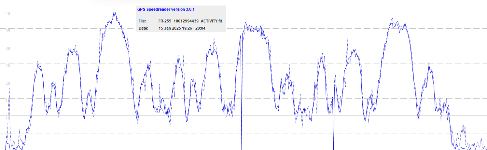

One of the trials from the second day also show an extremely long dropout (highlighted in yellow), which corresponds to the long-straight line (orange) visible on one of the screenshots showing the test circuit.

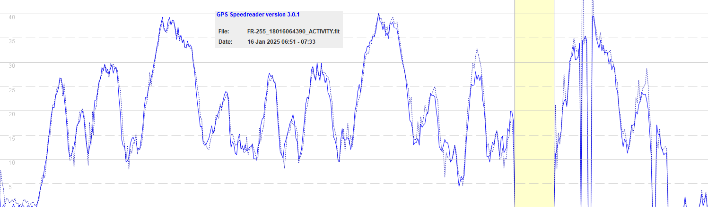

Just like the Fenix 7 Pro, dropouts result in latitude, longitude, and speed being absent from FIT records.

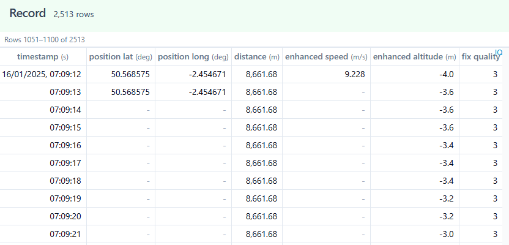

Notes:

- The speed disappears immediately.
- The longitude and latitude may persist for another second, but never more.
- Distance is frozen, because there are no changes to longitude and latitude.
- Altitude continues to be updated, since it is derived from the barometer.
- Fix quality is frozen, because there are no location events passing [Position.Info](https://developer.garmin.com/connect-iq/api-docs/Toybox/Position/Info.html) to APPro.

### Repeated Values

There were 4 instances of repeated values during the 16 trials on Garmin watches:

- All occurrences were on the Forerunner 255.
- None of the occurrences were on the Fenix 7 Pro.
  - This is consistent with experiences on the water and the apparent rarity.
- Two occurrences were when the watch was wrapped in foil.
  - FR-255_18012994439_ACTIVITY @ 19:31:59
  - FR-255_18016064390_ACTIVITY @ 07:12:51
- Two occurrences were when the watch was NOT wrapped in foil.
  - FR-255_18016064390_ACTIVITY @ 07:23:51
  - FR-255_18016064390_ACTIVITY @ 07:41:32

It has previously been observed that there are two manifestations of repeated values:

- Repeated values (latitude + longitude + speed), then a double-distance jump (and different speed).
- Double-distance jump (and different speed), then repeated values (latitude + longitude + speed).

The second manifestation is more rare than the first, and it may also take more than a second before the repeated values occur.

### Discussion

The degradation in the accuracy and precision of the GNSS receivers when wrapped in aluminium foil is clearly evident. Both the positional data and velocity data are affected and dropped points also occur frequently, presumably where there is no data from the GNSS receiver. When data is unavailable from the GNSS receiver, all watches continued to record other sensor data such as altitude, which is derived from the barometer.

It was not possible to demonstrate a relationship between poor GNSS signals and repeated values. There were 4 occurrences in total on the Garmin watches, all of which occurred on the Forerunner 255. Half of the occurrences were whilst the watch was wrapped in foil, and half whilst the watch was operating normally. Yet, half of the trials had severely degraded signals due to the foil, sometimes to the point where there was no GNSS data.

The calculation for the odometer (distance in the FIT file) was confirmed as being derived from latitude and longitude data, not derived from the SOG values which was deemed to be another possibility. The behavior of the odometer was very easy to confirm, simply by looking for records where the positional speed and doppler speed differed greatly, and comparing them to the odometer values.

The fix quality indicator written by APPro provides some additional insights, both in terms of solution quality and the manner in which fields are written to FIT files, including how they persist if they are not updated in time for the next FIT record. The [FitContributor](https://developer.garmin.com/connect-iq/api-docs/Toybox/FitContributor/Field.html) documentation mentions an issue with time sensitive data, how values may be lost if not already written, and there is also an implication that values will persist, if not updated.

One possible explanation of repeated values is that values are being be lost (i.e. second manifestiation, as described in the Garmin documentation), or carried forward if they are not updated in time for the record being written to the FIT file. Whatever the cause it seems to be far more common on the Forerunner 255 than on the Fenix 7 Pro, and it is yet to be convincingly demonstrated that it is more likely when GNSS reception is poor.

The COROS files provided limited insight, due to the heavy filtering that COROS apply to the latitude + longitude data, but they did give an idea of the typical ranges for HDOP from the Airoha AG3335M, both when the watch has a clear view of the sky, and when it is wrapped in foil. The normal value for a clear sky was 0.4 and values exceeding 3.0 (sometimes up to 5.0) occurred when wrapped in foil.

The Garmin [fix quality](https://developer.garmin.com/connect-iq/api-docs/Toybox/Position.html#Quality-module) indicator fluctuates between 3 (QUALITY_USABLE) and 4 (QUALITY_GOOD) when the watches are wrapped in foil, which tells us that it's always using at least 4 satellites (due to the 3D fix). The difference between 3 (QUALITY_USABLE) and 4 (QUALITY_GOOD) is HDOP < 3.0 or > 3.0, and for the AG3335M (or any multi-GNSS chipset) a HDOP > 3 would be expected to produce really poor PVT solutions.

### Next Steps

It would be really nice if Garmin would take a look at some windsurfing tracks that contain an abundance of repeated values. Timing issues can clearly affect [app fields](https://developer.garmin.com/connect-iq/api-docs/Toybox/FitContributor/Field.html) being written to the FIT, and it is very possible that system fields (e.g. latitude + longitude + speed) are similarly impacted. It is worth noting that when we see repeated latitude + longitude values in FIT files the speed is often repeated, but not always.

The fact that speed is not always repeated when latitude and longitude are repeated might also suggest that this is some kind of timing issue. There are several combinations of [NMEA](https://logiqx.github.io/gps-wizard/nmea/) sentences that the Garmin watches might be consuming and some of them have latitude + longitude in a different sentence to speed (e.g. GGA + VTG). Whatever NMEA sentences Garmin are consuming, they need to include HDOP for their fix quality.

The difficult thing will be writing a description that cuts through first line support and gets to a team who will have enough knowledge to investigate the issue. This will mean it needs to be written clearly and succinctly, with one or two careful chosen FIT files to demonstrate the issue in the clearest terms possible. The example FIT files should at the very least contain all currently known manifestations of the problem.

Lastly, whilst I remain unconvinced the issue relates to the wearing of the device and / or signal degradation, I do not reject the possibility. It just needs to be demonstrated that a single watch is more prone to repeated values when it is next to a rolled up the sleeve, ideally with a dozen or so trials. There could be one or more issues at play, but right now a FIT timing issue seems likely, especially in light of the Garmin documentation for [app fields](https://developer.garmin.com/connect-iq/api-docs/Toybox/FitContributor/Field.html).

Time will tell... more testing required.

### Data

All of the trials are available for download. Each OAO / FIT contains all 4 trials (back-to-back) from a single day.

- [2025-01-15.zip](2025-01-15.zip)
- [2025-01-16.zip](2025-01-16.zip)
