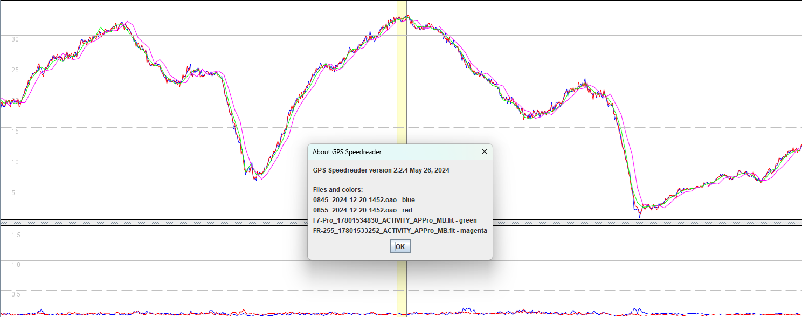
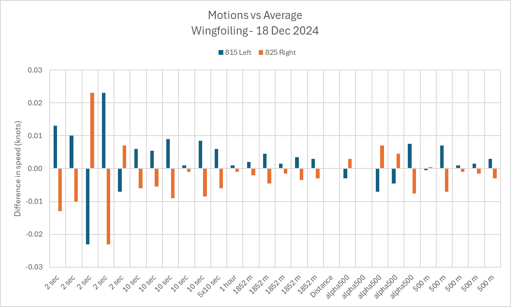
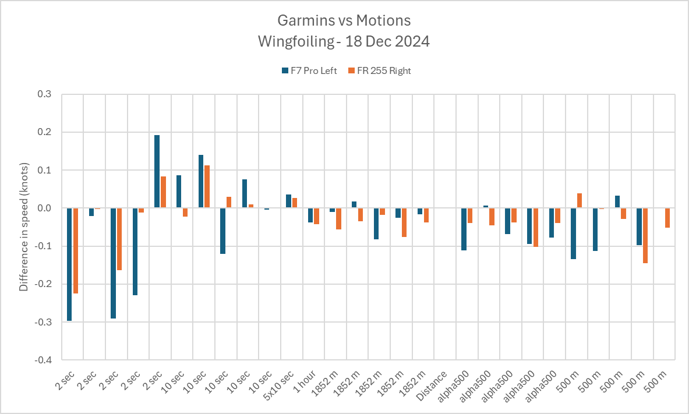

## Garmin Accuracy

### Overview

A large variety of tests have been performed on the Garmin watches, testing the effects of different GNSS modes, and activity profiles. Testing have been done driving, windsurfing, windfoiling, and wingfoiling. These all have slightly different speeds and dynamics.

I won't list all of the checks that I do for every session, but will give a brief overview. This first chart shows a comparison of two Motion minis, Garmin fenix 7 Pro Sapphire Solar, and Garmin Forerunner 255.

Aside from a 1 second temporal shift of the Forerunner 255, it can be seen that the Garmin watches are producing a pretty faithful reproduction of the actual speeds. They obviously lack the detail of the 5 Hz data from the Motions, but I always review the entire session in this way.

The data from the two Motions can be averaged and compared to the individual Motions. In this example the individual Motions rarely differ from the average by more than 0.01 knots, and slightly over 0.02 knots for a couple of 2s results.

The same kind of comparison can be done for the Garmin watches, comparing them to the average of the Motions. It should be noted that the differences are an order of magnitude greater than the Motions. This order of magnitude difference has been pretty typical during my Garmin testing.

### Summary

I don't have much time right now, so I can't write up months worth of individual test results. Here is a summary:

- When set up correctly and used correctly, Airoha-based Garmin watches can often produce 2s results that are within 0.1 kts of the Motions and usually within 0.3 knots. I don't recall ever seeing much more than 0.5 knots difference for 2s.
- Over longer distances the results are typically within 0.1 or 0.2 kts, when compared against the Motion.
- Spikes can occur but I've never seen them impact results, and they are caught by acceleration filters. I do all of my testing in GPSResults and GPS Speedreader with all of the filters switched off.
- There are a few observations that I consider to be minor [niggles](niggles.md) and described on another page.