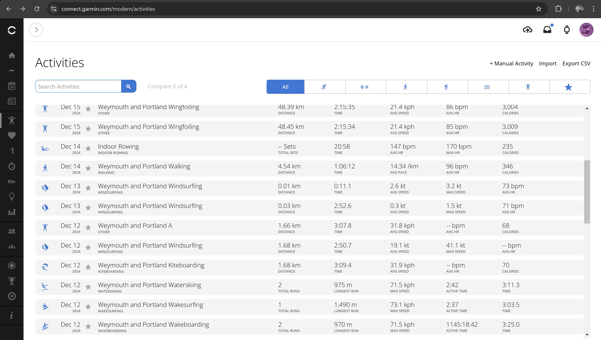
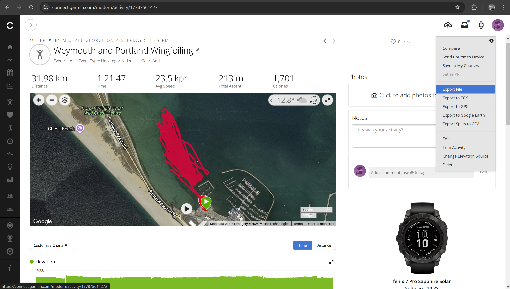

## Garmin Connect

### Activity Profiles

The only real choice on Forerunner watches is "other" because they don't offer windsurf or kiteboard to users. However, Connect IQ apps can use any of the Garmin activity profiles (including windsurf and kiteboard), even if the watch itself does not offer them to the user.

Garmin connect shows different information for different activity profile, and has a variety of icons. You can change the sport in Garmin Connect, but that doesn't change the underlying data. The underlying data and filters applied will be completely unchanged.

### Exporting Data

It is important to export data as a FIT file, and not GPX which is perhaps better known. The option "Export File" will achieve this but it will be a ZIP file and you will have to extract the FIT for speed analysis. Perhaps tools such as GPSResults and GPS Speedreader will add support ZIP files in the future?

Do not export the GPX file because it does not include the actual speed data, only positional data.

