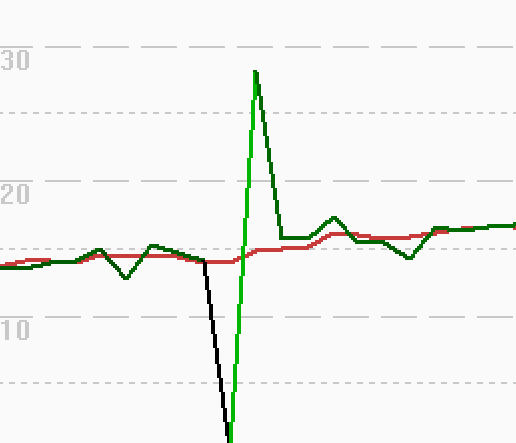

## Garmin Niggles

### Introduction

There are a few minor niggles in the Garmin data, which I have listed on this page.

### Temporal Offsets

Temporal offsets of 1 or 2 seconds seem to affect Garmin watches when using the least filtered modes; windsurf, kitesurf, other, etc.

This is not a major issue per-se, but something to be aware of when testing comparing devices. The delay can sometimes change by a second or two in the middle of a session.

I don't think that I've ever seen the data being early, only ever delayed.

### Frozen Positions

If you look at position-derived speeds in GPSResults you will sometimes see some artefacts like the one shown below. This happens because the latitude + longitude is occasionally not updated, resulting in a speed of zero, then double, then normal. 

Some notes about this behavior:

- This only affects the modes which do not have any significant filtering; e.g. windsurf, kitesurf, other, etc.
- It may happen once or twice during a session, or it may happen frequently.
- These artefacts have also been evident on older watches, and I've seen it on the vivoactive 3 or 4.
- This behavior only ever affects the latitude + longitude positional data, not speed data.
- The behavior isn't ideal, but it is not hugely problematic, even for alphas.
  - The latitude + longitude only dictates where the alpha can start and end.
  - Calculation of the alpha speed relies upon the Doppler-derived speeds.

### Aliasing

The [Airoha](airoha.md) chipset has a fixed update rate, which could well be 10 Hz in Garmin watches, but with an NMEA output rate of 1 Hz.

This results in some degree of [aliasing](../../../general/aliasing/README.md), which I wrote up in relation to COROS devices.

- The early COROS firmware(s) for Airoha-based watches also exhibit aliasing, just like Garmin and 1 Hz Motions.
- In May 2024, COROS broke their Airoha-based watches with a similar issue to Garmin watches in early 2022.
- In Sep 2024, COROS resolved the May issue (APEX 2 + APEX 2 Pro) and also got rid of the aliasing.

It is worth noting that Garmin watches using the MT3333 do not exhibit any aliasing, despite the chipset also being 10 Hz.

Fortunately this does not appear to have a significant impact on Garmin results, softened somewhat by 2s averages.

The ideal would be for a low-pass filter being applied in the Airoha, avoiding the aliasing as per my earlier [article](../../../general/aliasing/README.md).

### Spikes

This isn't a niggle per-se, just a quick note to say that spikes do occasionally occur during a crash, or coming ashore.

This is pretty rare though. I had to sail for 100s of hours before seeing this on my Forerunner 255.

However, the spike was suppressed by the standard acceleration filters of GPSResults and GPS Speedreader.