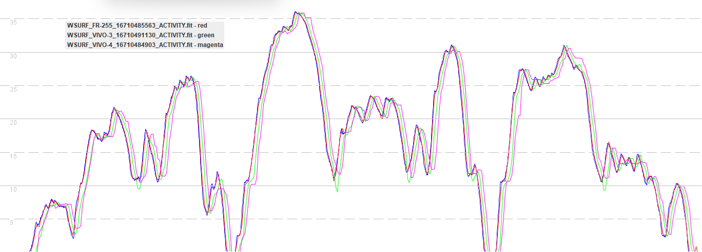
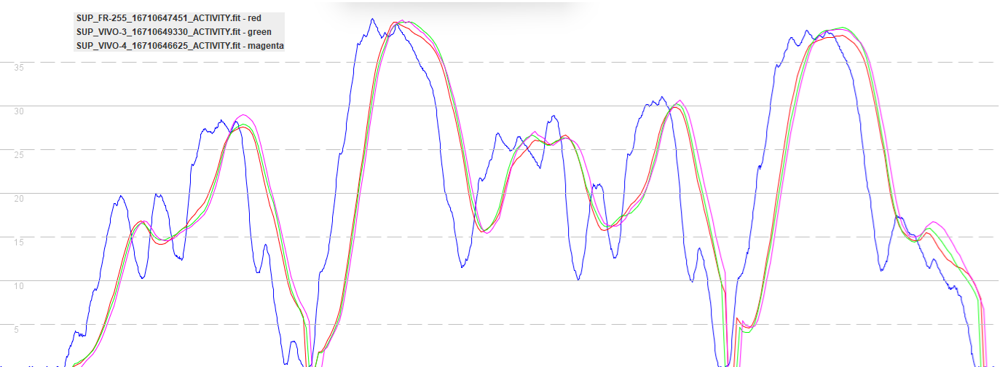

## Garmin Settings

### Overview

The settings and app choice can greatly impact the watch performance when speed sailing. 

- Data recording frequency
- GNSS setting
- Activity profile

### Data Recording Frequency

The default recording frequency on a Garmin watch is known as "smart". This only records data once every few seconds and unsuitable for speed sailing. The first thing to do when setting up a Garmin watch is to set the recording frequency to "every 1 second".

### GNSS Setting

Testing has repeatedly shown standard GPS can perform badly on Airoha-based watches from Garmin and COROS.

All systems and multi-band are much better as they can be trusted to produce good quality results in a wide range of conditions.

The two best GNSS options are as follows:

- All systems = GPS L1, GLONASS, Galileo E1, and BeiDou B1I
- All systems + multi-band = GPS L1 + L5, GLONASS, Galileo E1 + E5a, and BeiDou B1I + B2a

n.b. The native Garmin activities also appear to use QZSS, additional to the 4 global systems.

### Activity Profile

It is easy to demonstrate the importance of an appropriate activity profile with a couple of graphs.

Firstly, windsurfing on a variety of Garmin watches when compared to the Motion. Forerunner 255 in red (Airoha), vivoactive 3 in green (MediaTek), vivoactive 4 in magenta (Sony), Motion in blue (u-blox).

The closeness of the Forerunner 255 (red) to the Motion (blue) is extremely impressive. Delays of 1 or 2 seconds can be seen to affect the vivoactive 3 and 4 in this example, but this can happen with any Garmin watch. It's not a major issue per-se, just something to be aware of when testing and comparing devices.

Secondly, stand up paddling (SUP) on a variety of Garmin watches when compared to the Motion. Forerunner 255 in red (Airoha), vivoactive 3 in green (MediaTek), vivoactive 4 in magenta (Sony), Motion in blue (u-blox).

None of the watches produce an accurate recording during this test, because the SUP activity profile has applied heavy filtering. In the case of the SUP (and surf) activity profiles they lose a lot of detail and rarely capture the lower speeds of turns, thus being unsuitable for alpha 500m.

Practically every single Garmin activity profile has been tested on multiple watches, but in the interests of brevity:

- Suitable activity profiles include windsurf, kiteboard and other.
- Unsuitable activity profiles include SUP, surf, sailing and boating.

The only real choice on Forerunner watches is "other" because they don't offer windsurf or kiteboard to users. However, Connect IQ apps can use any of the Garmin activity profiles (including windsurf and kiteboard), even if the watch itself does not offer them to the user. You can always change the activity in Garmin Connect, but it won't change the underlying data. 

Note: The bike activity profile may look ok for much of the time, but it appears to implement its own unique filtering, related to walk / cycle detection.

