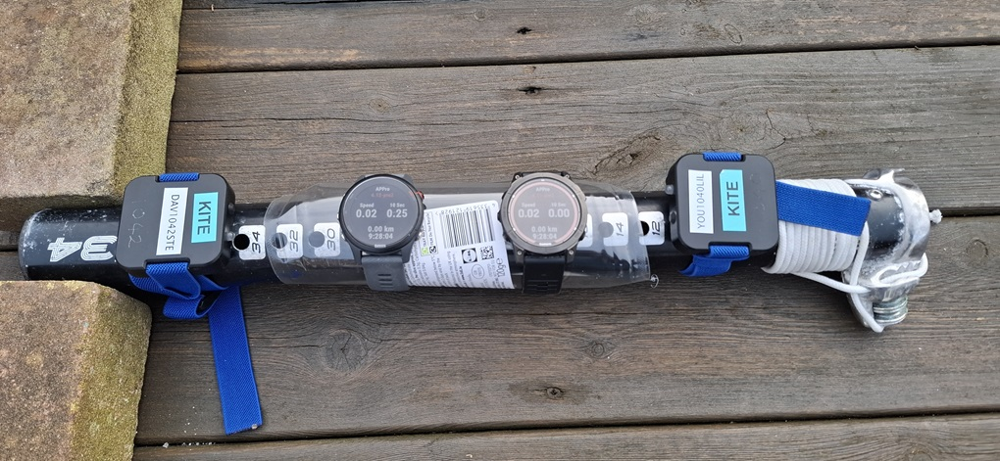
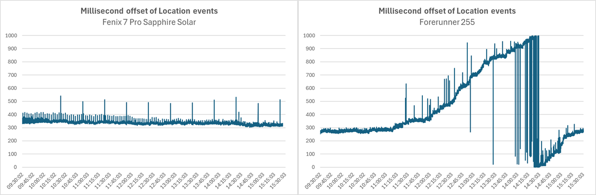
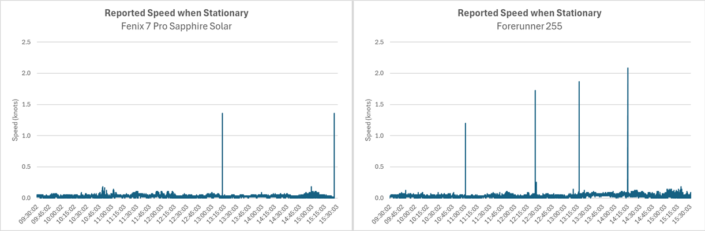
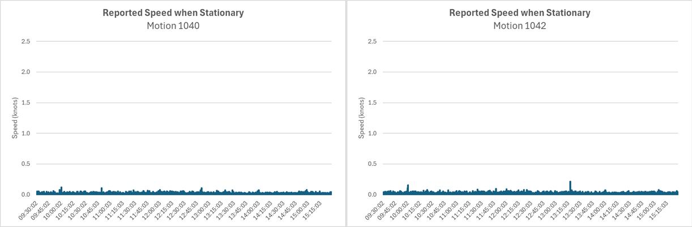
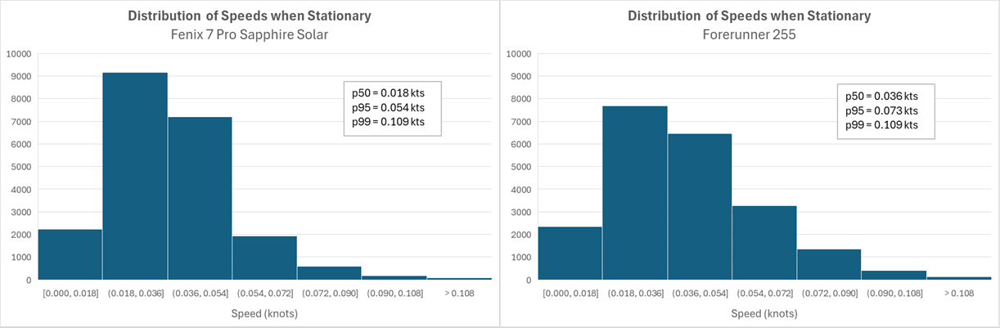
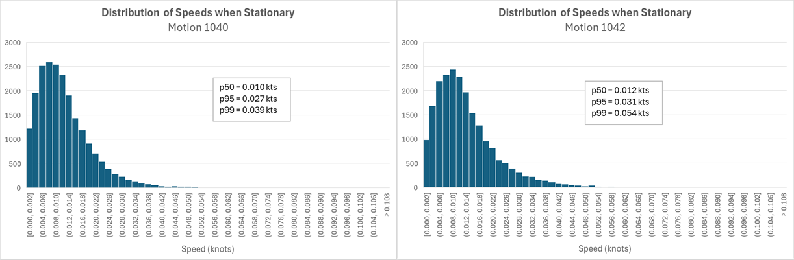

## Garmin - Static Testing

Author: Michael George

Created: 10 Feb 2025

### Introduction

Static testing is very common in GNSS research and literature, but until now has not been feasible on Garmin watches. The primary reason has been that Garmin set very low speeds to zero, making it impossible to do static testing.

The application APPro has access to the GNSS data and has added a developer field called "sog" (speed over ground) to the FIT. This is a quick investigation to assess the feasibility of using the "sog" field for static testing.

### Approach

The test used two 1 Hz Mini Motions in addition to a Garmin Forerunner 255 and Fenix 7 Pro Sapphire Solar.

The devices were fixed to a mast extension, and placed in an open garden for 6 hours.

### Findings

#### Timing Issues

Although timings were not the primary focus of this investigation, it is worth noting how the event timings in the Forerunner 255 were not consistent.

The timings of FR 255 location events drifted considerably during the 6 hours of testing, whilst the fenix 7 Pro remained relatively constant.

It is also noticeable that the timings of the fenix 7 pro event had occasional blips. The interval between F7 anomalies was consistently 30 minutes.

#### Measured Speed

The speeds measured by the Garmin watches were consistently low throughout the 6 hours of testing, but with an occasional spike.

The speeds from the Mini Motions were slightly lower, and without any noticeable spikes.

### Distributions

The Garmin distributions can be plotted, but limited to the resolution of the speeds being recorded, which is around 0.018 kts.

The Motion distributions don't have the same limited resolution as the Garmin watches, so can be plotted in more detail.

### Results

In the P50 and P95 categories the F7 Pro performed slightly better than the FR 255, but quantization errors may have contributed to this slightly. It was mentioned previously that the resolution of the speeds being record is around 0.018 kts.

The Mini Motions perform better than both of the Garmin watches, roughly twice the precision of the fenix 7 Pro.

|               | FR 255 | F7 Pro | Mini 1040 | Mini 1042 |
| ------------- | :----: | :----: | :-------: | :-------: |
| p50 (kts)     | 0.036  | 0.018  |   0.010   |   0.012   |
| p95 (kts)     | 0.073  | 0.054  |   0.027   |   0.031   |
| p99 (kts)     | 0.109  | 0.109  |   0.039   |   0.054   |
| mean (kts)    | 0.033  | 0.028  |   0.012   |   0.014   |
| max (kts)     | 2.086  | 1.360  |   0.121   |   0.216   |
| distance (km) | 0.364  | 0.310  |   0.137   |   0.152   |

Note: The distance was calculated by using the sum of the speeds in m/s.

### Summary

This was just a quick an easy test to establish whether static testing of Garmin watches might prove to be useful.

The results suggest that this approach to testing might prove to be useful, prior to real-world testing of the watches.

The capability to capture near-zero speeds is limited to a private beta of APPro, but will ship in the next public release.

