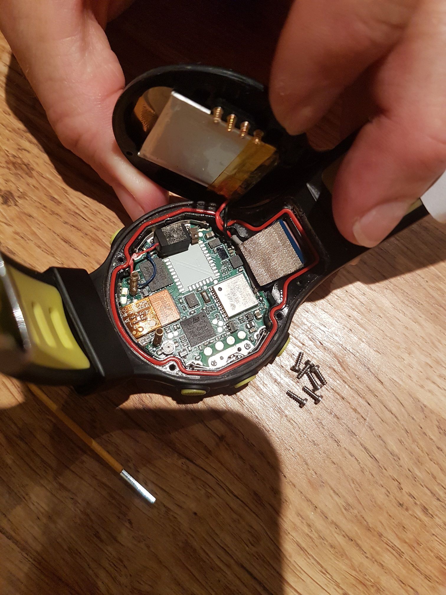
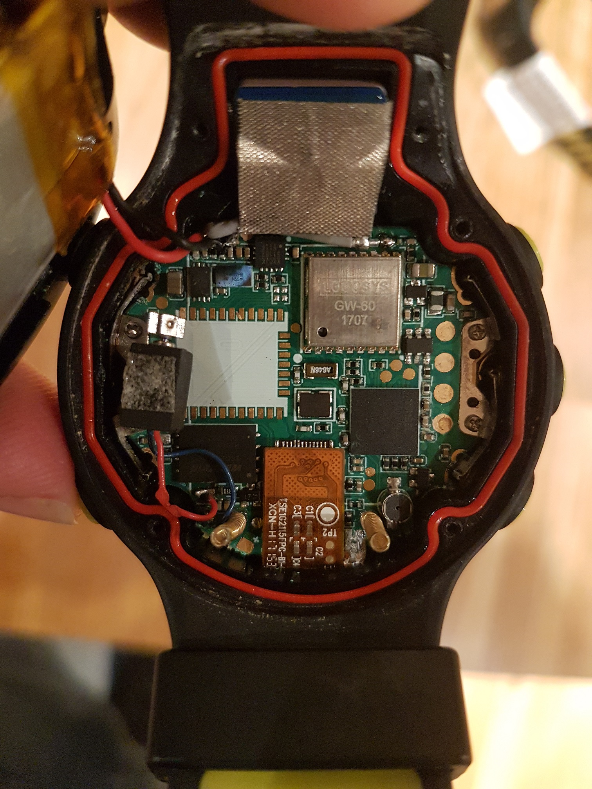
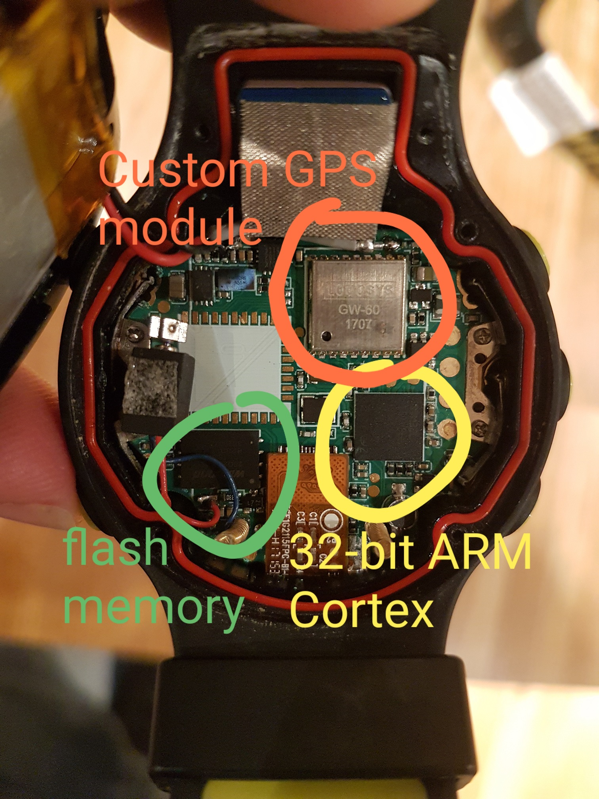

## Locosys Detective Work

Last updated 12 Dec 2022. Added notes relating to the availability of climb rate.


### Introduction

It is reasonably well known that the Locosys GT-11 used the SiRFstar II and Locosys GT-31 used the SiRFstar III.

What isn't so clear is what GPS chip was used in the GW-52 and GW-60; perhaps the SiRFstar IV or something like MediaTek MT3318?

It has been [mentioned](https://www.seabreeze.com.au/forums/Windsurfing/Gps/Speed-Accuracy?page=4#27) on the Seabreeze forum that the GW-52 and GW-60 firmware both contain plain-text references to MediaTek frames and this has lead to a belief that the GW-52 and GW-60 are using a chip such as the MT3318.

This document will start by summarizing why it matters and then share my final conclusion. The super-geeky amongst you will probably find the remainder of the article quite interesting, but everyone else should stop reading after the conclusion!


### Why It Matters

Two of the most significant factors in GPS performance are the chipset and the antenna design. Chipsets from different manufacturers typically have very different performance characteristics and limitations, which has a bearing on their suitability for competitive speedsurfing.

Something unique to the GT-31, GW-52 and GW-60 is the availability of SDOP (standard dilution of precision, GT-31) and SDOS (standard deviation of speed, GW-52 and GW-60). Aside from u-blox, no other GPS chipset manufacturer provides speed accuracy estimates at this time. The GT-31 provides SDOP and had a scientific paper published but the GW-52 and GW-60 have remained something of a mystery.

The possibility of a MediaTek chip being used in the GW-52 and GW-60 (due to references in their firmware) creates further questions:

- Wasn't SDOP on the GT-31 proprietary to SiRF?
- Why was it renamed to SDOS on the GW-52 / GW-60, are SDOP and SDOS the same thing?
- How did MediaTek reproduce SDOP in their chip or is SDOS something different?
- How comparable are SDOP (GT-31), SDOS (GW-52 + GW-60) and sAcc (u-blox)? What do they each represent?

Understanding what these are really helps when building GPS prototypes, or when evaluating existing GPS units (especially for approval for GPSTC).

 

### Conclusions

The MediaTek references in the GW-52 and GW-60 firmware are actually strong evidence that a MediaTek GPS chip is **not** being used by those devices!

This will sound like an odd statement to make right now, and it was also a surprise to me, but I'll explain how I reached my conclusion!

In all likelihood the GW-52 and GW-60 probably use the SiRFstar IV. Whilst they could contain the SiRFstar V it would be rather unnecessary.

If you aren't a GPS geek then you don't need to read any further, and can just take my word that the GW-52 and GW-60 probably use the SiRFstar IV.

The remainder of this document will describe my analysis and the various findings in more detail.


### Approach

I decided to look into this from a number of angles:

- Studying the timeline of the GT-31, GW-52, GW-60 and numerous GPS modules from Locosys, plus the actual GPS chips from SiRF and MediaTek.
- Features of the likely GPS chips were researched, including the SiRFstar IV and all of the Locosysy GPS modules that used it between 2010 and 2021. 
- I've looked at the data sheets of GPS modules from the many OEMs using the GPS / GNSS chips from SiRF and MediaTek. 
- I've studied all of the relevant NMEA [commands and sentences](nmea.md) supported by each chip and hunted for anything resembling a speed accuracy estimate resembling SDOP / SDOS or ROC (rate of climb, climb rate, vertical velocity, speed up / down, etc).
- I've looked at the firmware of the GT-31, GW-52 and GW-60 to see what clues they contain.


### Speed Accuracy Estimates

#### SiRFDrive  + SiRFNavIII

EHPE, EVPE and EHVE have been consistently documented since an early SiRF binary protocol document, produced by NAVMAN in [2004](../chipsets/sirf/pdf/SiRF_Binary_Protocol_1.x_2004_02.pdf).

The SiRF binary protocol document from 2009 describes them for message ID 41 (geodetic navigation data) as follows:

| Name                                | Bytes | Description                                      |
| ----------------------------------- | ----- | ------------------------------------------------ |
| Estimated Horizontal Position Error | 4 U   | EHPE in meters x 10<sup>2</sup>                  |
| Estimated Vertical Position Error   | 4 U   | EVPE in meters x 10<sup>2</sup>                  |
| Estimated Time Error                | 4 U   | ETE in seconds x 10<sup>2</sup> (SiRFDrive only) |
| Estimated Horizontal Velocity Error | 2 U   | EHVE in m/s x 10<sup>2</sup> (SiRFDrive only)    |

It is worth mentioning that EHPE, EVPE, ETE and EHVE were also described in the SiRF demo [user guide](../chipsets/sirf/pdf/SiRF_Demo_User_Guide_1.5_2007_06.pdf) in June 2007.

A SiRF proprietary NMEA output sentence called **$PSRFEPE** also includes accuracy estimates:

| Field | Description                         | Units   |
| ----- | ----------------------------------- | ------- |
| HDOP  | Horizontal Dilution of Precision    | -       |
| EHPE  | Estimated Horizontal Position Error | m       |
| EVPE  | Estimated Vertical Position Error   | m       |
| EHVE  | Estimated Velocity Error            | m/s     |
| EHE   | Estimated Heading Error             | degrees |

The proprietary $PSRFEPE is available from the SiRFstar IV and SiRFstar V, but in the GW-52 and GW-60 this isn't actually significant because they will be reading message ID 41 (geodetic navigation data) using the SiRF binary protocol.

Note: The SiRF binary protocol includes ETE (but not EHE) whereas the Erinome-I [documentation](../chipsets/sirf/pdf/Erinome-I_User_Manual_rev1.7.pdf) describing $PSRFEPE includes EHE. The one socket protocol interface control [document](../chipsets/sirf/pdf/One_Socket_Protocol_Interface_Control_Document_2009.pdf) from 2009 does mention EHE in the "DR NAV Status Output Message" but it is not included in the output of message ID 41.


### Examining Firmware

Examining the firmware was a simple case of looking at all of the plain text output by the "strings" command on Linux.

I started by looking at the GW-52 and GW-60, before moving on to the GT-31.


#### GW-52 + GW-60

The following NMEA codes were found in the GW-52 and GW-60 firmware.

These sentences are enough to provide everything needed for standard logging; everything except SDOP / SDOS and ROC:

- GPGGA - Global positioning system fix data
- GPGSA - GNSS DOP and active satellites
- GPGSV - GNSS satellites in view
- GPRMC - Recommended minimum navigation information
- PLSEPE - Proprietary Locosys (PLS), Estimated Positional Error
- PLSV - Proprietary Locosys (PLS). Message V

Several Mediatek commands were also present in the GW-52 and GW-60 firmware:

- $PMTK103\*30 - Cold Restart. Don't use time, position, almanac / ephemeris data. 
- $PMTK253,0,115200\*01 - Set data output format and baud rate for current port.
- $PMTK605\*31 - Query the firmware release information. 

None of the Mediatek commands required to change the [fix and output rate](https://forum.arduino.cc/t/gps-pmtk220-versus-pmtk300/249143) (1 Hz / 5 Hz) are present in the GW-52 or GW-60 firmware:

- $PMTK220,1000\*1F - Set NMEA port update rate to 1Hz
- $PMTK220, 200\*2C - Set NMEA port update rate to 5Hz
- $PMTK300,1000,0,0,0,0\*1C - Set rate of position fixing activity to 1 Hz
- $PMTK300,200,0,0,0,0\*2F - Set rate of position fixing activity to 5 Hz

Summary:

- The MediaTek chipsets only provide NMEA outputs. They do not provide binary outputs like SiRF or u-blox.
- There are enough NMEA commands to log standard data but they do not include anything resembling SDOP / SDOS.
- There are no NMEA sentences to retrieve climb rate (rate of climb, vertical velocity, etc), yet the GW-52 and GW-60 both record it.
- There is no way to toggle a MediaTek chip between 1 Hz and 5 Hz using the $PMTK commands in the firmware.


The GW-52 and GW-60 firmware both contain quite a lot of debug messages. Test code clearly isn't being fully removed at compile time.

It's also interesting to note that the GW-52 includes an internal name of "GW31", whereas the GW-60 has an internal name of "GW60".


#### GT-31

The GT-31 firmware is actually ASCII-encoded so it needs to be decoded prior to looking for plain text.

After determining how the file had been encoded (thankfully, basic stuff), decoding was done on Linux with the following commands:

```
grep ^S315 GT31_FW_V1.4B0803T | sed 's/^S315........//;s/..$//' | tr -d "\n\r" | xxd -r -p | strings >GT31.txt
```

Format strings for common NMEA sentences were easily spotted. The format strings all relate to the memory card logging of the GT-31:

- $GPGGA - Global Positioning System Fix Data
- $GPGLL - Geographic Position - Latitude/Longitude
- $GPGSA - GPS DOP and active satellites
- $GPGSV - Satellites in view
- $GPRMC - Recommended Minimum Navigation Information
- $GPVTG - Track made good and Ground speed
- $GPZDA - GNSS Time & Date

A few possible NMEA commands were also spotted, possibly for initializing the SiRFstar III or to facilitate debugging:

- $PLSC - Proprietary Locosys (PLS). Message C
- $PLSR - Proprietary Locosys (PLS). Message R
- $PSRF - Proprietary SiRF prefix (SRF)

The firmware included a lot of obvious debug messages and it was noted that there was also a reference to SiRFDrive.

You may recall seeing EHVE in m/s x 10<sup>2</sup> in message ID 41 (geodetic navigation data, SiRFDrive only) of the SiRF binary protocol.

There were no references to either MediaTek, MTK or $PMTK in the GT-31 firmware.

Significantly there were no common NMEA prefixes listed either, suggesting use of the SiRF binary protocol when reading the GPS outputs.


### Refresher

Let's remind ourselves of some basic facts that relate to the GT-31:

- The SiRF binary format has included EHVE (Estimated Horizontal Velocity Error) in m/s x 10<sup>2</sup> for SiRFDrive since at least 2004.
- The SiRFstar III was released in 2005 with support for SiRFDrive and was therefore capable of outputting EHVE.
- The SiRF binary protocol added EPE to the list of NMEA messages for SiRFNavIII in Nov 2008. EHVE is one of the $PSRFEPE fields.
- The GT-31 was released in 2009. It used the SiRFstar III and recorded SDOP. Tom Chalko also published his SDOP [paper](../chipsets/sirf/pdf/Speed_Dilution_of_Precision.pdf) in 2009.
- There were several activities relating to EPE for SiRFNavIII (e.g. $PSRFEPE, EHVE) and SDOP in 2008 / 2009, leading up to the GT-31.
- The GT-31 firmware contains a reference to SiRFDrive which suggests that it knows about EHVE.
- It is reasonable to conclude the SiRFstar III in the GT-31 is actually deriving SDOP either from EHVE, or is using a similar approach.

Let's remind ourselves of some basic facts about the GW-52 and GW-60:

- They both provide logging at 1 Hz or 5 Hz and data is only ever output from the GW-52 / GW-60 as an SBP file.
- They both record SDOS (standard deviation of speed). The abbreviation SDOS appeared in the Locosys GW-52 and GW-60 brochures.
- The MediaTek chipsets only provide NMEA outputs. They do not provide binary outputs like SiRF or u-blox.
- The GW-52 and GW-60 can interpret standard NMEA sentences, which is enough for regular session logs (including COG, HDOP, sats, etc).
- There are no NMEA sentences to retrieve climb rate (rate of climb, vertical velocity, etc), yet the GW-52 and GW-60 both record it.
- The GW-52 and GW-60 both contain a small selection of $PMTK commands to initialize and restart a MediaTek GPS / GNSS chip.
- MediaTek speed error estimates would have to appear in $PMTK sentences. There is no evidence in the GW-52 or GW-60 firmware.
- Therefore, neither the GW-52 or GW-60 have any mechanism to receive speed error estimates from a MediaTek GPS / GNSS chip.
- Neither the GW-52 or the GW-60 has the ability to instruct a MediaTek GPS / GNSS chip to toggle between 1 Hz and 5 Hz.

It's not clear why the GT-31 used the term SDOP (standard dilution of precision) for a field that has units (m/s). SDOP is definitely not a "dilution of precision" but the term may have been used because DOP was familiar to the speedsurfing community.

Whilst the above facts don't prove that the GW-52 or GW-60 use a SiRF chip (like their GT-31 predecessor), these facts pretty much rule out a MediaTek chip. This document has illustrated that neither SDOP / SDOS or ROC (climb rate) can be retrieved from MediaTek chipsets.

The presence of proprietary MediaTek NMEA commands in the firmware do suggest the GW-52 and GW-60 can use a MediaTek chip. However, inability to receive any speed error estimates, climb rate, or toggle between 1 Hz / 5 Hz indicates they don't actually ship with a MediaTek chip.


### Hypothesis

The GT-11, GT-31, GW-52 and GW-60 are obviously products in their own right but they can also be regarded as test platforms for the Locosys GPS modules.

Between 2010 and 2021, Locosysy were producing a number of GPS modules based on SiRF and MediaTek chipsets. The company obviously had a lot of expertise in GPS / GNSS chips from SiRF and MediaTek so designing the GW-31 / GW-52 to work with either chip is perfectly conceivable.

I suspect that the GW-52 was originally designed to work with SiRF and MediaTek chips, but was actually released with a SiRFstar IV chip. The GW-60 would have been completely new hardware but it's quite likely that Locosys decided to stick with the SiRFstar IV and were able to re-use a lot of firmware code from the GW-52.

There is a lot of commonality between the GW-52 and GW-60 firmware. It seems most likely that any MediaTek trials were only done on the GW-31 / GW-52 and the capability was never used on a GW-60. It's just that the associated code was never removed from the GW-60 firmware.


### Possibilities

#### GW-52

Looking at the Locosys GPS modules between 2010 and 2021, only the [S4-1513](pdf/s4-1513_datasheet_v1.1.pdf) series used a SiRF chip that supported 5Hz but it could easily have been utilised in the GW-31 / GW-52.

- Rom based - S4-1513-2R
- Flash based - S4-1513, S4-1513-2E

It would seem most likely that the GW-52 would have used the S4-1513 (flash), due to the lower power usage when compared to the S4-1513-2X models. Even if the GW-52 did not use an S4-1513 module, it could have used the raw components including the SiRFstar IV.

The GW-52 can't have used the S4-0606 or S4-1612 ranges, because despite using SiRFstar IV they were 1 Hz,according to the Locosys product sheets.

Table 5.2-8 ($PSRFEPE request) of the S4-1513 [datasheet](pdf/s4-1513_datasheet_v1.1.pdf) also has "undefined" where EPE would be specified, possibly to obfuscate the SiRFDrive capability. If you compare table 5.2-8 against the relevant section in the SiRF binary protocol reference you'll see that everything else matches up perfectly.


#### GW-60

The GW-60 won't have used the standard Locosys S4-1513 range due to size constraints but it could easily have used the internal components, or created a custom module designed especially for the GW-60. The SiRFstar IV chip is only 3.5 x 3.2 x 0.6 mm in size!

This would mean that both the GW-52 and GW-60 use the SiRFstar IV but with SDOS probably derived from EHVE, or at least using similar calculations.

As an aside, SDOP should never really have been called "speed dilution of precision" because it is not a dilution of precision. It is easy to understand why Locosys used the term SDOS (standard deviation of speed) instead of SDOP, because it is more accurate.


### Summary

The presence of some MediaTek commands in the GW-52 and GW-60 firmware actually help to disprove possible use of a MediaTek chip. I've also yet to discover a speed error estimate being generated by any MediaTek chip. The closest I have found documented is positional estimates (horizontal, vertical, latitude, longitude and altitude) from the MediaTek MT3333. Climb rate is stored in SBP files, yet it is not available from MediaTek chips or NMEA.

I suspect the $PMTK commands are just hangovers from development and testing of the GW-52. All of the NMEA commands and sentences are in plain sight but they are all very basic and do not include speed error estimates. The NMEA commands required to switch between 1 Hz and 5 Hz logging via NMEA commands are also absent from the GW-52 and GW-60 firmware.

Some good reasons to suspect that Locosys used the SiRFstar IV:

- The Locosys S4-1513 uses the SiRFstar IV chip and supports 5 Hz logging.
  - The S4-1513 technology would have been well suited to the GW-31 / GW-52 and it existed long before the GW-52.
- Locosys were actively selling the S4-1513 range of GPS modules throughout the lifetimes of the GW-52 and GW-60.
  - Even if the S4-1513 module itself were not used in the GW-52, Locosys expertise could have built it around the SiRFstar IV.
- SiRFstar IV supports SiRFdrive and thus outputs EHVE, measured in cm/s (just like SDOP and SDOS).
  - The availability of SDOP (albeit with the name SDOS) was clearly a USP in the GW-52 and GW-60 marketing brochures.
- Discontinuation of the GW-60 coincided with discontinuation of the Locosys GPS modules utilising the SiRFstar IV chipset.

I therefore feel that in all probability, Locosys would have used the SiRFstar IV in the GW-52 and GW-60.

The SiRFstar IV matches up with the GW-52 and GW-60 specifications; 1 Hz + 5 Hz logging, availability of climb rate and estimation of speed errors with a resolution of 1 cm/s.


### Final Note

Tom Chalko's SDOP paper in 2009 included the following statements:

> This article explores and tests the “Speed Dilution of Precision” (SDOP) parameters developed and kindly provided by SiRF (many thanks SiRF) and implemented by Locosys Technology Inc (many thanks Roger at Locosys) into firmware of their GT31 hand-held GPS data logger.
>
> SDOP is a new SiRF3 parameter determined on the basis of the Kalman Filter covariance computed during each 1-second cycle of the SiRF3 chipset

Recognizing that Locosys probably used the SiRFstar IV chip in the GW-52 and GW-60 means we can safely assume that SDOP and SDOS are actually the same thing. It seems more than likely that they are either derived from EHVE (Estimated Horizontal Velocity Error) which was originally for SiRFDrive and subsequently used by SiRFNavIII, or calculated using a similar approach.

The GW-52 specification refers to SDOS and says "typical accuracy of 10s average speed measurement: ~3 cm/s, 99.7% certainty". The mention of 99.7% suggests to me that that SDOS is based on 3σ (3 standard deviations). This would seem to be consistent with the Tom's test results back in 2009. It is also worth noting that the u-blox sAcc measure is almost certainly based on 1σ due to similarly named u-blox metrics being specified as 1 standard deviation.


### Addendum #1

After writing this article, I've opened up a broken GW-60 to see what is inside.







The custom GPS module (Locosys GW-60 1707) gives nothing much away. It's not any of the standard Locosys GPS modules from the time because it is slightly smaller (9.5 x 9mm) and has less pins. Perhaps they shrunk the S4-1513 that I mentioned earlier because the S4-0606 is only 6mm x 6mm module but doesn't have the shielding.

It was also interesting to discover what processor is being used by the GW-60. It is the [STM32L151V8](https://www.st.com/en/microcontrollers-microprocessors/stm32l151v8.html) lower-power microcontroller which is based on the 32-bit ARM [Cortex-M3](https://developer.arm.com/Processors/Cortex-M3). The flash memory (bottom left) is a 256M-bit (32MB) Winbond [25Q256FVEG](https://www.winbond.com/hq/product/code-storage-flash-memory/serial-nor-flash/?__locale=zh_TW&partNo=W25Q256FV).


### Addendum #2

The MediaTek chipsets only support NMEA, not binary like SiRF or u-blox. Whilst reviewing all of the NMEA sentences supported by SiRF, MediaTek and u-blox chipsets in Dec 2022, it was noted that none include climb rate. Climb rate is only available in binary outputs of the SiRF and u-blox chips.

However, both the GW-52 and GW-60 record climb rate in their SBP output. The fact that climb rate (ROC) cannot originate from an NMEA sentence is yet another piece of evidence that neither the GW-52 or GW-60 are using a MediaTek chip.


### References

- Locosys
  - Marketing materials
    - [GW-52 specifications v1.2](pdf/GW-52_spec_v1.2.pdf) - mentions SDOS and 99.7% certainty
    - [GW-60 product details](pdf/GW60_EDM.pdf) - mentions SDOS and 99.7% certainty
    - [LOCOSYSTECH product brochure](pdf/LOCOSYSTECH_DM.pdf) - includes details of the S4-1513 range of GPS modules
  - GPS module data sheets
    - [S4-0606 datasheet v1.2](pdf/s4-0606_datasheet_v1.2.pdf) - 1 Hz update rate
    - [S4-1513 datasheet v1.1](pdf/s4-1513_datasheet_v1.1.pdf) - up to 5 Hz update rate
    - [S4-1612 datasheet v1.4](pdf/s4-1612_datasheet_v1.4.pdf) - 1 Hz update rate
    - [S4-1613 datasheet v1.4](pdf/s4-1613_datasheet_v1.4.pdf) - 1 Hz update rate
- SiRF
  - Marketing materials
    - [SiRFstar III product insert](../chipsets/sirf/pdf/GSC3LP_Product_Insert.pdf) - supports SiRFDrive
  - Binary protocol descriptions
    - [One Socket Protocol Interface Control Document 2009](../chipsets/sirf/pdf/One_Socket_Protocol_Interface_Control_Document_2009.pdf) - includes SiRF binary protocol from Sep 2009
    - [SiRF Binary Protocol 2.4 Nov 2008](../chipsets/sirf/pdf/SiRF_Binary_Protocol_2.4_2008_11.pdf) - EPE is included in message 129 (switch To NMEA protocol)
    - [SiRF Binary Protocol 2.3 Dec 2007](../chipsets/sirf/pdf/SiRF_Binary_Protocol_2.3_2007_12.pdf) - EPE is not included in message 129
    - [SiRF Binary Protocol 1.x Feb 2004](../chipsets/sirf/pdf/SiRF_Binary_Protocol_1.x_2004_02.pdf) - EPE is not included in message 129
  - NMEA protocol descriptions
    - [Erinome-I User Manual rev1.7](../chipsets/sirf/pdf/Erinome-I_User_Manual_rev1.7.pdf) - based on SiRFstar V it details the SiRF specific NMEA sentence $PSRFEPE
    - [GSD4e NMEA Manual May 2010](../chipsets/sirf/pdf/GSD4e_NMEA_Manual.pdf) - document relating to the SiRFstar IV but has no details about $PSRFEPE
  - SiRF Demo
    - [SiRF Demo User Guide 1.5 Jun 2007](../chipsets/sirf/pdf/SiRF_Demo_User_Guide_1.5_2007_06.pdf) - table 3-6 details EHPE, EVPE, ETE, EHVE but no mention of EHE
  - Research papers
    - [Speed Dilution of Precision](../chipsets/sirf/pdf/Speed_Dilution_of_Precision.pdf) - paper by Tom Chalko in 2009
    - [Decoding of SiRF Binary Protocol](../chipsets/sirf/pdf/Decoding_of_SiRF_Binary_Protocol.pdf) - paper from 2011
- MediaTek
  - [MT3333_Platform_NMEA_Message_Specification_V1.07](../chipsets/mediatek/pdf/MT3333_Platform_NMEA_Message_Specification_V1.07.pdf) - MT3333 messages, including location accuracy
  - [M10478-M10578-NMEA_Sentence_Output](../chipsets/mediatek/pdf/M10478-M10578-NMEA_Sentence_Output.pdf) - MT3333 sentences, including the proprietary EPE sentence
  - [Data_Sheet_M10478-A3](../chipsets/mediatek/pdf/Data_Sheet_M10478-A3.pdf) - confirms MT3333 is being used and supports 10 Hz
  - [Data_Sheet_M10578-A3](../chipsets/mediatek/pdf/Data_Sheet_M10578-A3.pdf) - confirms MT3333 is being used and supports 10 Hz
- u-blox
  - [u-blox 7 Receiver Description Including Protocol Specification](../chipsets/ublox/pdf/u-blox7-V14_ReceiverDescriptionProtocolSpec_Public.pdf)
  - [u-blox 8 / M8 Receiver Description Including Protocol Specification](../chipsets/ublox/pdf/u-blox8-M8_ReceiverDescrProtSpec_UBX-13003221.pdf)
